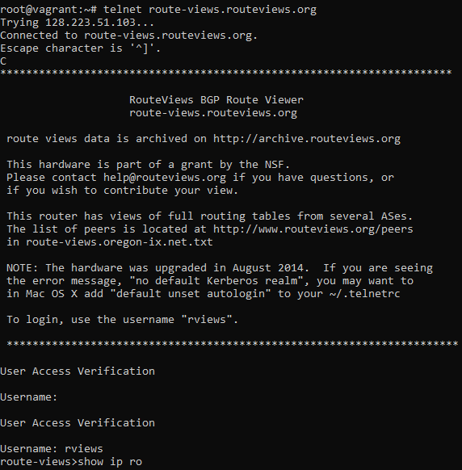
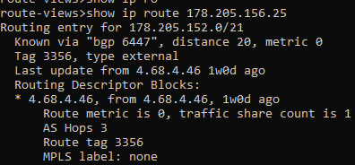
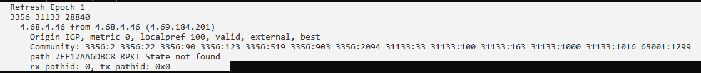
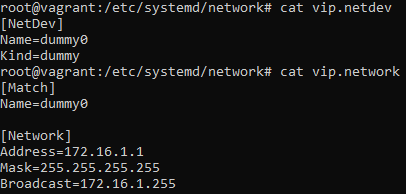
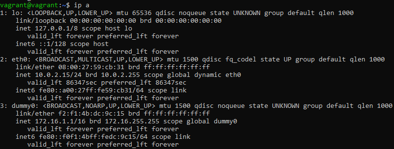
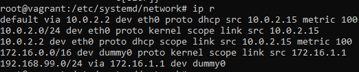
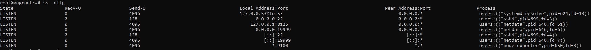
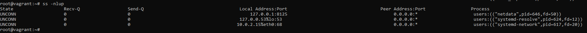
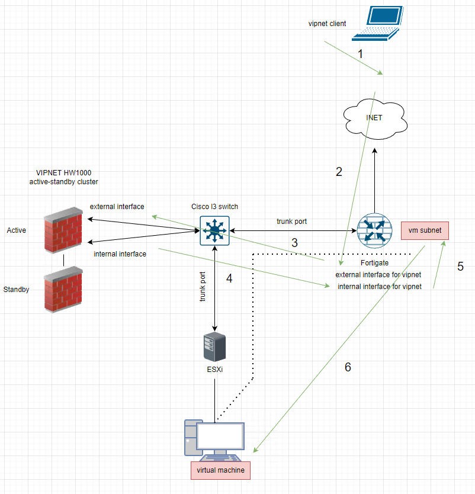

# Домашнее задание к занятию "3.8. Компьютерные сети"

## Выполнил Шарафуков Ильшат

### 1. Подключитесь к публичному маршрутизатору в интернет. Найдите маршрут к вашему публичному IP

Подключился к публичному маршрузитатору route-views.routeviews.org:

Нашел маршрут до своего публичного IP:

Увидел, через какие автономные системы доступен данный маршрут:

### 2. Создайте dummy0 интерфейс в Ubuntu. Добавьте несколько статических маршрутов. Проверьте таблицу маршрутизации.

Создал виртуальный (dummy or loopback or virtual ip) интерфейс. Для этого в /etc/systemd/network создал конфиг файлы для нового интерфейса:

Далее, я перезапустил сетевую службу с помощью команды "systemctl restart systemd-networkd". После этого у меня появился новый сетевой интерфейс dummy0

Добавил статический маршрут через новый интерфейс с помощью команды "ip route add 192.168.99.0/24 via 172.16.1.1". Данный маршрут можно сразу увидеть в таблице маршрутизации

### 3. Проверьте открытые TCP порты в Ubuntu, какие протоколы и приложения используют эти порты? Приведите несколько примеров.

Используя команду 'ss -nltp' получил список открытых tcp сокетов и приложений, которые их используют:

Из наиболее очевидного, tcp22 порт используется для ssh: 

* users:(("sshd",pid=699,fd=3))

Порт tcp9100 использует приложение node_exporter: 

* users:(("node_exporter",pid=650,fd=3))

### 4. Проверьте используемые UDP сокеты в Ubuntu, какие протоколы и приложения используют эти порты?
Используя команду 'ss -nlup' получил список открытых udp сокетов и приложений, которые их используют:

Порт udp53 используется самой ВМ для резолва доменных имен (DNS):

* users:(("systemd-resolve",pid=624,fd=12))

Порт udp8125 использует приложение netdata для отображения web интерфейса:

* users:(("netdata",pid=646,fd=50))

### 5. Используя diagrams.net, создайте L3 диаграмму вашей домашней сети или любой другой сети, с которой вы работали.

Прикладываю схему, которую рисовал при работе с ПАК vipnet-hw1000

