# Домашнее задание к занятию "3.9. Элементы безопасности информационных систем"

## Выполнил Шарафуков Ильшат

### 1. Установите Bitwarden плагин для браузера. Зарегестрируйтесь и сохраните несколько паролей.

Установил плагин и сохранил в нем тестовый пароль:

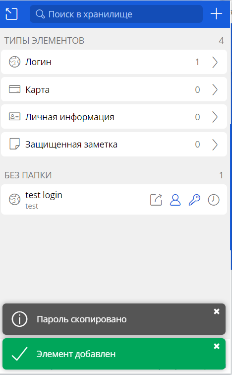

### 2. Установите Google authenticator на мобильный телефон. Настройте вход в Bitwarden акаунт через Google authenticator OTP.

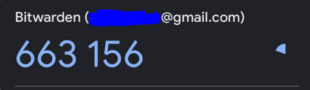

### 3. Установите apache2, сгенерируйте самоподписанный сертификат, настройте тестовый сайт для работы по HTTPS.

Установил web сервер apache:
* apt install apache2

Включил поддержку SSL для веб сервера:
* sudo a2enmod ssl

Перезапустил службу:
* sudo systemctl restart apache2

Сгенерировал SSL сертификат. В выпадающем меню почти все оставил по умолчанию, кроме "Common Name". Тут я ввел доменное имя ilshat.test:
* sudo openssl req -x509 -nodes -days 365 -newkey rsa:2048 -keyout /etc/ssl/private/apache-selfsigned.key -out /etc/ssl/certs/apache-selfsigned.crt

Создал конфиг файл для работы веб сервера по протоколу https:
* sudo nano /etc/apache2/sites-available/your_domain_or_ip.conf

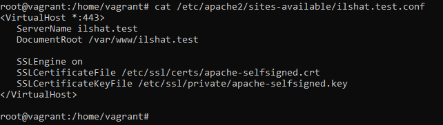

Создал простой html файлик для отображения на 443 порту:
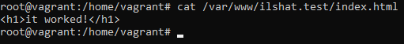

Применил новую конфигурацию специальной утилитой apache:
* sudo a2ensite ilshat.test.conf

Перезапустил службу:
* sudo systemctl reload apache2

Добавил в /etc/hosts/ на машине хосте (где запускается ВМ) запись с новым доменным именем, чтобы можно было проверить работу сервиса:
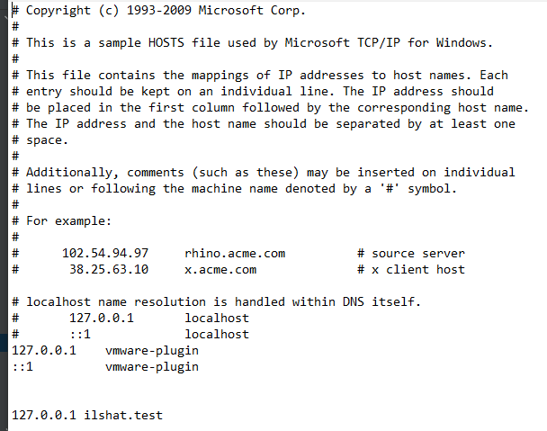

Перехожу в браузере по доменному имени по протоколу https, все работает:

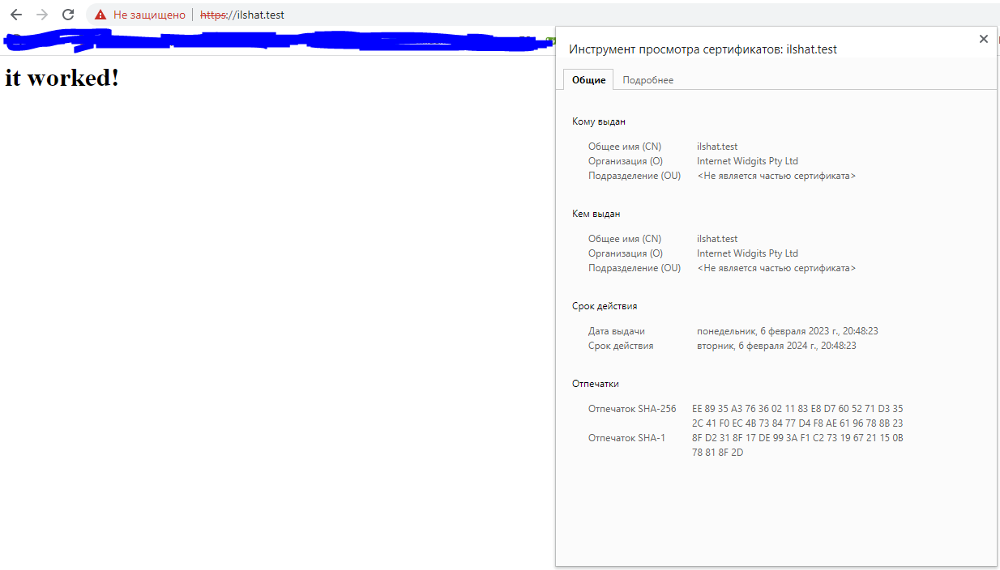

### 4. Проверьте на TLS уязвимости произвольный сайт в интернете (кроме сайтов МВД, ФСБ, МинОбр, НацБанк, РосКосмос, РосАтом, РосНАНО и любых госкомпаний, объектов КИИ, ВПК ... и тому подобное).

С помощью приведенной утилиты (github.com/drwetter/testssl.sh.git) протестировал сайт vc.ru на уязвимости:

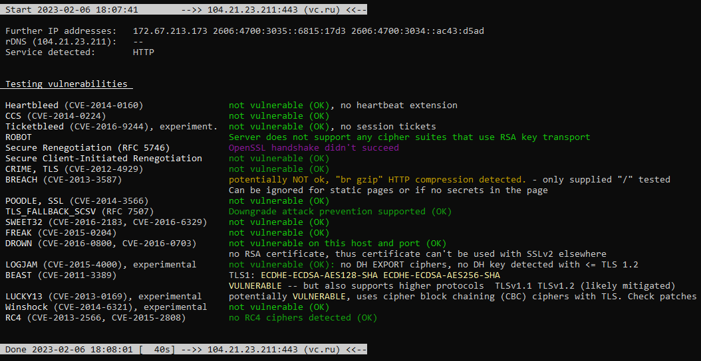

### 5. Установите на Ubuntu ssh сервер, сгенерируйте новый приватный ключ. Скопируйте свой публичный ключ на другой сервер. Подключитесь к серверу по SSH-ключу.

Сгенерировал ssh ключи с помощью следующей команды:
* ssh-keygen

Далее я скопировал свежесозданные ключи на клиентскую ВМ:
* ssh-copy-id vagrant@192.168.10.22

И после этого я смог без пароля попасть на ВМ где были сгенерированы ключи:
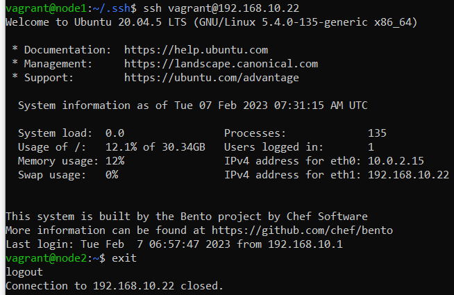

### 6. Переименуйте файлы ключей из задания 5. Настройте файл конфигурации SSH клиента, так чтобы вход на удаленный сервер осуществлялся по имени сервера.

Переименовал файлы ключей из задания 5 (добавил к названиям ключей цифру 1):
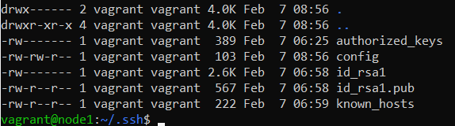

Использовать переименованные ключи можно с помощью ключа -i и указанием пути до ключа:
* ssh -i id_rsa1 vagrant@192.168.10.22

Чтобы ходить на удаленную ВМ по имени сервера, есть несколько путей. Можно отредактировать файл /etc/hosts, можно изменить составляющую конфиг файла ~/.ssh/config
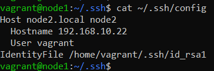

После перезагрузки соответствующей службы мы можем ходить на удаленный хост используя только доменное имя:

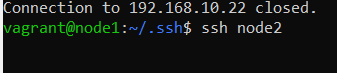

### 7. Соберите дамп трафика утилитой tcpdump в формате pcap, 100 пакетов. Откройте файл pcap в Wireshark.

Собрал дамп трафика с помощью утилиты tcpdump в следующей конфигурации:
* tcpdump -i eth0 -w test.pcap -s 65535 
Ключ -w с указанием названия позволяет сохранить дамп в отдельный файлик который потом можно выгрузить с помощью winscp на локальную машину и открыть с помощью wireshark:

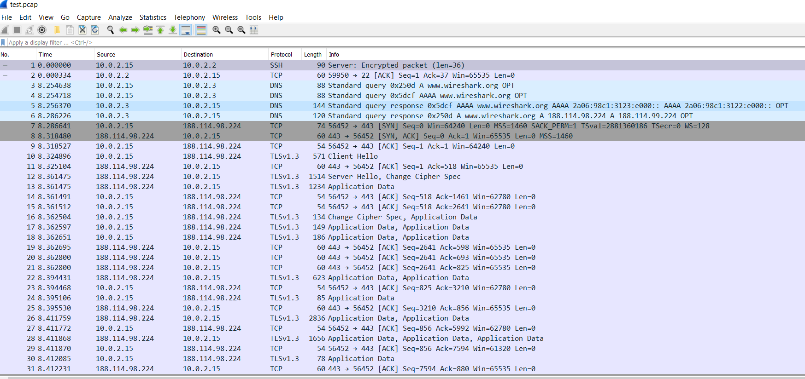
