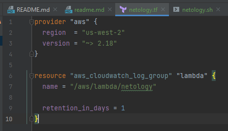
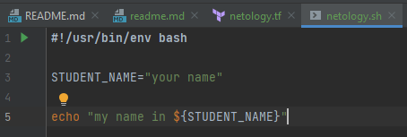
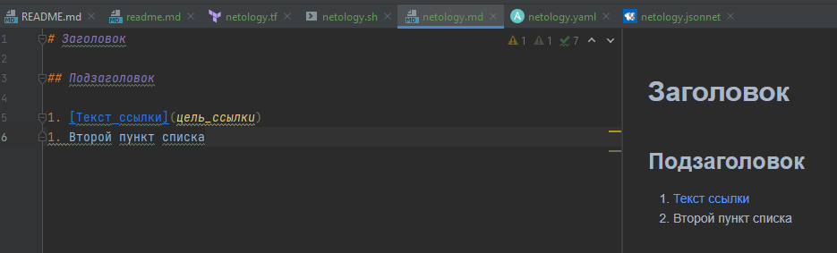
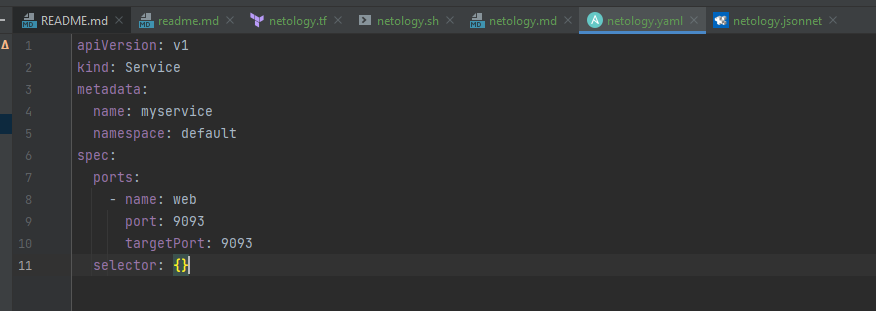
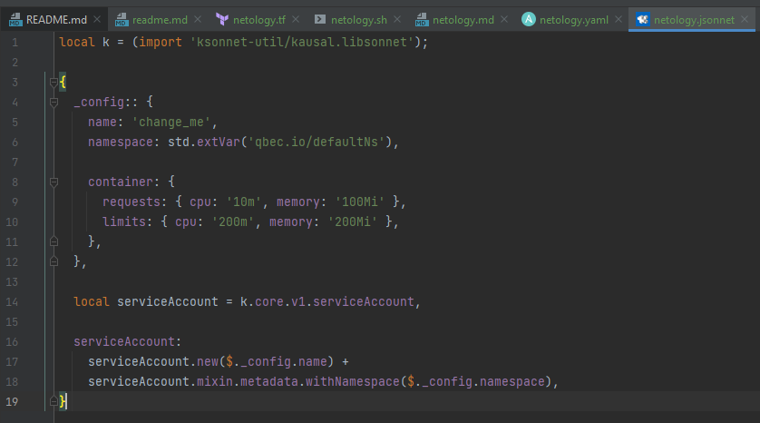

# Домашнее задание к занятию "Введение в DevOps"

## Выполнил Шарафуков Ильшат

1. Задание №1.
Установить Pycharm Community Edition cо следующими плагинами:

Terraform: 

Bash: 

Markdown: 

Yaml: 

Jsonnet: 

2. Задание №2.

Описание жизненного цикла задачи(разработка нового функционала).

Перед началом разработки нового функционала ПО необходимо получить техническое задание
от заказчика, которое должно содержать описание требуемого функционала и так же возможное 
видение реализации от заказчика.

После получения ТЗ тех команда, состоящая из разработчиков, тестировщиков и девопс инженеров 
разрабатывает проект. 

Далее идет процесс непосредственно разработки нового функционала ПО, который в свою очередь 
может следовать одному из нескольких подходов к разработке, например Agile.

В процессе разработки код проходит тесты от команды тестировщиков и в случае
выявления ошибок возвращается на доработку команде разработичиков.

Параллельно с этим команда DevOps инженеров готовит (создает\удаляет) инфраструктуру,
на которой будет работать разрабатываемый код. 

В конце данного процесса написанный код проходит интеграционное тестирование и далее отдается
в "прод" по согласованию с заказчиком. 

После этого на протяжении согласованного с заказчиком промежутка времени происходит эксплуатация\поддежка 
разработанного решения.
