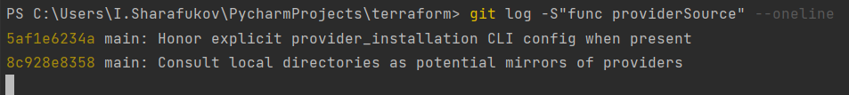
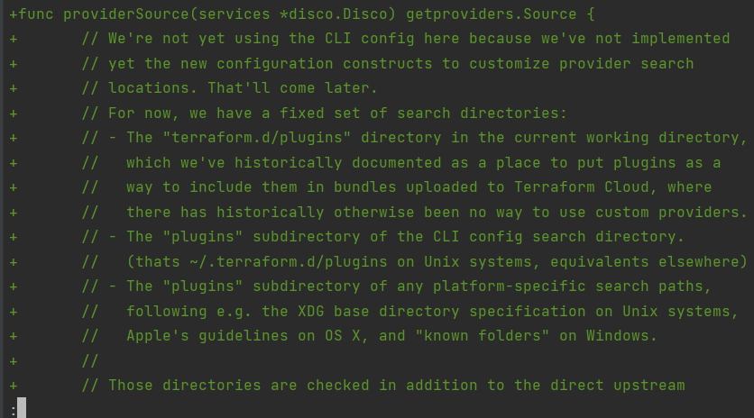
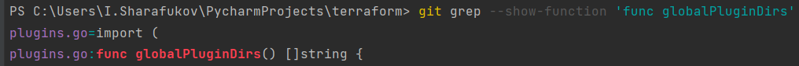
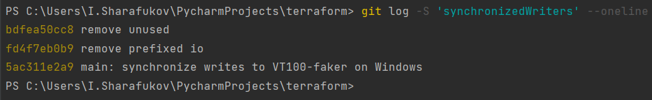

## Домашнее задание к занятию «2.4. Инструменты Git»

1. commit aefead2207ef7e2aa5dc81a34aedf0cad4c32545

BUG FIXES:
 * backend/s3: Prefer AWS shared configuration over EC2 metadata credentials by default ([#25134](https://github.com/hashicorp/terraform/issues/25134))
 * backend/s3: Prefer ECS credentials over EC2 metadata credentials by default ([#25134](https://github.com/hashicorp/terraform/issues/25134))
 * backend/s3: Remove hardcoded AWS Provider messaging ([#25134](https://github.com/hashicorp/terraform/issues/25134))
+* command: Fix bug with global -v/-version/--version flags introduced in 0.13.0beta2 [GH-25277]
 * command/0.13upgrade: Fix 0.13upgrade usage help text to include options ([#25127](https://github.com/hashicorp/terraform/issues/25127))
 * command/0.13upgrade: Do not add source for builtin provider ([#25215](https://github.com/hashicorp/terraform/issues/25215))
 * command/apply: Fix bug which caused Terraform to silently exit on Windows when using absolute plan path ([#25233](https://github.com/hashicorp/terraform/issues/25233))

2. v0.12.23

3. Это мерж коммит, у него 2 родителя. Хеши данных коммитов 56cd7859e0 9ea88f22fc

4. 

33ff1c03bb (tag: v0.12.24) v0.12.24

b14b74c493 [Website] vmc provider links

3f235065b9 Update CHANGELOG.md

6ae64e247b registry: Fix panic when server is unreachable

5c619ca1ba website: Remove links to the getting started guide's old location

06275647e2 Update CHANGELOG.md

d5f9411f51 command: Fix bug when using terraform login on Windows

4b6d06cc5d Update CHANGELOG.md

dd01a35078 Update CHANGELOG.md

225466bc3e Cleanup after v0.12.23 release

5. Хеш коммита, в котором была создана данная функция 8c928e83589d90a031f811fae52a81be7153e82f

git log -S"func providerSource"

Вывод команды  git log -S

Вывод команды git show 8c928e8358

6. 
Хеши коммитов, в которых изменялась данная функция. 
78b1220558
52dbf94834
41ab0aef7a 
66ebff90cd 
8364383c35 

Я нашел файл в котором изменялась данная функция с помощью команды git grep --show-function 'func globalPluginDirs'

После этого произвел поиск коммитов, в котором изменялась данная функция в данном файле

git log -L :globalPluginDirs:plugins.go --oneline

7.
Сначала я нашел коммиты, в которых менялась данная функция с помощью git log

После этого я посмотрел самый первый коммит 5ac311e2a9, в котором данная функция была добавлена.
Автор этой функции (этого коммита):
Martin Atkins <mart@degeneration.co.uk>