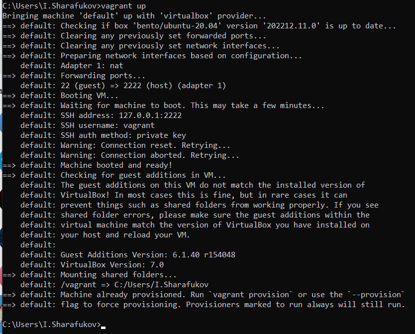
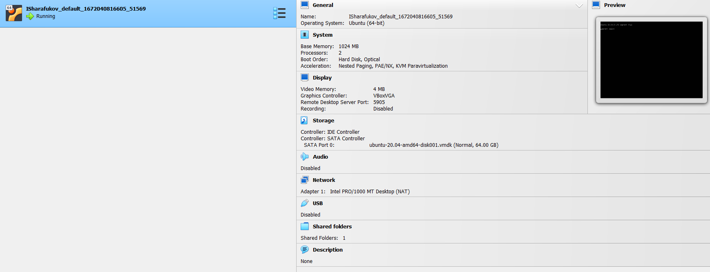
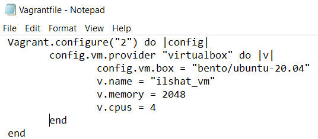
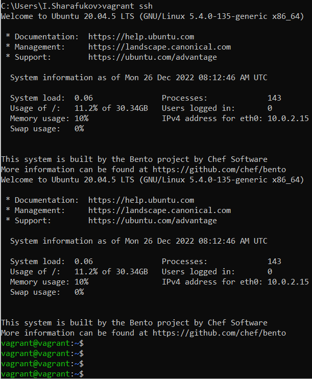
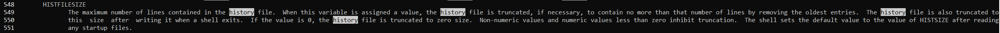
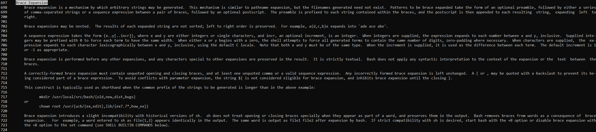
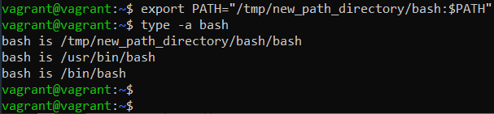

# Домашнее задание к занятию "3.1. Работа в терминале. Лекция 1"

## Выполнил Шарафуков Ильшат

1. 
2. По умолчанию для ВМ выделены следующие ресурсы: 2 CPU, 1G RAM, жесткий диск на 64G

3. Чтобы изменить харатеристики ВМ, такие как количество RAM или CPU необходимо поправить конфиг файл vagrantfile 
и перезапустить ВМ: vagrant halt -> vagrant up. ВМ будет запущена с новым названием и характеристиками.

4. Через vagrant ssh провалился в shell ВМ

5. За длину журнала history отвечает переменная HISTFILESIZE. Это описывается в мане, в строчках 548-551. 

Директива ignoreboth сочетает в себе 2 опции: 
* ignorespace — позволяет не сохранять строки, начинающиеся с символа пробел
* ignoredups — позволяет не сохранять строки, совпадающие с последней выполненной командой
6. Фигурные скобки {} применимы в сценариях, когда необходимо однократно создать много файлов с примерно одинаковым названием.
Это описывается в разделе EXPANSION -> Brace Expansion, на строчках 697 - 724.

7. Создать множество файлов однократным вызовом можно следующим образом:
* touch my_file_{1..100000}.txt
Создать такое количество файлов не представляется возможным, как и 300000, потому что для bash количество аргументов слишком большое и при попытке создания мы получаем следующую ошибку:
-bash: /usr/bin/touch: Argument list too long
Насколько я понял, это ограничение ядра. Было бы здорово, если бы вы дали маленькое пояснение по этому вопросу.
8.  Возвращает True, если каталог /tmp существует.
9. Команды, которые потребовались для выполнения задания:

mkdir -p /tmp/new_path_directory/bash
cp /usr/bin/bash /tmp/new_path_directory/bash
export PATH="/tmp/new_path_directory/bash:$PATH"

10. at и batch. 
at используется для назначения одноразового задания в указанное время.
batch используется для назначения одноразового задания, которые должны выполняться когда загрузка системы становится ниже определенного значения.
11. Отключил через vagrant halt
