# Домашнее задание к занятию "3.2. Работа в терминале. Лекция 2"

## Выполнил Шарафуков Ильшат

1. ### Какого типа команда cd? Попробуйте объяснить, почему она именно такого типа: опишите ход своих мыслей, если считаете, что она могла бы быть другого типа.

Команда CD является встроенной в shell, то есть данная команда вызывается (исполняется) напрямую в командной оболочке.
Соответственно при запуске данной команды вызывается новый процесс, который является дочерним по отношению к родительскому (изначальному, относительно этого процесса).
Если команду CD делать внешней, то при запуске будет запускаться новый процесс, который будет являться независимым, со своими файловыми дескрипторами и проч. Это значит, что если cd будет являться внешней программой, то она будет менять директорию только в рамках нового процесса, а в текущем shell все будет оставаться без изменений. 

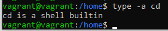

2. ### Какая альтернатива без pipe команде grep <some_string> <some_file> | wc -l?

Аналогом команды grep <some_string> <some_file> | wc -l будет являться команда:

* grep -c <some_string> <some_file>. В данном случае ключ -c считает количество совпадений

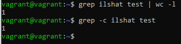

### 3.  Какой процесс с PID 1 является родителем для всех процессов в вашей виртуальной машине Ubuntu 20.04?

Процесс с PID 1:

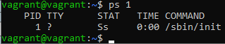

Это программа init, которая является первым пользовательским процессом. Она запускается ядром системы. 
Данная программа выполняет настройку окружения пользователя.

### 4. Как будет выглядеть команда, которая перенаправит вывод stderr ls на другую сессию терминала?

Я ввел команду ls с несуществующим ключом и отправил поток вывода в другую сессию терминала следующим образом:

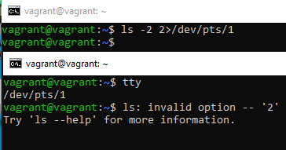

### 5. Получится ли одновременно передать команде файл на stdin и вывести ее stdout в другой файл? Приведите работающий пример.

С помощью конструкции представленной на скриншоте ниже я передал команде файл на stdin и перенаправил stdout в другой файл

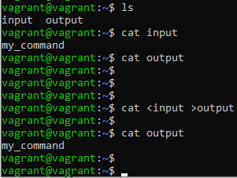

### 6. Получится ли, находясь в графическом режиме, вывести данные из PTY в какой-либо из эмуляторов TTY? Сможете ли вы наблюдать выводимые данные?

Я зашел в консоль созданной ВМ в virtualbox и перенаправил вывод команды из PTY в TTY:

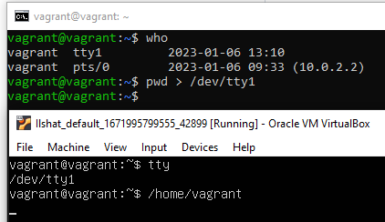

### 7. Выполните команду bash 5>&1. К чему она приведет? Что будет, если вы выполните echo netology > /proc/$$/fd/5? Почему так происходит?

При выполнении команды bash 5>&1 будет создан файловый дескриптор под номером 5, далее он будет перенаправлен в stdout.

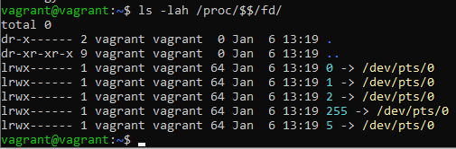

Если мы выполним echo netology > /proc/$$/fd/5, то вывод будет направлен в текущее окно терминала:

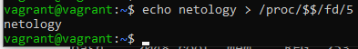

### 8. Получится ли в качестве входного потока для pipe использовать только stderr команды, не потеряв при этом отображение stdout на pty?

bash 100>&2

ls -lah /root/ 2>&1 1>&100 | grep cannot

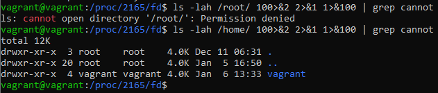

Создали файловый дескриптор (ФД) под номером 100, перенаправили его в stderr, после этого перенаправляем stderr в stdout и в конце направляем stdout в новый ФД под номером 100

### 9. Что выведет команда cat /proc/$$/environ? Как еще можно получить аналогичный по содержанию вывод?

Данная команда выведет переменные текущего окружения, поскольку мы читаем файл нашего текущего процесса, о чем говорит данный символ $$. Аналогичный по содержанию вывод можно получить с помощью команды env, которая так же показывает переменные с которыми запускается окружение.

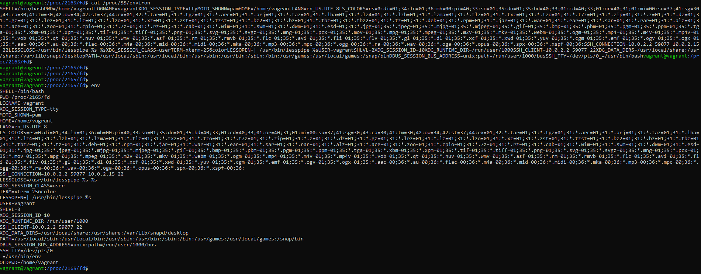

### 10. Используя man, опишите что доступно по адресам /proc/<PID>/cmdline, /proc/<PID>/exe.

* /proc/[pid]/cmdline содержит полную командную строку для процессов, которые не являются зомби процессами.
* /proc/[pid]/exe - символьная ссылка, которая содержит полное имя исполняемого файла.

### 11. Узнайте, какую наиболее старшую версию набора инструкций SSE поддерживает ваш процессор с помощью /proc/cpuinfo. 

Наиболее старшая версия набора инструкций SSE - sse4_2

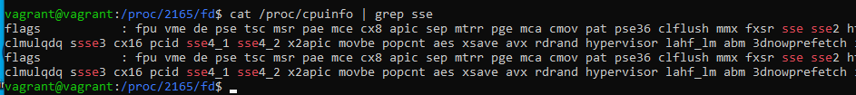

### 12. "При открытии нового окна терминала и vagrant ssh создается новая сессия и выделяется pty.
Это можно подтвердить командой tty, которая упоминалась в лекции 3.2.
Однако:

vagrant@netology1:~$ ssh localhost 'tty'

not a tty

Почитайте, почему так происходит, и как изменить поведение."

Так происходит потому что при отправлении команды 'tty' через ssh не создается pty и соответственно не происходит запуск командной оболочки для выполнения этой команды.
Изменить данное поведение можно с помощью ключа '-t'

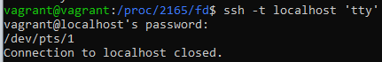

### 13. Бывает, что есть необходимость переместить запущенный процесс из одной сессии в другую. Попробуйте сделать это, воспользовавшись reptyr. Например, так можно перенести в screen процесс, который вы запустили по ошибке в обычной SSH-сессии.

Открыл htop, отправил его в фон через CTRL+Z в фон. Посмотрел номер процесса через ps auxf | grep htop
Получил номер процесса 3114.
Далее я отвязал процесс 3114 от родительского процесса через disown 3114.
После этого я открыл новую сессию в screen и внутри этой сессии выполнил reptyr 3114. Мой htop перешел в эту screen сессию

### 14. sudo echo string > /root/new_file не даст выполнить перенаправление под обычным пользователем, так как перенаправлением занимается процесс shell'а, который запущен без sudo под вашим пользователем. Для решения данной проблемы можно использовать конструкцию echo string | sudo tee /root/new_file. Узнайте? что делает команда tee и почему в отличие от sudo echo команда с sudo tee будет работать.

tee перенаправляет выходные данные команд в один или несколько файлов. 
Конструкция с sudo tee будет работать, потому что это внешняя по отношению к командной оболочке программа и она запускается под sudo, то соответственно у неё есть права на исполнение

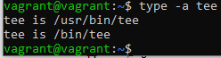