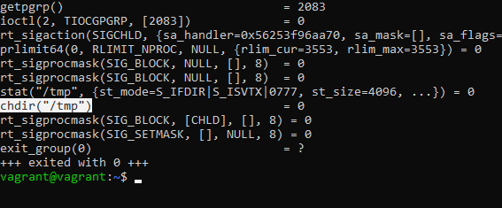
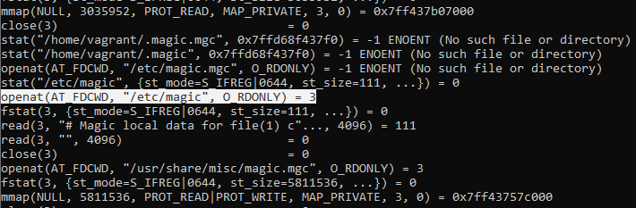

# Домашнее задание к занятию "3.3. Операционные системы. Лекция 1"

## Выполнил Шарафуков Ильшат

1. Команда 'cd' делает системный вызов chdir. 

2. Программа file работает с конфигурационным файлом, расположенным в /etc/magic. Данный файл содержит описания различных форматов файлов, опираясь на которые данная команда определяет тип файла.

3. Через lsof можно посмотреть какой файловый дескриптор использует приложение для записи в файл и сделать 'echo 0 > /proc/2343/fd/4' (FD взят для примера, а 2343 номер процесса который использует приложение)

4. Зомби процессы при завершении освобождают используемые ресурсы, но остаются пустой записью в таблице процессов. Зомби процесс хранит статус завершения, предназначенный для чтения родительским процессом.

5. 

6. Команда uname -a делает системный вызов uname(). Альтернативное местоположение:

* Part of the utsname information is also accessible via /proc/sys/kernel/{ostype, hostname, osrelease, version, domainname}

7. Точка с запятой позволяет записывать две и более команд в одной строке, не влияя на ход выполнения программы. Служебные символы && означают логическое 'and'. То есть команда записанная через && будет выполнена только тогда, когда предыдущая команда выполнится успешно. 
Например: 
* $ command one && command two
Команда 2 выполнится только если команда 1 выполнится успешно.

set -e прерывает выполнение программы, если код выхода команды ненулевой. 

Смысла применять && в скриптах bash совместно с set -e не имеет смысла, потому что скрипт будет прерывать работу при первой обнаруженной ошибке в ходе выполнения.

8. set -euxo pipefail

* -e : скрипт завершает работу, если любая команда выйдет с ошибкой
* -u : оболочка проверяет, определены ли переменные используемые в скрипте. если переменной не будет, скрипт завершится.
* -x : bash печатает в вывод все команды перед их исполнением
* -o pipefail : в отличие от ключа '-e' данный ключ проверяет что все команды завершились успешно

Данные параметры нужно использовать в скриптах для увеличения безопасности при исполнении кода, например bash в отличие от высокоуровневых ЯП не будет завершать работу программы при обнаружении неинициализированной переменной.

9. Самые часто встречающиеся статусы процессов:

* S,s,l > (они комбинируются между собой)
* I, > (так же комбинируются между собой)

