# Домашнее задание к занятию "3.4. Операционные системы. Лекция 2"

## Выполнил Шарафуков Ильшат

### 1. Установите node_exporter и произведите с ним следующие манипуляции:

    * поместите его в автозагрузку,
    * предусмотрите возможность добавления опций к запускаемому процессу через внешний файл (посмотрите, например, на `systemctl cat cron`),
    * удостоверьтесь, что с помощью systemctl процесс корректно стартует, завершается, а после перезагрузки автоматически поднимается.

Установил node_exporter, создал простой unit file.

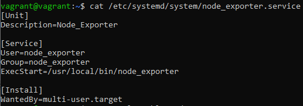

Процесс был добавлен в автозагрузку. Процесс корректно стартует после ручной остановки и после перезагрузки (скриншот 1_2 и 1_3)

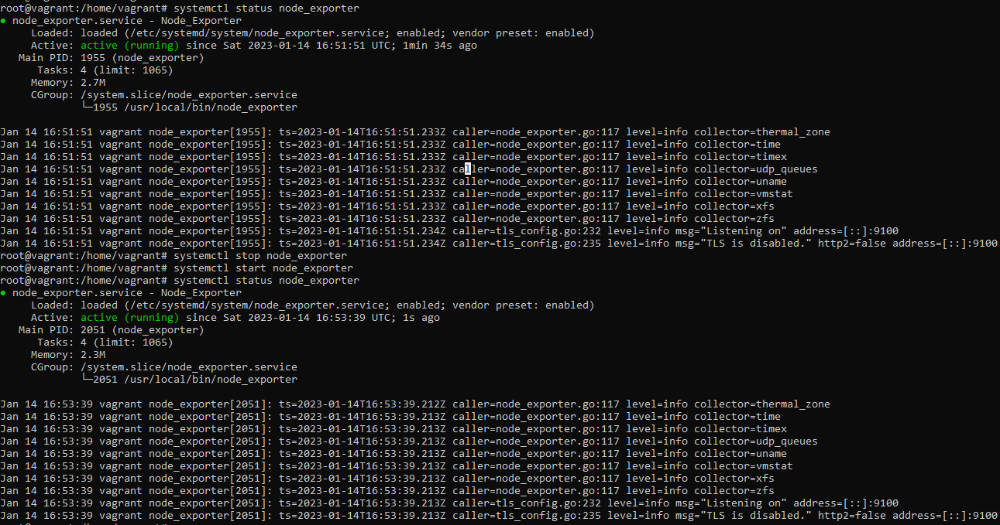

Процесс после рестарта ВМ:

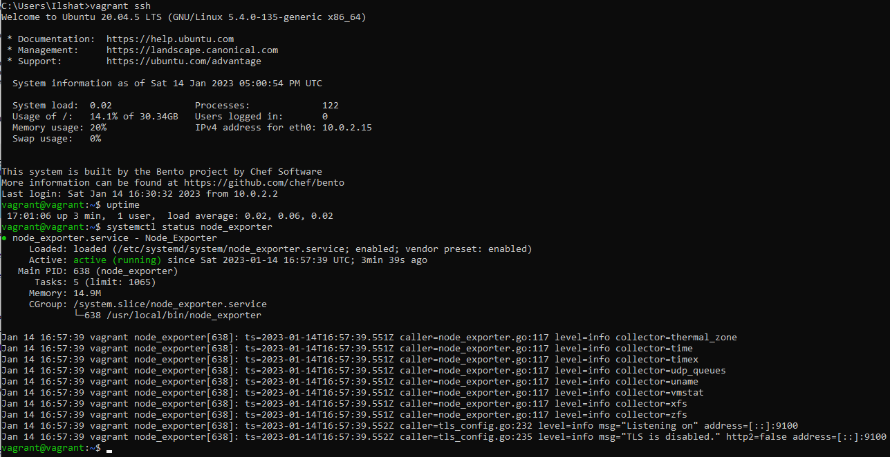

### 2. Ознакомьтесь с опциями node_exporter и выводом /metrics по-умолчанию. Приведите несколько опций, которые вы бы выбрали для базового мониторинга хоста по CPU, памяти, диску и сети.

В выводе /metrics представлено множество параметров. Для базового мониторинга я бы использовал следующие:

* 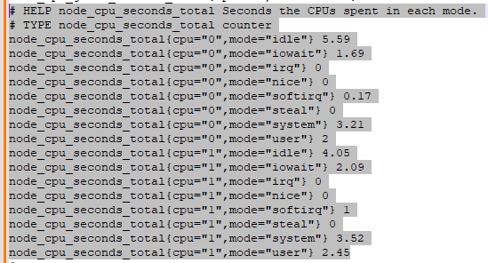
* 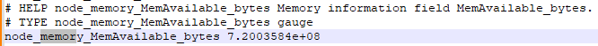
* 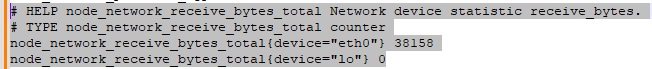
* 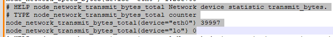
* 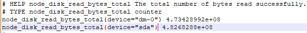
* 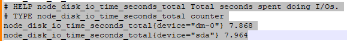

### 3. Установите netdata, пробросьте порт из virtualbox на localhost 

Установил netdata, пробросил порт, ознакомился с метриками.

* 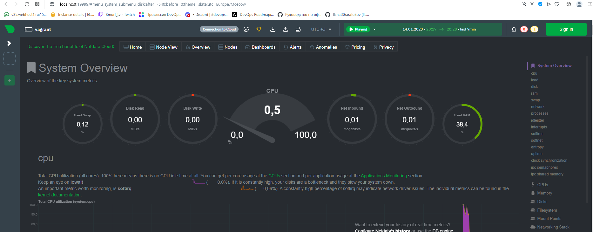

### 4. Можно ли по выводу dmesg понять, осознает ли ОС, что загружена не на настоящем оборудовании, а на системе виртуализации?

На основании вывода команды dmesg -H можно сделать вывод, что ОС запускается на системе виртуализации

* 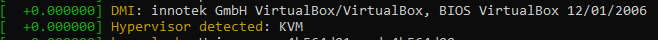

### 5. Как настроен sysctl fs.nr_open на системе по-умолчанию? Определите, что означает этот параметр. Какой другой существующий лимит не позволит достичь такого числа (ulimit --help)?

fs.nr_open - жесткое ограничение на количество открытых файловых дескрипторов для каждого отдельного процесса

* 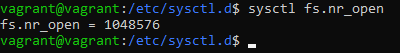

Далее мы можем увидеть максимальное число файловых дескрипторов (92233...):

* 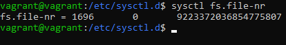

С помощью команды ulimit с ключами -S и -H мы можем получить мягкое и жесткое ограничение по числу ФД для каждого отдельного процесса:

* 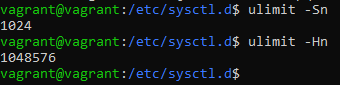

Иначе говоря, пользователь не сможет занять больше 1024 ФД, но это ограничение можно увеличить. Однако конечное число ФД не может превышать жесткое ограничение указанное на скриншоте.
Надеюсь я все правильно описал

### 6. Запустите любой долгоживущий процесс (не ls, который отработает мгновенно, а, например, sleep 1h) в отдельном неймспейсе процессов; покажите, что ваш процесс работает под PID 1 через nsenter. Для простоты работайте в данном задании под root (sudo -i). Под обычным пользователем требуются дополнительные опции (--map-root-user) и т.д.

Запустил отдельную командную оболочку bash с помощью команды 'unshare -f --pid --mount-proc /bin/bash'

После этого запустил sleep 1h

Вижу что мой процесс живет изолированно в рамках PID

* 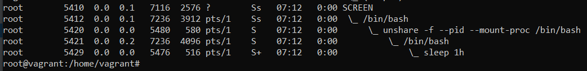
* 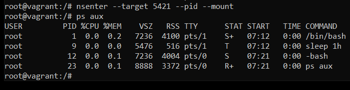

### 7. Найдите информацию о том, что такое :(){ :|:& };:. Запустите эту команду в своей виртуальной машине Vagrant с Ubuntu 20.04 (это важно, поведение в других ОС не проверялось). Некоторое время все будет "плохо", после чего (минуты) – ОС должна стабилизироваться. Вызов dmesg расскажет, какой механизм помог автоматической стабилизации. Как настроен этот механизм по-умолчанию, и как изменить число процессов, которое можно создать в сессии?

* [349447.074041] cgroup: fork rejected by pids controller in /user.slice/user-1000.slice/session-111.scope

Данный процесс помог в восстановлении системы при запуске указанного скрипта 

Насколько я понимаю, увеличить лимит форкнутых (запущенных процессов) можно вот тут:

* 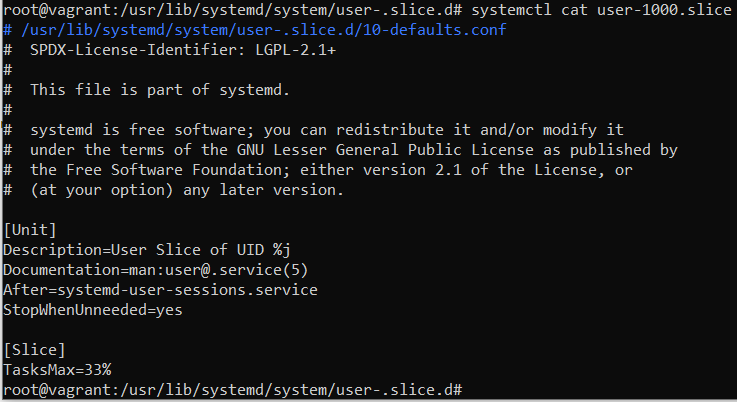