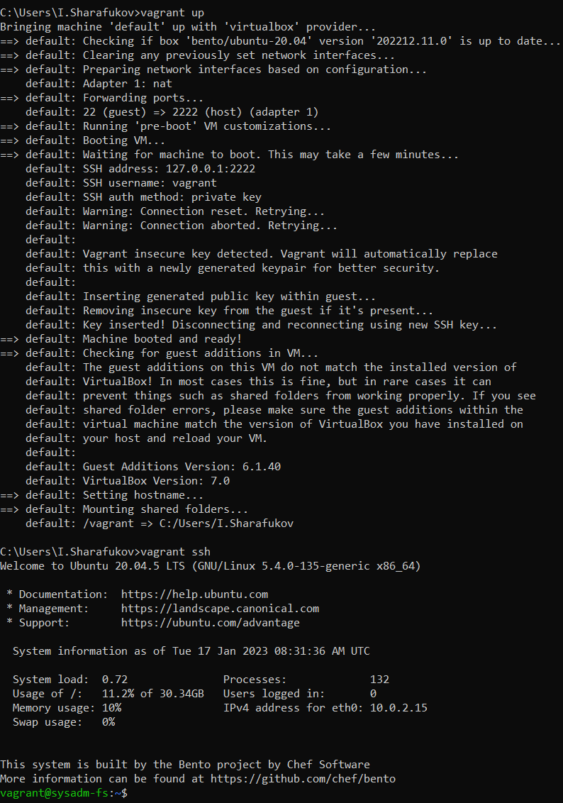
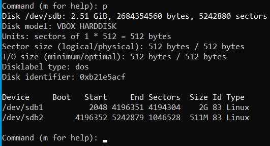
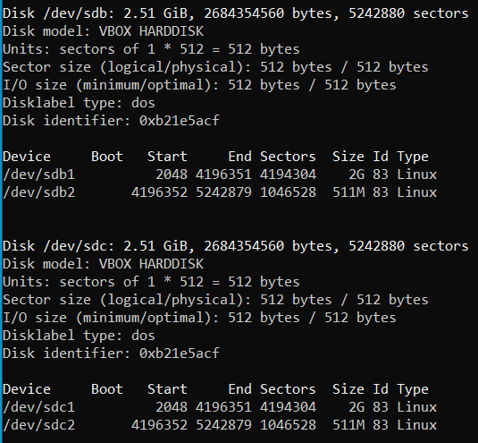
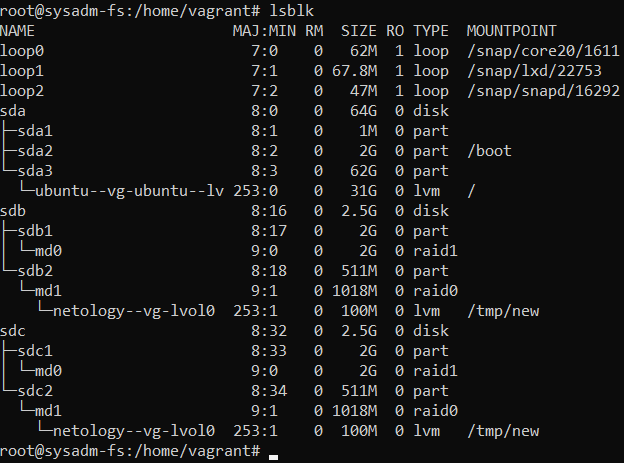
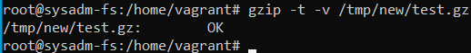
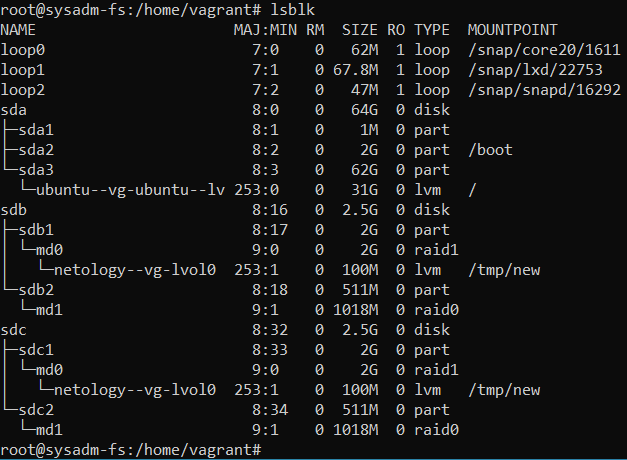
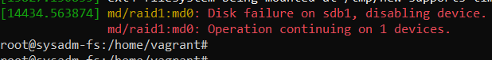
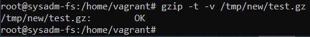

# Домашнее задание к занятию "3.5. Файловые системы"

## Выполнил Шарафуков Ильшат

### 1. Узнайте о sparse (разряженных) файлах.

Разрежённый файл (англ. sparse file) — файл, в котором последовательности нулевых байтов заменены на информацию об этих последовательностях (список дыр).
https://ru.wikipedia.org/wiki/Разрежённый_файл#:~:text=Разрежённый%20файл%20(англ.,этих%20последовательностях%20(список%20дыр).

2. ### Могут ли файлы, являющиеся жесткой ссылкой на один объект, иметь разные права доступа и владельца? Почему?

Жесткие ссылки ссылаются на один и тот же inode, поэтому изменение прав только для линкованого файла невозможно. 

3. Пересоздал ВМ с указанными параметрами. 

4.  ### Используя fdisk, разбейте первый диск на 2 раздела: 2 Гб, оставшееся пространство.

* Создал 2 партиции на диске /dev/sdb/ размером 2G и 500Mb с помощью утилиты fdisk: 
* * fidisk --list  - выбрал диск, который хочу разметить. В данном случае /dev/sdb
* * fdisk /dev/sdb - открываю fdisk в интерактивном режиме для выбранного диска
* * n - новая партиция
* * p - тип партиции (primary)
* * 1 - номер партиции 
* * 2048 - первый сектор
* * +2G - последний сектор 
* * n - новая партиция 
* * p - тип партиции (primary)
* * 2 - номер партиции 
* * +511M - последний сектор 
* * p - сохранить изменения на диске

5. ### Используя sfdisk, перенесите данную таблицу разделов на второй диск.

* * sfdisk -d /dev/sdb - выводит информацию о партициях в формате, который можно передать на вход команды sfdisk для копирования партиций. 
* * sfdisk -d /dev/sdb | sfdisk /dev/sdc - копируем партиции с диска /sdb/ на диск /sdc/

6. ### Соберите mdadm RAID1 на паре разделов 2 Гб.

* * mdadm --create --verbose /dev/md0 --level=1 --raid-devices=2 /dev/sdb1 /dev/sbc1 - создал программый raid-1 с использованием двух дисков.

7. ### Соберите mdadm RAID0 на второй паре маленьких разделов.

* * mdadm --create --verbose /dev/md1 --level=0 --raid-devices=2 /dev/sdb2 /dev/sbc2 - создал программый raid-0 с использованием двух дисков.

8. ### Создайте 2 независимых PV на получившихся md-устройствах.

* * pvcreate /dev/md0 - создал PV
* * pvcreate /dev/md1 - создал PV

9. ### Создайте общую volume-group на этих двух PV.

* * vgcreate netology-vg /dev/md0 /dev/md1 - создал общую VG с использованием двух PV

10. ### Создайте LV размером 100 Мб, указав его расположение на PV с RAID0.

* * lvcreate -L 100M netology-vg /dev/md1 

11. ### Создайте mkfs.ext4 ФС на получившемся LV.

* * lvcreate -L 100M netology-vg /dev/md1 

12. ### Смонтируйте этот раздел в любую директорию, например, /tmp/new.

* * mount /dev/netology-vg/lvol0 /tmp/new/

13. ### Поместите туда тестовый файл, например wget https://mirror.yandex.ru/ubuntu/ls-lR.gz -O /tmp/new/test.gz.

Скопировал.

14. ### Прикрепите вывод lsblk

15. ### Протестируйте целостность файла

16. ### Используя pvmove, переместите содержимое PV с RAID0 на RAID1.

* * pvmove /dev/md1 /dev/md0 

17. ### Сделайте --fail на устройство в вашем RAID1 md.

* * mdadm --fail /dev/md0 /dev/sdb1 

18. ### Подтвердите выводом dmesg, что RAID1 работает в деградированном состоянии.

19. ### Протестируйте целостность файла, несмотря на "сбойный" диск он должен продолжать быть доступен

20. ### Погасите тестовый хост, vagrant destroy.

Отключил ВМ.