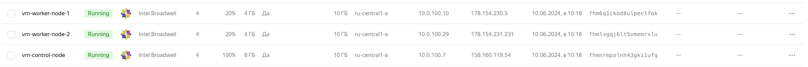
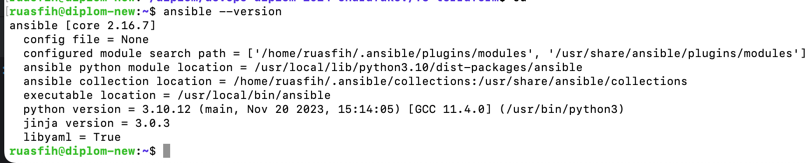
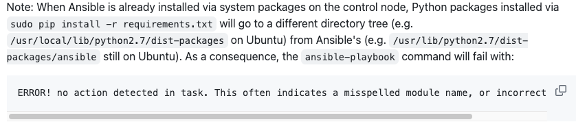
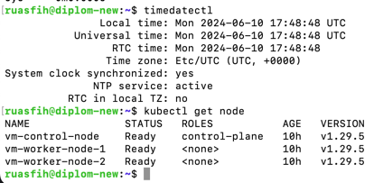
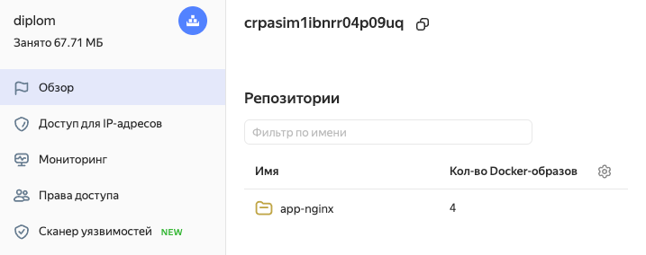
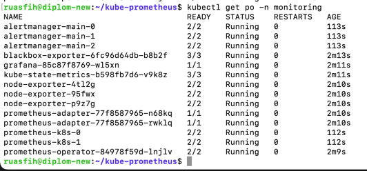
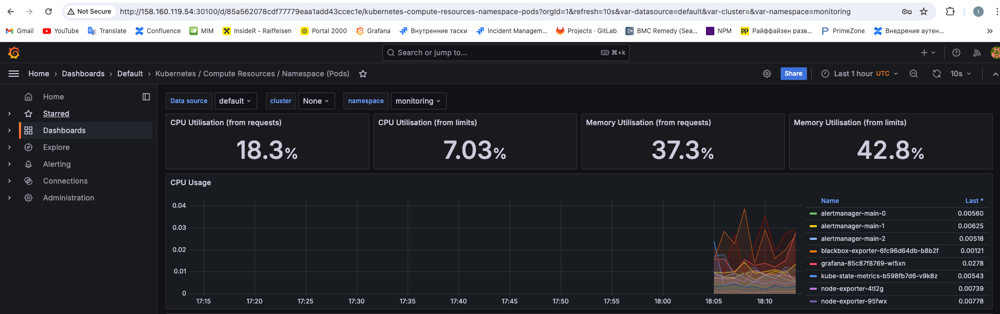
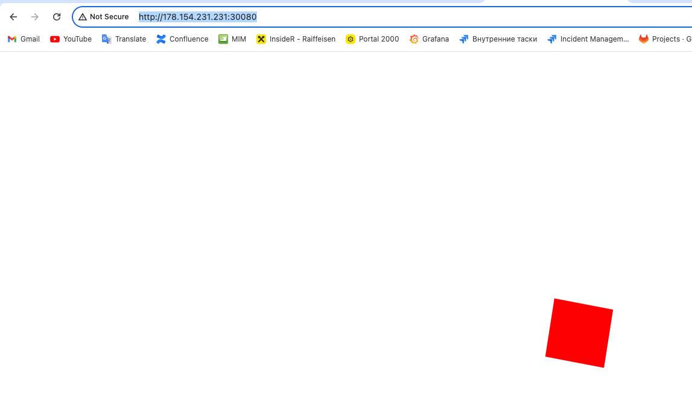
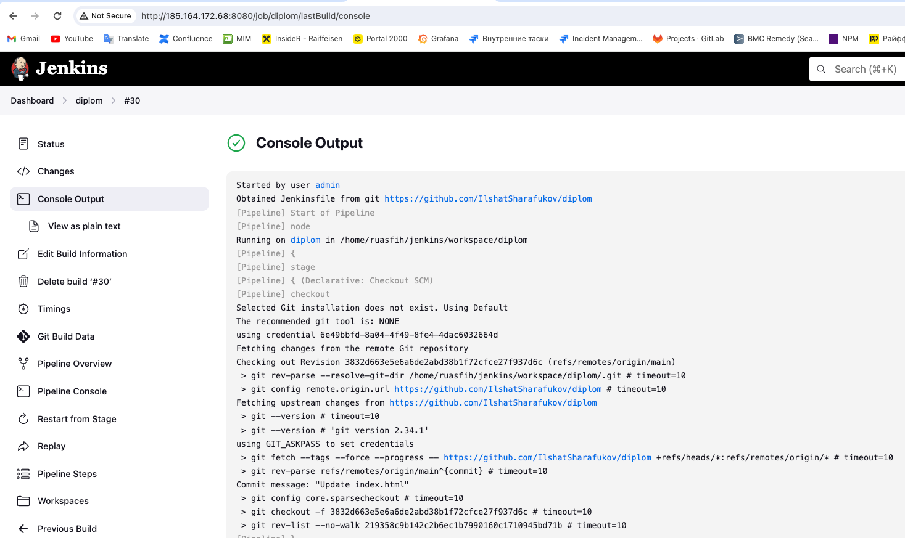
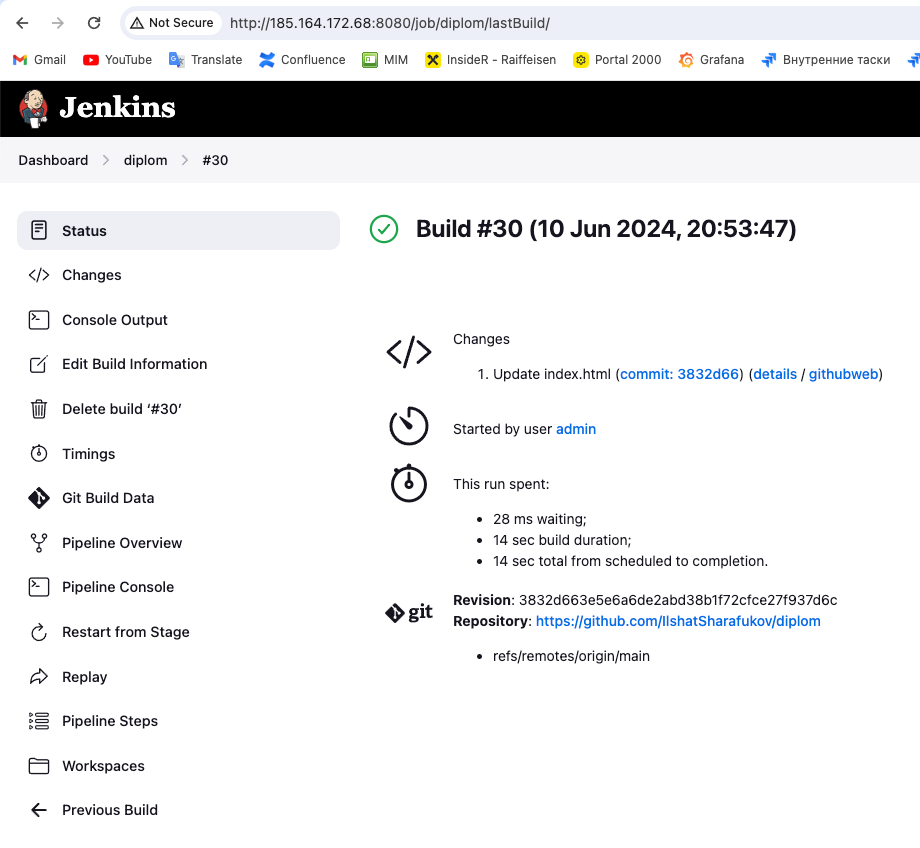

# Дипломный практикум в Yandex.Cloud 

### Выполнил Шарафуков Ильшат

## Задание на [дипломный практикум](https://github.com/netology-code/devops-diplom-yandexcloud)

Этапы выполнения:

1) Создание облачной инфраструктуры при помощи Terraform.
2) Создание Kubernetes кластера
3) Создание тестового приложения
4) Подготовка cистемы мониторинга и деплой приложения
5) Установка и настройка CI/CD

## Выполнение практикума

### Создание облачной инфраструктуры при помощи Terraform.

1) Манифест для создания  [сервисного аккаунта](terraform/sa.tf)

2) Манифест для создания [S3 bucket](terraform/bucket.tf)

3) Манифест для создания [VPC и подсетей](terraform/vpc.tf)

4) Основной манифест для создания [инфраструктуры](terraform/main.tf)

Для изменения входных данных, необходимо внести изменения в [variables.tf](terraform/variables.tf)

После создания всех манифестов, развернул необходимую для выполнения задания инфраструктуру в облаке:



### Подготовка к созданию Kubernetes кластера

На управляющей ВМ установил python3.10 и ansible 2.16.7:



Были проблемы с корректной работой ansible: если устанавливать ansible через стандартные пакетные медеждеры ВМ (например apt), то ansible с некоторыми плейбуками начинает работать "криво".
Данное поведение описывается в [репозитории kubespray](https://github.com/kubernetes-sigs/kubespray):


Чтобы этого не происходило, нужно устаналивать ansible через pip3.

```
pip3 install ansible
```

### Создание Kubernetes кластера.

1) Сделал клон репозитория [kubespray](https://github.com/kubernetes-sigs/kubespray)

    Внес изменения в файлы конфигурации
    
        В манифест inventory/sample/group_vars/all/all.yml
        kube_read_only_port: 10255

        В манифест inventory/sample/group_vars/k8s_cluster/k8s-cluster.yml
        kubelet_authentication_token_webhook: true
        kubelet_authorization_mode_webhook: true

2) Написал [шаблон](terraform/hosts.tftpl) для создания inventory файла через terraform после выполнения манифеста.

3) Дописал конфигурацию в [main](terraform/main.tf) блок для заполнения файла инвентори и запуска playbook'ов kubspray после выполнения манифеста и создания файла [hosts.ini](terraform/hosts.ini)

4) После завершения выполнения плейбуков зашел на control-node и переместил файл с конфигом в директорию ~/.kube/ и дал прав.
Это необходимо для возможности управления кластером через утилиту kubectl:

        mkdir -p $HOME/.kube
        sudo cp -i /etc/kubernetes/admin.conf $HOME/.kube/config
        sudo chown $(id -u):$(id -g) $HOME/.kube/config

5) Выписал сертификаты на публичный адрес для возможности удаленного администрирования кластером k8s с управляющей ВМ:



### Создание тестового приложения

1) Создал в новом репозитории [страничку](https://github.com/IlshatSharafukov/diplom/blob/main/html/index.html) c цветным крутящимся квадратиком по центру экрана. 
Цвет этого квадрата можно будет менять при тестах CI\CD. Там же оставил [dockerfile](https://github.com/IlshatSharafukov/diplom/blob/main/dockerfile).

2) Создал container registry в ЯО и запушил в него docker image:



### Подготовка cистемы мониторинга и деплой приложения

1)  Склонировал репозиторий с [kube-prometheus](https://github.com/prometheus-operator/kube-prometheus) и запустил соответствующий манифест:

        kubectl apply --server-side -f manifests/setup
         kubectl wait \
         	--for condition=Established \
         	--all CustomResourceDefinition \
         	--namespace=monitoring
         kubectl apply -f manifests/

Убедился что все поды нормально запустились:



2) Изменил type сервиса manifests/grafana-service.yaml на nodeport и указал порт внешного адреса 30100. Далее я удалил networkpolicy в NS monitoring чтобы у меня появился доступ:
```
kubectl -n monitoring delete networkpolicies.networking.k8s.io --all
```

Далее я проверил доступ до графаны и убедился что у меня собираются все нужные метрики:



3) Создал манифест для деплоя [тестового приложения](https://github.com/IlshatSharafukov/diplom/blob/main/deploy.yaml) и запустил [приложение](http://178.154.231.231:30080/)



### Установка и настройка CI/CD'

1) Развернул [jenkins](http://185.164.172.68:8080/) и jenkins agent, подцепил агента, создал SC Pipeline.

C установкой и эксплуатацией jenkins была очень большая проблема, а именно: из под сетей ЯО по какой-то причине не качались никакие обновления и плагины для jenkins.
Ошибка заключалась в том что jenkins не мог достучаться до серверов обновления и серверов где хранятся плагины. Вопрос решился тем, что я поднял jenkins ВНЕ сетей ЯО на отдельной виртуалке в коммерческом дата центре. Там все заработало без проблем.

2)  Написал [jenkinsfile](https://github.com/IlshatSharafukov/diplom/blob/main/Jenkinsfile), который собирает docker image и пушит в docker hub в яндекс облаке.





