# Домашнее задание к занятию 1 «Введение в Ansible»

## Выполнил Шарафуков Ильшат

### Задания (основная часть):

```
1. Попробуйте запустить playbook на окружении из test.yml, зафиксируйте значение, которое имеет факт some_fact для указанного хоста при выполнении playbook.

2. Найдите файл с переменными (group_vars), в котором задаётся найденное в первом пункте значение, и поменяйте его на all default fact.

3. Воспользуйтесь подготовленным (используется docker) или создайте собственное окружение для проведения дальнейших испытаний.

4. Проведите запуск playbook на окружении из prod.yml. Зафиксируйте полученные значения some_fact для каждого из managed host.

5. Добавьте факты в group_vars каждой из групп хостов так, чтобы для some_fact получились значения: для deb — deb default fact, для el — el default fact.

6. Повторите запуск playbook на окружении prod.yml. Убедитесь, что выдаются корректные значения для всех хостов.

7. При помощи ansible-vault зашифруйте факты в group_vars/deb и group_vars/el с паролем netology.

8. Запустите playbook на окружении prod.yml. При запуске ansible должен запросить у вас пароль. Убедитесь в работоспособности.

9. Посмотрите при помощи ansible-doc список плагинов для подключения. Выберите подходящий для работы на control node.

10. В prod.yml добавьте новую группу хостов с именем local, в ней разместите localhost с необходимым типом подключения.

11. Запустите playbook на окружении prod.yml. При запуске ansible должен запросить у вас пароль. Убедитесь, что факты some_fact для каждого из хостов определены из верных group_vars.

12. Заполните README.md ответами на вопросы. Сделайте git push в ветку master. В ответе отправьте ссылку на ваш открытый репозиторий с изменённым playbook и заполненным README.md.
```

### Ответы (основная часть):

1. Запустил playbook:

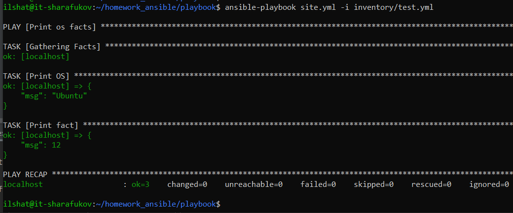

2. Поменял значение some_fact в директории group_vars/all/examp.yml

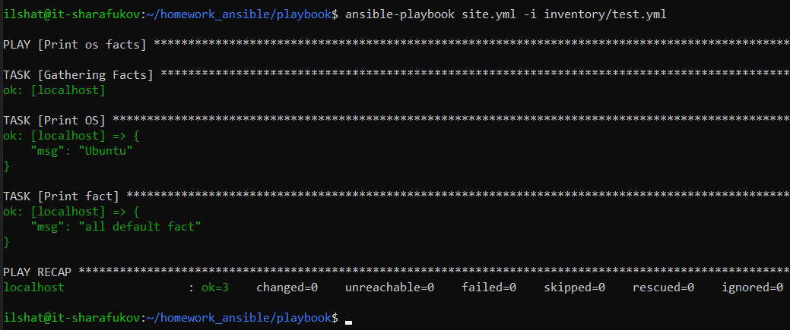

3. Подготовил окружение для дальнейшего выполнения заданий:

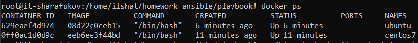

4. Запустил playbook на окружении prod.yml:

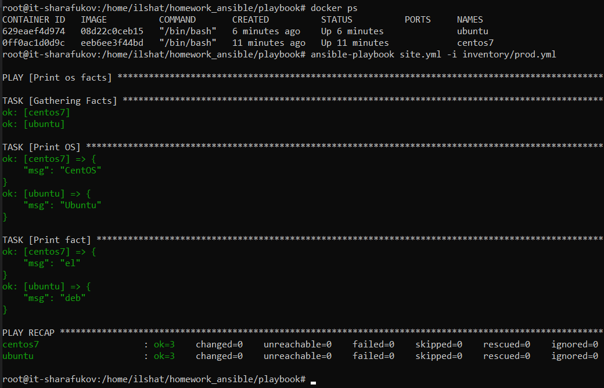

5 и 6. Изменил файлы examp.yml в group_vars для deb и el. После этого запустил playbook:

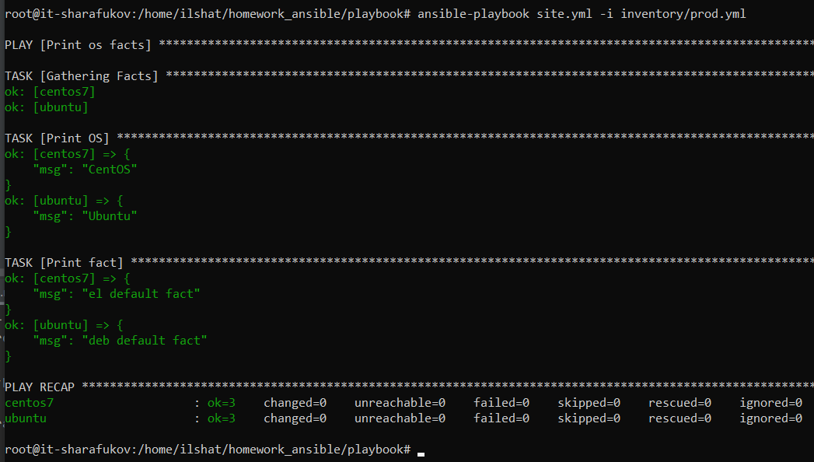

7. Зашифровал факты в двух указанных папках:

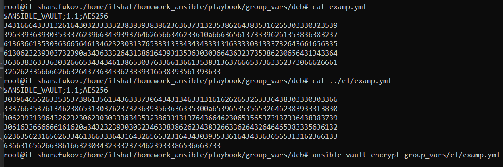

8. Убедился, что после шифрования фактов playbook запускается и отрабатывает:

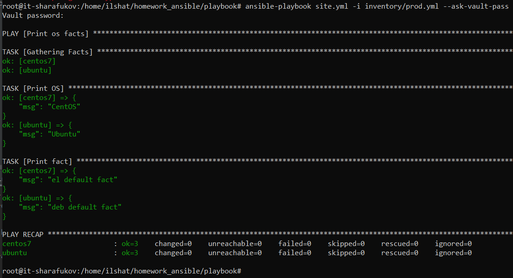

9. Плагин "local"

10. Добавил новую группу хостов с названием local и типом подключения local:

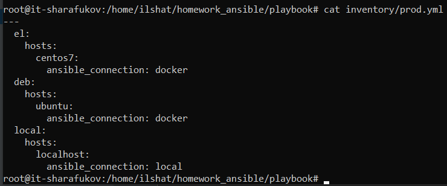

11. Запустил playbook и убедился в его работоспособности.

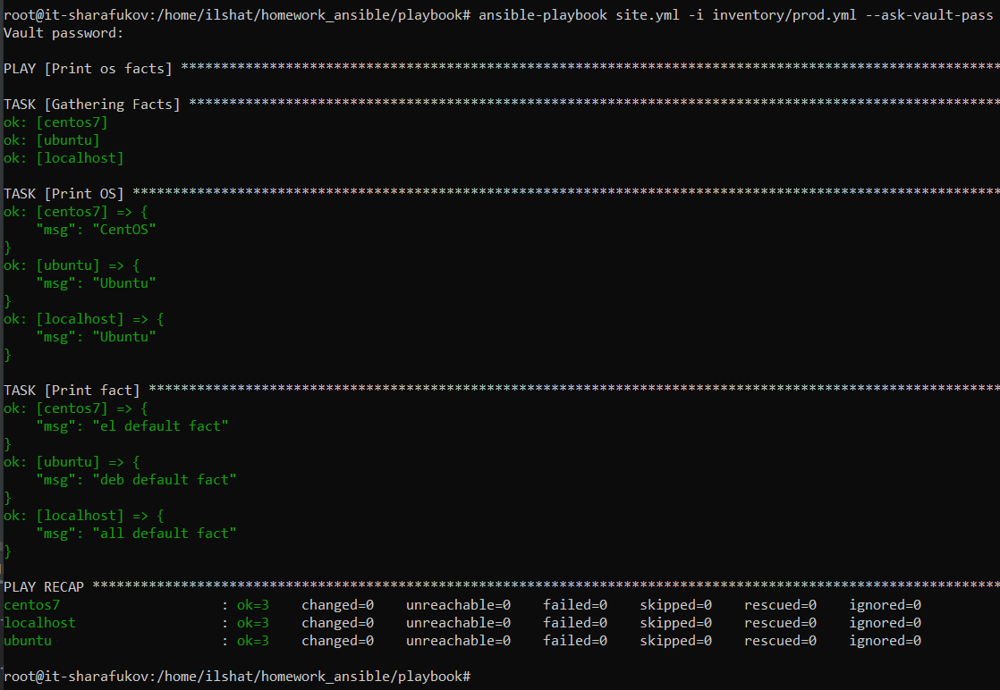

12. Заполнил readme.md ответами на вопросы.

### Задания (необязательная часть):

```
1. При помощи ansible-vault расшифруйте все зашифрованные файлы с переменными.

2. Зашифруйте отдельное значение PaSSw0rd для переменной some_fact паролем netology. Добавьте полученное значение в group_vars/all/exmp.yml.

3. Запустите playbook, убедитесь, что для нужных хостов применился новый fact.

4. Добавьте новую группу хостов fedora, самостоятельно придумайте для неё переменную. В качестве образа можно использовать этот вариант.

5. Напишите скрипт на bash: автоматизируйте поднятие необходимых контейнеров, запуск ansible-playbook и остановку контейнеров.

6. Все изменения должны быть зафиксированы и отправлены в ваш личный репозиторий.
```

### Ответы (необязательная часть):

1. Расшифровал все зашифрованные файлы с переменными. 

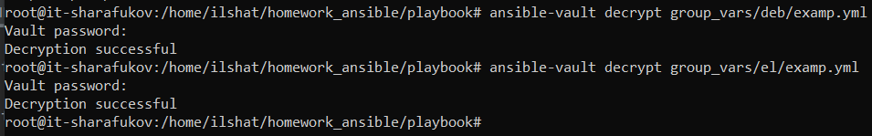

2. Зашифровал значение указанное в задании для переменной some_fact. Далее, добавил это значение в group_vars/all/exmp.yml

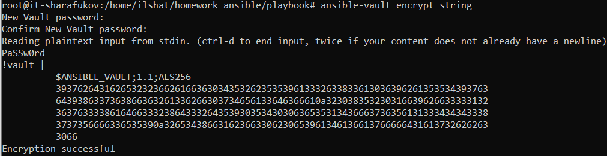

3. Запустил playbook, убедился что для нужных хостов применился новый fact. 

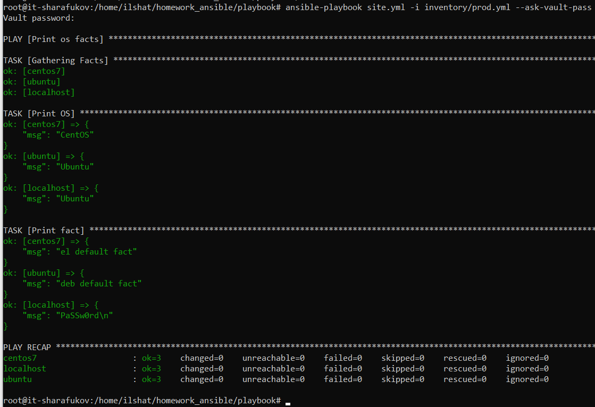

4. Создал новую группу хостов fedora, написал новую переменную для неё (папка group_vars/fedora_var)

5. Написал bash скрипт для автоматического поднятия контейнеров, запуска ansble и отключения контейнеров (скрипт bash.sh в папке /playbook/)

6. Отправил изменения в репозиторий