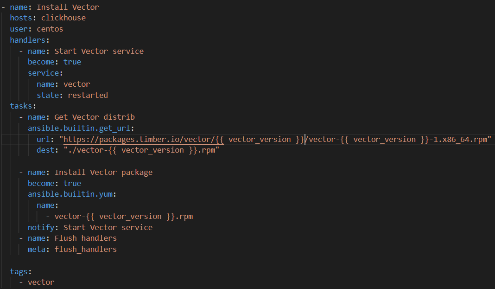

# Домашнее задание к занятию 2 «Работа с Playbook»

## Выполнил Шарафуков Ильшат

### Задания (основная часть):

```
Подготовьте свой inventory-файл prod.yml.
Допишите playbook: нужно сделать ещё один play, который устанавливает и настраивает vector.
При создании tasks рекомендую использовать модули: get_url, template, unarchive, file.
Tasks должны: скачать дистрибутив нужной версии, выполнить распаковку в выбранную директорию, установить vector.
Запустите ansible-lint site.yml и исправьте ошибки, если они есть.
Попробуйте запустить playbook на этом окружении с флагом --check.
Запустите playbook на prod.yml окружении с флагом --diff. Убедитесь, что изменения на системе произведены.
Повторно запустите playbook с флагом --diff и убедитесь, что playbook идемпотентен.
Подготовьте README.md-файл по своему playbook. В нём должно быть описано: что делает playbook, какие у него есть параметры и теги.
Готовый playbook выложите в свой репозиторий, поставьте тег 08-ansible-02-playbook на фиксирующий коммит, в ответ предоставьте ссылку на него.
```

### Ответы (основная часть):

1. Подготовил свой inventory-файл prod.yml


2. Дописал playbook для установки сервиса Vector:



3. При написании task использовал модуль get_url.

4. Task скачивает дистрибутив нужной версии, выполняет распаковку в выбранную директорию и устанавливает vector.

5. Запустил ansible-lint site.yml - ошибок не было обнаружено


6. Запустил playbook с флагом --check:


7. Запустил playbook с флагом --diff:


8. Повторно запустил playbook с флагом --diff. Убедился, что playbook идемпотентен. 

9. Подготовил readme.md файл с описанием playbook

10. Выложил playbook в свой репозиторий. 

