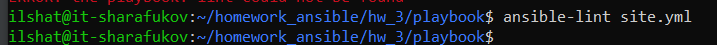
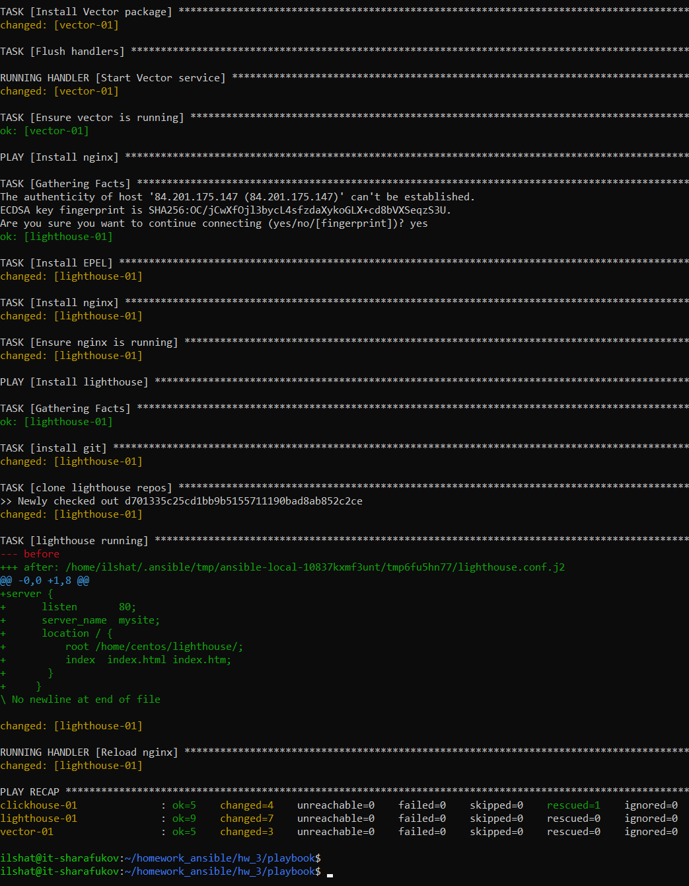

# Домашнее задание к занятию 3 «Использование Yandex Cloud»

## Выполнил Шарафуков Ильшат

### Подготовка к выполнению:

```
Подготовьте в Yandex Cloud три хоста: для clickhouse, для vector и для lighthouse.
Репозиторий LightHouse находится по ссылке.
```

### Основная часть:

```
Допишите playbook: нужно сделать ещё один play, который устанавливает и настраивает LightHouse.
При создании tasks рекомендую использовать модули: get_url, template, yum, apt.
Tasks должны: скачать статику LightHouse, установить Nginx или любой другой веб-сервер, настроить его конфиг для открытия LightHouse, запустить веб-сервер.
Подготовьте свой inventory-файл prod.yml.
Запустите ansible-lint site.yml и исправьте ошибки, если они есть.
Попробуйте запустить playbook на этом окружении с флагом --check.
Запустите playbook на prod.yml окружении с флагом --diff. Убедитесь, что изменения на системе произведены.
Повторно запустите playbook с флагом --diff и убедитесь, что playbook идемпотентен.
Подготовьте README.md-файл по своему playbook. В нём должно быть описано: что делает playbook, какие у него есть параметры и теги.
Готовый playbook выложите в свой репозиторий, поставьте тег 08-ansible-03-yandex на фиксирующий коммит, в ответ предоставьте ссылку на него.
```

### Ответы:

Дописал плейбук, создал 3 виртуальные машины в YC с помощью terraform. Вписал IP адреса в inventory файл. 

Проверка ошибок с помощью ansible-lint: 



Запустил плейбук, убедился что все работает:



