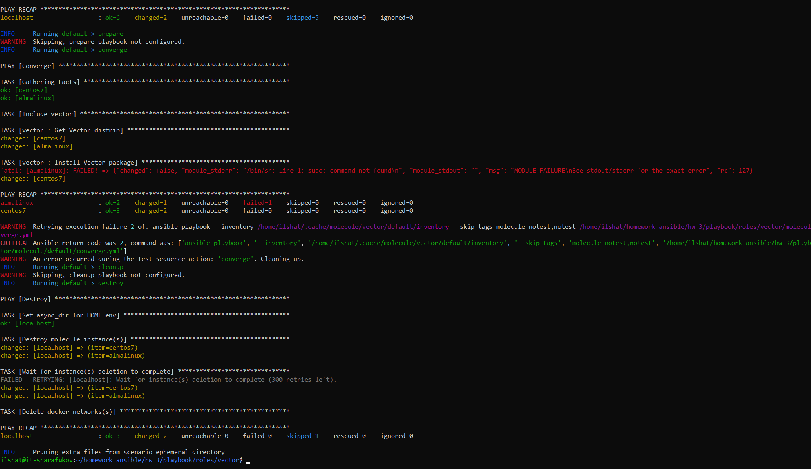
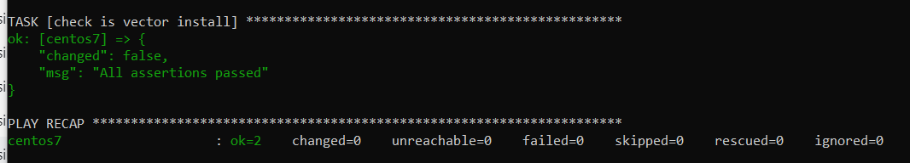
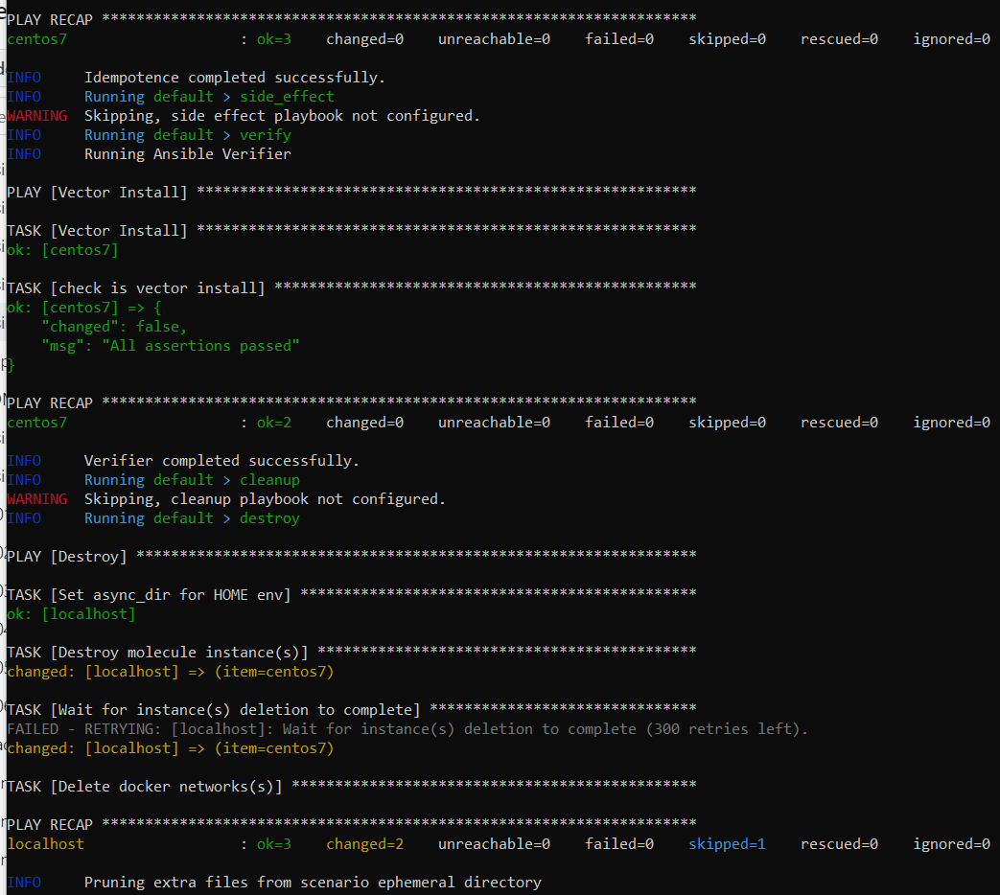
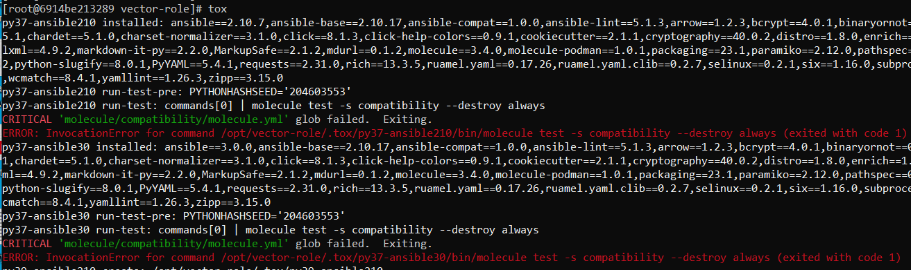
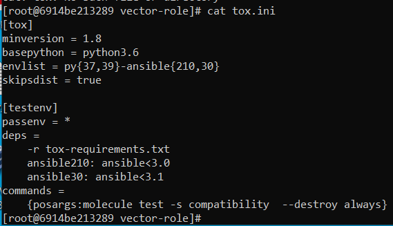
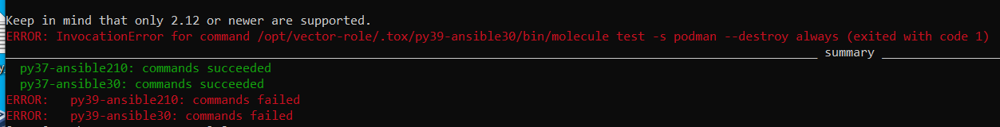

# Домашнее задание к занятию 5 «Тестирование roles»

## Выполнил Шарафуков Ильшат

### Задания.

### Основная часть:

### Molecule
```
Запустите molecule test -s centos_7 внутри корневой директории clickhouse-role, посмотрите на вывод команды. Данная команда может отработать с ошибками, это нормально. Наша цель - посмотреть как другие в реальном мире используют молекулу.
Перейдите в каталог с ролью vector-role и создайте сценарий тестирования по умолчанию при помощи molecule init scenario --driver-name docker.
Добавьте несколько разных дистрибутивов (centos:8, ubuntu:latest) для инстансов и протестируйте роль, исправьте найденные ошибки, если они есть.
Добавьте несколько assert в verify.yml-файл для проверки работоспособности vector-role (проверка, что конфиг валидный, проверка успешности запуска и др.).
Запустите тестирование роли повторно и проверьте, что оно прошло успешно.
Добавьте новый тег на коммит с рабочим сценарием в соответствии с семантическим версионированием.
```

### Tox
```
Добавьте в директорию с vector-role файлы из директории.
Запустите docker run --privileged=True -v <path_to_repo>:/opt/vector-role -w /opt/vector-role -it aragast/netology:latest /bin/bash, где path_to_repo — путь до корня репозитория с vector-role на вашей файловой системе.
Внутри контейнера выполните команду tox, посмотрите на вывод.
Создайте облегчённый сценарий для molecule с драйвером molecule_podman. Проверьте его на исполнимость.
Пропишите правильную команду в tox.ini, чтобы запускался облегчённый сценарий.
Запустите команду tox. Убедитесь, что всё отработало успешно.
Добавьте новый тег на коммит с рабочим сценарием в соответствии с семантическим версионированием.
После выполнения у вас должно получится два сценария molecule и один tox.ini файл в репозитории. Не забудьте указать в ответе теги решений Tox и Molecule заданий. В качестве решения пришлите ссылку на ваш репозиторий и скриншоты этапов выполнения задания.
```

### Ответы Molecule:

1. Запустил сценарий centos_7 в директории clickhouse-role. Данная команда отработала с ошибками

2. Создал свой сценарий тестирования

3. Протестировал роль для операционной системы Centos7 и Almalinux



4. Добавил assert в verify.yml-файл:

```
- name: Vector Install
  hosts: all
  gather_facts: false
  tasks:
  - name: Vector Install
    package:
        name: "vector"
        state: "installed"
    check_mode: yes
    register: pkg_status
  - name: check is vector install
    assert:
      that:
        - not pkg_status.changed
```



5. Запустил тестирование роли повторно и убедился что оно прошло успешно



### Ответы Tox:

Запустите docker run...tox не отработал, потому что в нем нет сценария "compatibility"



Создал облегченный сценарий, поправив файл molecule.yml:

```
scenario:
  test_sequence:
        - destroy
        - create
        - converge
        - destroy
```

В файле tox.ini поправил название сценария:



После этого запустил tox и убедился что все работает успешно (кроме python3.9):



