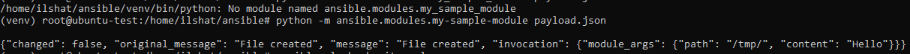
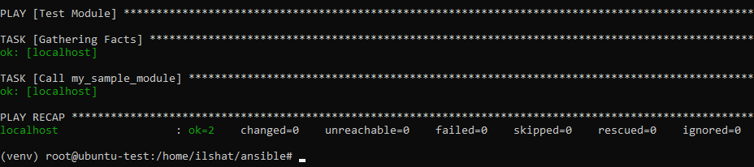
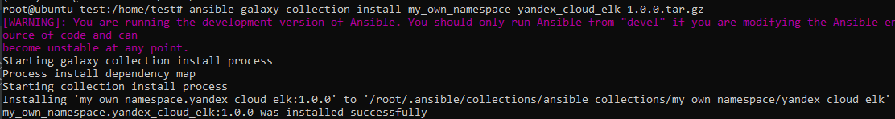
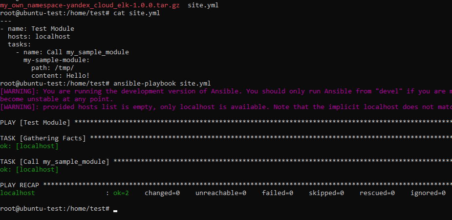

# Домашнее задание к занятию 6 «Создание собственных модулей»

## Выполнил Шарафуков Ильшат

### Задания:

```
Шаг 1. В виртуальном окружении создайте новый my_own_module.py файл.

Шаг 2. Наполните его содержимым.

Или возьмите это наполнение из статьи.

Шаг 3. Заполните файл в соответствии с требованиями Ansible так, чтобы он выполнял основную задачу: module должен создавать текстовый файл на удалённом хосте по пути, определённом в параметре path, с содержимым, определённым в параметре content.

Шаг 4. Проверьте module на исполняемость локально.

Шаг 5. Напишите single task playbook и используйте module в нём.

Шаг 6. Проверьте через playbook на идемпотентность.

Шаг 7. Выйдите из виртуального окружения.

Шаг 8. Инициализируйте новую collection: ansible-galaxy collection init my_own_namespace.yandex_cloud_elk.

Шаг 9. В эту collection перенесите свой module в соответствующую директорию.

Шаг 10. Single task playbook преобразуйте в single task role и перенесите в collection. У role должны быть default всех параметров module.

Шаг 11. Создайте playbook для использования этой role.

Шаг 12. Заполните всю документацию по collection, выложите в свой репозиторий, поставьте тег 1.0.0 на этот коммит.

Шаг 13. Создайте .tar.gz этой collection: ansible-galaxy collection build в корневой директории collection.

Шаг 14. Создайте ещё одну директорию любого наименования, перенесите туда single task playbook и архив c collection.

Шаг 15. Установите collection из локального архива: ansible-galaxy collection install <archivename>.tar.gz.

Шаг 16. Запустите playbook, убедитесь, что он работает.

Шаг 17. В ответ необходимо прислать ссылки на collection и tar.gz архив, а также скриншоты выполнения пунктов 4, 6, 15 и 16.
```

### Ответы:

Скриншот выполнения пункта 4:



Скриншот выполнения пункта 6 (проверка на идемпотентность):



Скриншот выполнения пункта 15:



Скриншот выполнения пункта 16:



Ссылка на git с коллекцией и tar.gz архивом:

https://github.com/IlshatSharafukov/my-own-collection/tree/v1.0.0/yandex_cloud_elk

