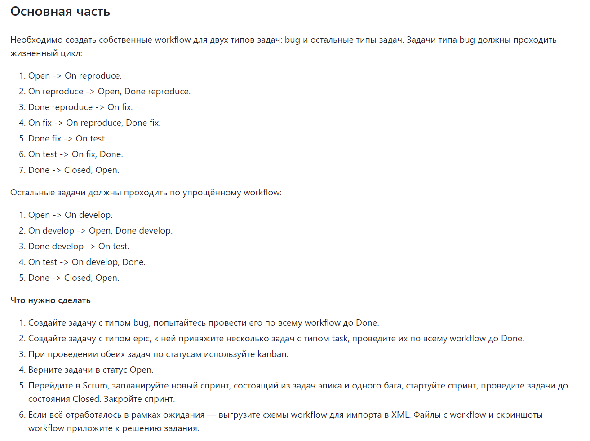
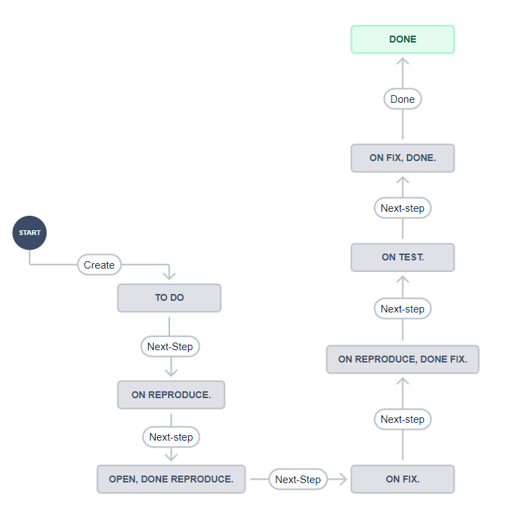
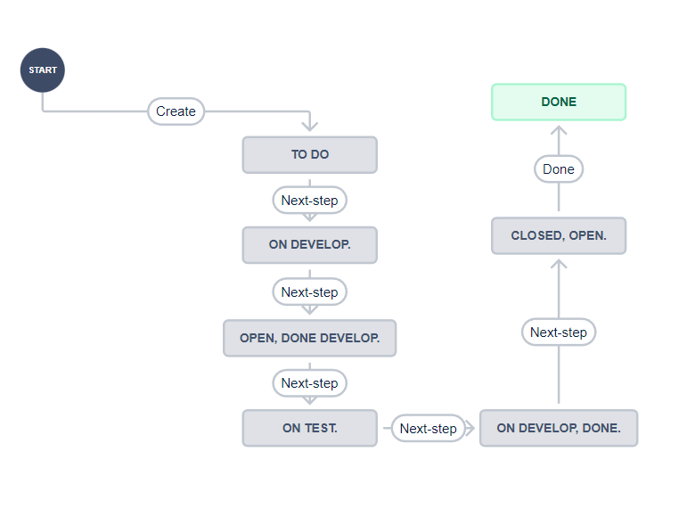
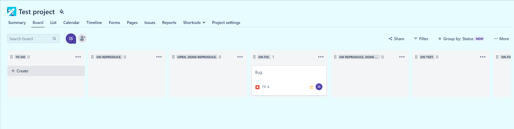

# Домашнее задание к занятию 7 «Жизненный цикл ПО»

## Выполнил Шарафуков Ильшат

### Задание:

### Ответы:

Создал 2 новых workflow для Issue Type "BUG":

И для всех остальных Issue Type:

В своём тестовом окружении провел задачу по всему workflow.

Так же мной был создан спринт, к которому были привязаны Task из предыдущих заданий. Ввиду того что задание сформулировано некорректно и не адаптировано под текущие реалии, выгрузить XML workflow не представляется возможным.

https://community.atlassian.com/t5/Jira-questions/How-to-activate-the-inactive-workflow/qaq-p/1198597

В связи с этим моё решение будет ограничиваться лишь скриншотами тех workflow, которые я создал.