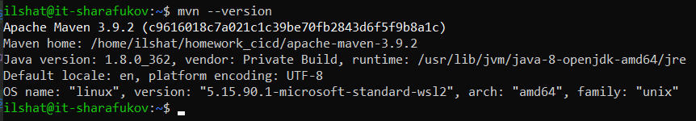
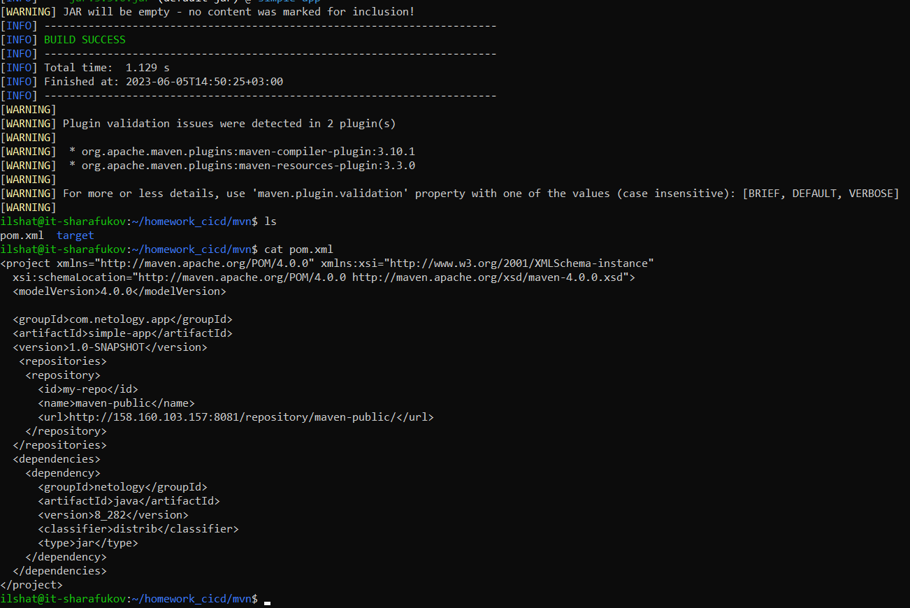

# Домашнее задание к занятию 9 «Процессы CI/CD»

## Выполнил Шарафуков Ильшат

### Подготовка к выполнению:

Создал 2 ВМ в YC с указанными параметрами, заполнил inventory, добавил публичный ключ для работы playbook. 
Запустил playbook, получил 2 настроенные виртуальные машины:

### Знакомоство с SonarQube:

Прошелся по всем шагам, указанным в задании, и таким образом успешно прошел тест. 

### Знакомство с Nexus:

Произвел все вышеописанные манипуляции, прикладываю XML файл с загруженного артефакта:

### Знакомство с Maven:

Произвел подготовку к выполнению задания:

Скачал и сбилдил артефакт к нексуса:

