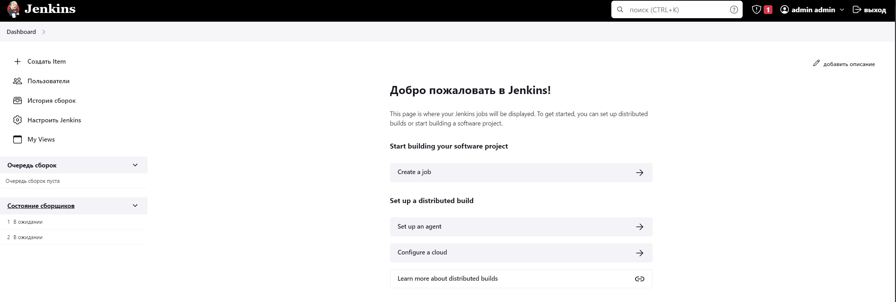
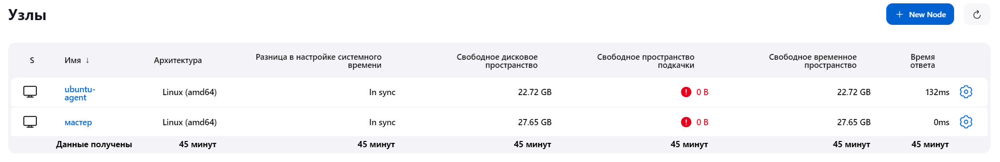
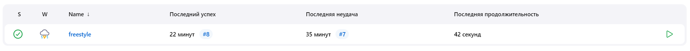
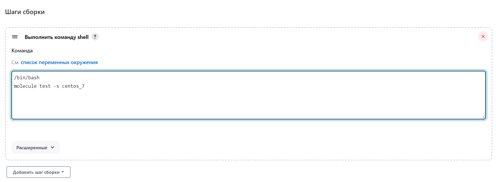
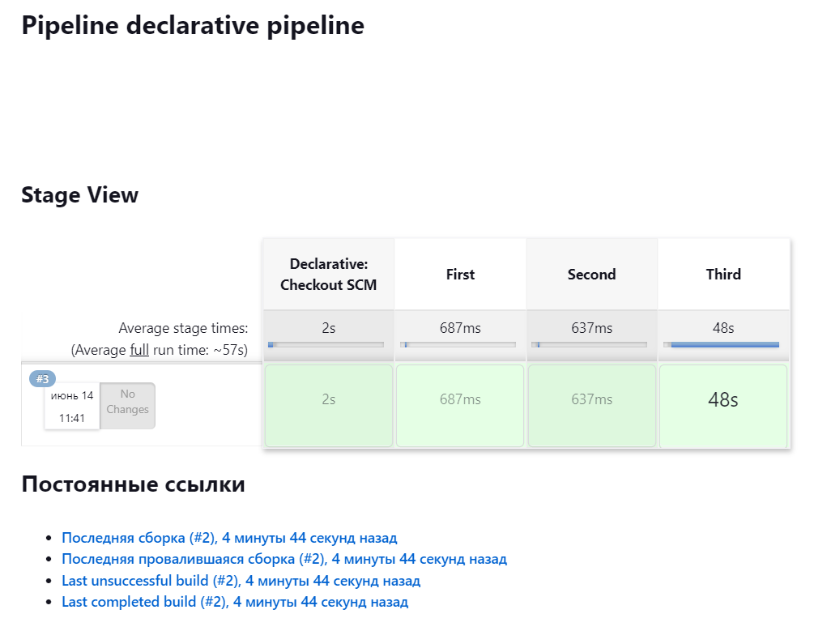
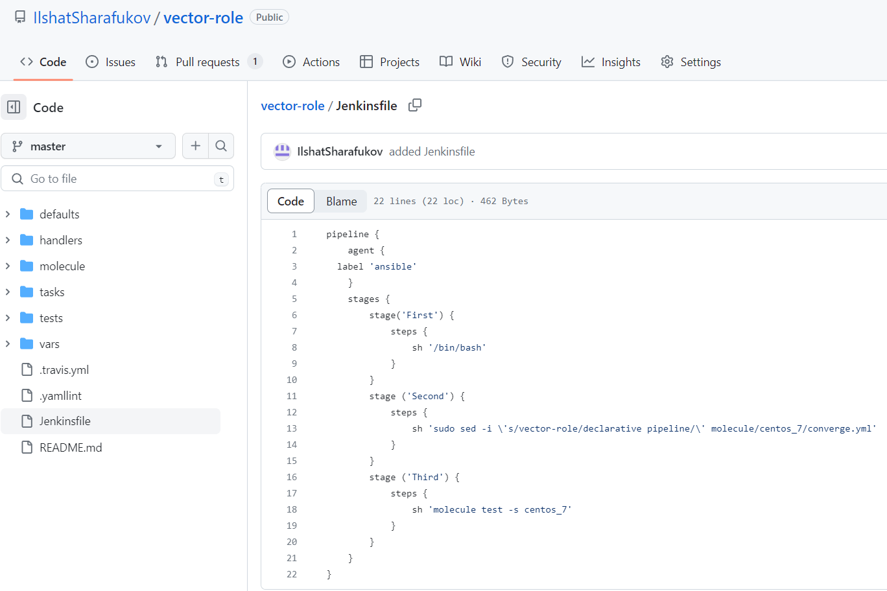
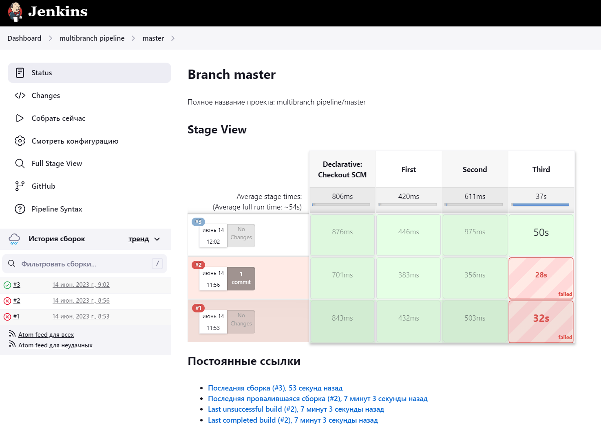
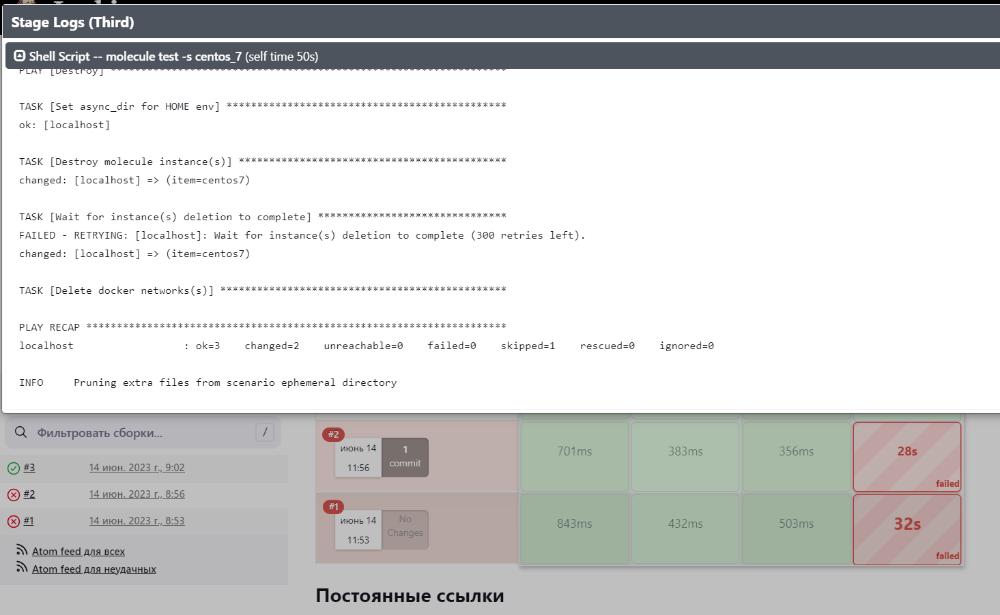

# Домашнее задание к занятию 10 «Jenkins»

## Выполнил Шарафуков Ильшат

### Подготовка к выполнению:

```
Создать два VM: для jenkins-master и jenkins-agent.
Установить Jenkins при помощи playbook.
Запустить и проверить работоспособность.
Сделать первоначальную настройку.
```

### Результат: 

Установил jenkins на виртуальную машину с помощью ansible-playbook:



### Основная часть:

```
Сделать Freestyle Job, который будет запускать molecule test из любого вашего репозитория с ролью.
Сделать Declarative Pipeline Job, который будет запускать molecule test из любого вашего репозитория с ролью.
Перенести Declarative Pipeline в репозиторий в файл Jenkinsfile.
Создать Multibranch Pipeline на запуск Jenkinsfile из репозитория.
Создать Scripted Pipeline, наполнить его скриптом из pipeline.
Внести необходимые изменения, чтобы Pipeline запускал ansible-playbook без флагов --check --diff, если не установлен параметр при запуске джобы (prod_run = True). По умолчанию параметр имеет значение False и запускает прогон с флагами --check --diff.
Проверить работоспособность, исправить ошибки, исправленный Pipeline вложить в репозиторий в файл ScriptedJenkinsfile.
Отправить ссылку на репозиторий с ролью и Declarative Pipeline и Scripted Pipeline.
```

### Ответы:

Jenkins agent на centos7 встал нормально, но molecule ни в какую не хотела работать на этой ОС. Было потрачено 3 дня на устранение возникающих проблем, но это не принесло никакого результата.

В конечном итоге было принято решение развернуть jenkins agent на ОС ubuntu 20, т.к. в рамках предыдущих заданий мы производили тестирование плейбуков именно на этой ОС.



1) Freestyle Job:





2,3. Declarative Pipeline с запуском из Git, где лежат playbook:



Сам Jenkinsfile:



4) Multibranch Pipeline на запуск Jenkinsfile из репозитория:



Сам Jenkinsfile остался без изменений, его я взял из задания 2 и 3. 



5) 