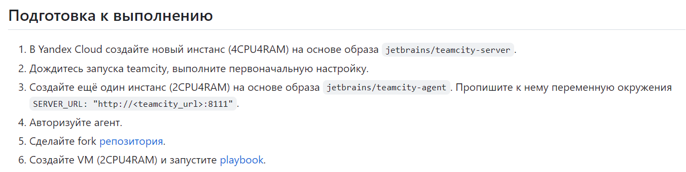
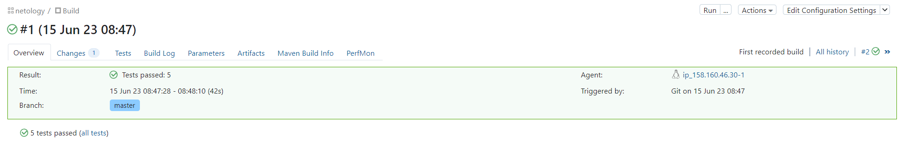
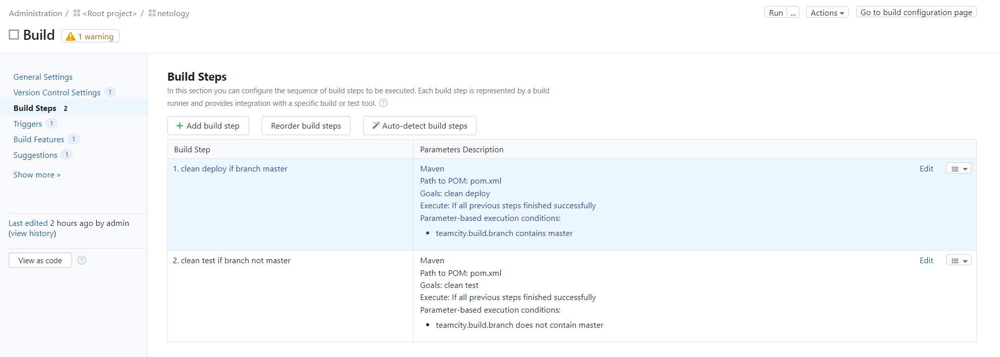
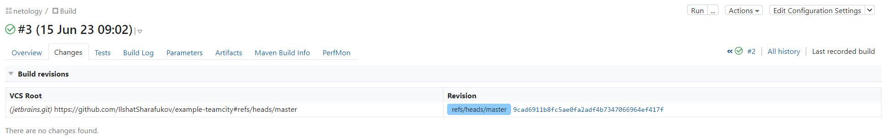
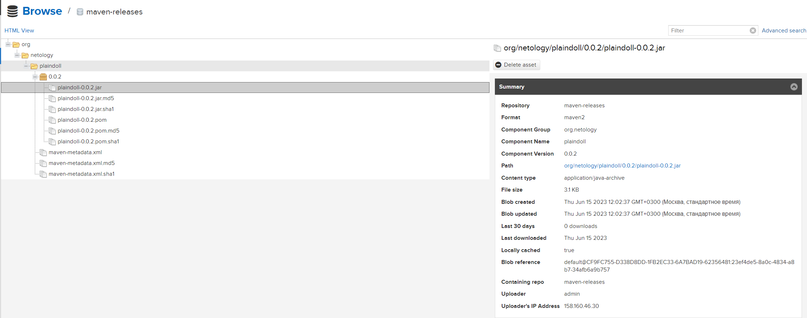
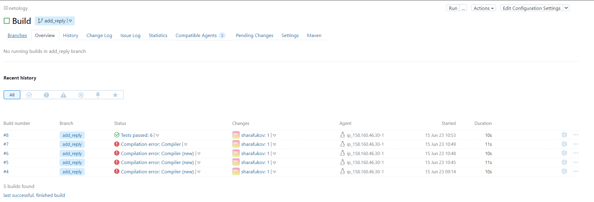
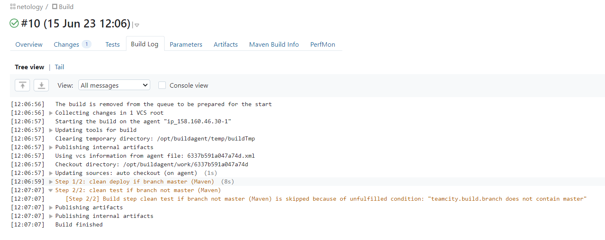
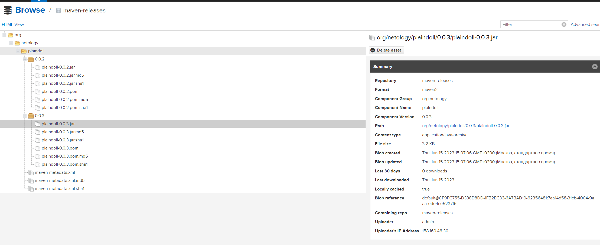
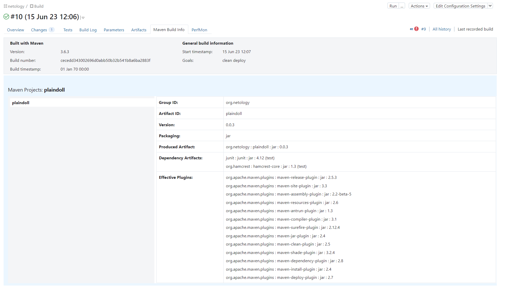

# Домашнее задание к занятию 11 «Teamcity»

## Выполнил Шарафуков Ильшат




Произвел подготовку к выполнению задания, а именно, запустил teamcity сервер и teamcity agent. 
С агентом была проблема, при установке через YC с помощью указания образа docker контейнера, сам контейнер внутри ВМ не поднимался. Пришлось заходить вручную и давать следующую команду:

```
docker run -d -e SERVER_URL="http://51.250.79.46:8111" jetbrains/teamcity-agent
```

После этого агент подключился и я его авторизовал.

### Основная часть:

```
Создайте новый проект в teamcity на основе fork.
Сделайте autodetect конфигурации.
Сохраните необходимые шаги, запустите первую сборку master.
Поменяйте условия сборки: если сборка по ветке master, то должен происходит mvn clean deploy, иначе mvn clean test.
Для deploy будет необходимо загрузить settings.xml в набор конфигураций maven у teamcity, предварительно записав туда креды для подключения к nexus.
В pom.xml необходимо поменять ссылки на репозиторий и nexus.
Запустите сборку по master, убедитесь, что всё прошло успешно и артефакт появился в nexus.
Мигрируйте build configuration в репозиторий.
Создайте отдельную ветку feature/add_reply в репозитории.
Напишите новый метод для класса Welcomer: метод должен возвращать произвольную реплику, содержащую слово hunter.
Дополните тест для нового метода на поиск слова hunter в новой реплике.
Сделайте push всех изменений в новую ветку репозитория.
Убедитесь, что сборка самостоятельно запустилась, тесты прошли успешно.
Внесите изменения из произвольной ветки feature/add_reply в master через Merge.
Убедитесь, что нет собранного артефакта в сборке по ветке master.
Настройте конфигурацию так, чтобы она собирала .jar в артефакты сборки.
Проведите повторную сборку мастера, убедитесь, что сбора прошла успешно и артефакты собраны.
Проверьте, что конфигурация в репозитории содержит все настройки конфигурации из teamcity.
В ответе пришлите ссылку на репозиторий.
```

1) Создал новый проект на основе fork репозитория, указанного в задании. Для этого я создал в своем гите свой собственный репозиторий и сделал копию предложенного репозитория.
2) Сделал автодетект конфигурации, он обнаружил конфиг maven. 
3) Первая сборка в master прошла успешно, все тесты были выполнены:



4) Поменял условия сборки:



5) Загрузил settings.xml, креды для подключения к nexus не менял, оставил стандартные (admin\admin123)

6) В pom.xml так же добавил ссылку на репозиторий nexus и сделал пуш в свой репо на github.

7) Запустил сборку по master и убедился, что все прошло успешно



8) Мигрировал build configuration в репозиторий



9) Создал отдельную ветку 'add_reply' в репозитории на гите

10) Написал новый метод для класса Welcomer:

```
	public String sayHunterNew(){
		return "I do my teamcity homework and I really like it. hunter";
	}
```

11) Написал тест для нового класса hunter:

```
	@Test
	public void welcomerSaysHunterNew(){
		assertThat(welcomer.sayHunterNew(), containsString("hunter"));
	}
```

12) Сделал push изменений в репозиторий.

13) Сборка самостоятельно запустилась, после исправления ошибок тесты прошли успешно.



14) Сделал merge из ветки add_reply в master. 

15) Артефакт с новой версией 0.0.3 появился, не совсем понял что я должен был тут сделать





16,17) Насколько я понял, maven и так собирает .jar в артефакты сборки, это можно видеть на скрине:



18,19) https://github.com/IlshatSharafukov/example-teamcity

