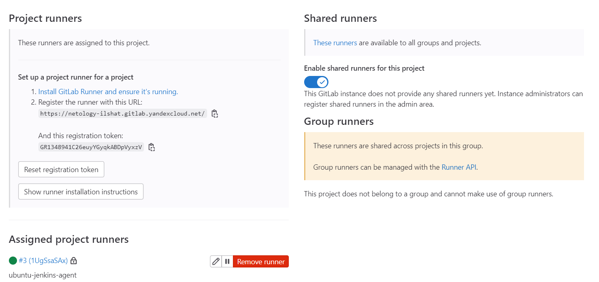
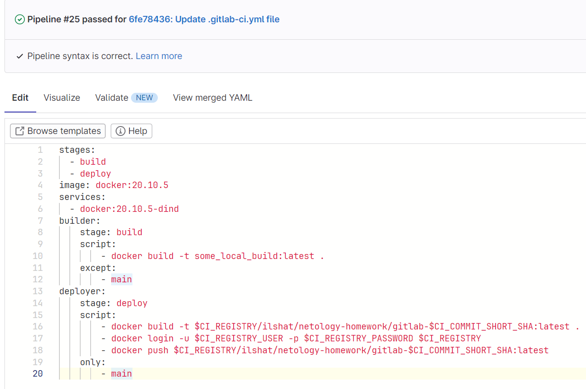
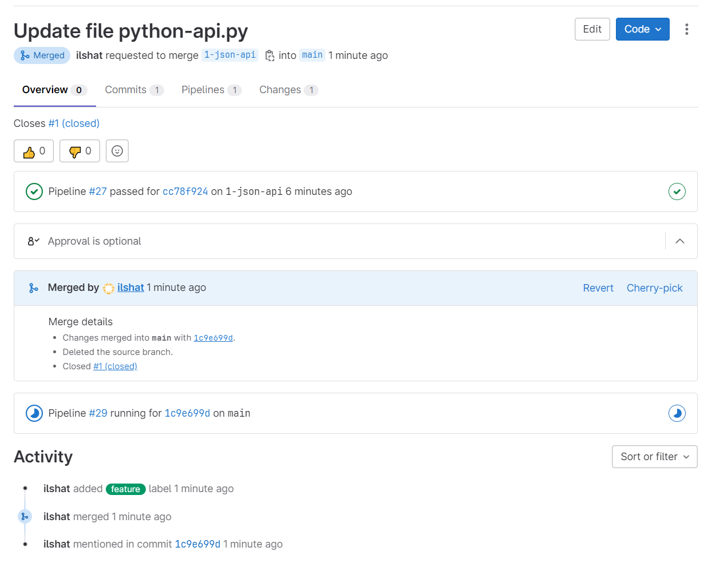

# Домашнее задание к занятию 13 «Gitlab»

## Выполнил Шарафуков Ильшат

Подготовил к выполнению домашнего задания Gitlab с использованием YC и наполнил его файлами:


### Основная часть DevOps: 

Перед написанием pipeline необходимо установить и подготовить к работе gitlab-runner по инструкции, предлагаемой самим gitlab:



pipeline:



dockerfile:


Результат выполнения pipeline:


Образ в container registry:


### Product Owner, Developer, Tester:

Создал новый issue с описанием требуемых изменений и label:


Исправил код, сделал коммит в feature branch и после этого сделал merge request:



Сборка выполнилась успешно.


После сборки в container registry появился образ моего контейнера, который я выгрузил к себе на отдельную ВМ и запустил чтобы проверить API:


Данной командой я поднял докер контейнер и пробросил соответсвующий порт до веб сервера:

```
docker run -itd -p 5290:5290 476f454f9ed9
```

В браузере проверил корректность метода get_info нашего API:


