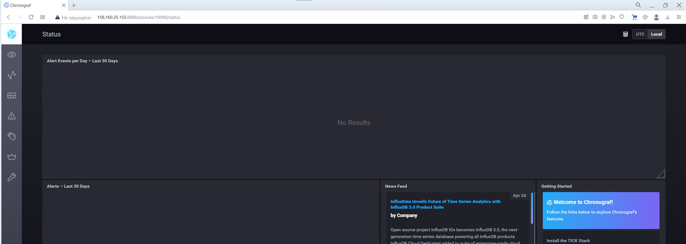
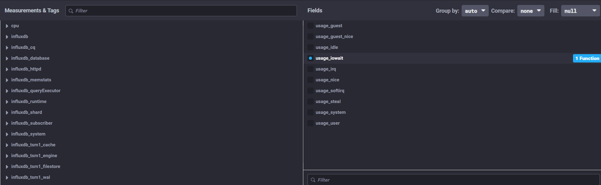
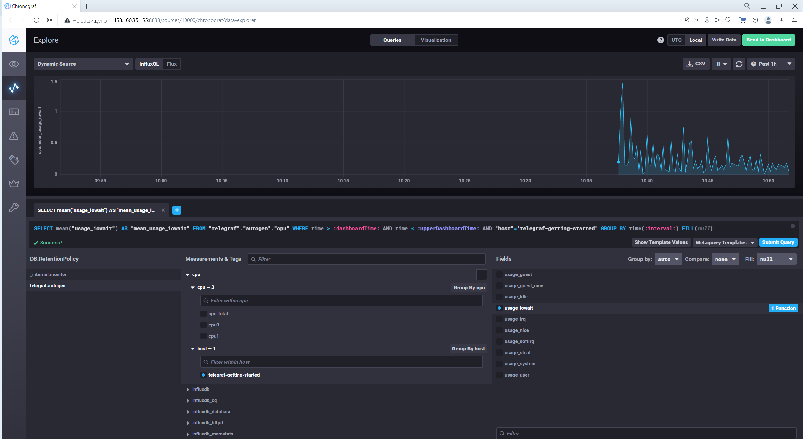

# Домашнее задание к занятию 13 «Введение в мониторинг»

## Выполнил Шарафуков Ильшат

### Основная часть:

```
1) Вас пригласили настроить мониторинг на проект. 
На онбординге вам рассказали, что проект представляет из себя платформу для вычислений с выдачей текстовых отчётов, которые сохраняются на диск. 
Взаимодействие с платформой осуществляется по протоколу http. 
Также вам отметили, что вычисления загружают ЦПУ. Какой минимальный набор метрик вы выведите в мониторинг и почему?

2) Менеджер продукта, посмотрев на ваши метрики, сказал, что ему непонятно, что такое RAM/inodes/CPUla. 
Также он сказал, что хочет понимать, насколько мы выполняем свои обязанности перед клиентами и какое качество обслуживания. 
Что вы можете ему предложить?

3) Вашей DevOps-команде в этом году не выделили финансирование на построение системы сбора логов. 
Разработчики, в свою очередь, хотят видеть все ошибки, которые выдают их приложения. 
Какое решение вы можете предпринять в этой ситуации, чтобы разработчики получали ошибки приложения?

4) Вы, как опытный SRE, сделали мониторинг, куда вывели отображения выполнения SLA = 99% по http-кодам ответов. 
Этот параметр вычисляется по формуле: summ_2xx_requests/summ_all_requests. 
Он не поднимается выше 70%, но при этом в вашей системе нет кодов ответа 5xx и 4xx. Где у вас ошибка?

5) Опишите основные плюсы и минусы pull и push систем мониторинга.

6) Какие из ниже перечисленных систем относятся к push модели, а какие к pull? А может есть гибридные?

Prometheus
TICK
Zabbix
VictoriaMetrics
Nagios

```


1) Что касается метрик самого веб приложения, я бы вывел в мониторинг количество http запросов и количество корректных кодов ответа HTTP сервера (2xx, 3xxx, 4xxx).
Что касается метрик работоспособности самого сервера, на котором производятся вычисления (неважно физический ли это сервер или виртуальная машина), то я бы вывел следующие метрики:
информация по диску и процессам чтения записи на сервере, а именно количество IOPS, задержки на диске и объём свободного пространства.
информация по загрузке ЦПУ и количеству "отъеденного" RAM на машине, возможно количество открытых файловых дескрипторов.
информация по объёму трафика на сетевых интерфейсах машины (виртуальной или физической)

2) Можно предложить настроить мониторинг самого продукта и его основных метрик, может быть вывести SLI, настроить по основным метрикам дашборды в Графане, настроить AlertManager.
Так же можно настроить и вывести некоторые из метрик, которые будут показывать насколько продукт работает в соответсвии с заявленым SLO.

3) Как вариант, можно использовать самописные скрипты, которые проверяют содержимое логов на наличие ошибок. Либо использовать какой-либо OpenSource коллектов логов для их анализа

4) Ошибка в том, что в формуле подсчета не учитываются 3xx коды и в конечном итоге должна выглядеть так:

(summ_2xx_requests + summ_3xx_requests)/summ_all_requests

5) Плюсы push моделей: упрощенная отправка данных мониторинга в несколько различных систем, более гибкая настройка (можно тонко определять какие метрики отправлять, а какие нет), менее затратный способ передачи данных и в следствие этого более высокопроизводительный 
Плюсы pull моделей: контроль подлинности данных, имеется возможность организации и настройки единого прокси сервера до всех агентов, упрощенная отладка во время настройки мониторинга

6) Prometheus - push модель
TICK - pull модель
Zabbix - гибридная модель, т.к. может работать через агентов и самостоятельно опрашивать хосты
VictoriaMetrics - гибридная модель, т.к. может работать через агентов и самостоятельно опрашивать хосты
Nagios - push модель

7) Запустил стек TICK. Скриншот веб интерфейса хроногаф:



8) Из указанного репозитория Chronograf запускается БЕЗ метрик, которые требуются для выполнения задания:



Но в целом суть работы данного стека мониторинга понятна, поэтому выкладываю скриншот загрузки ЦПУ:

