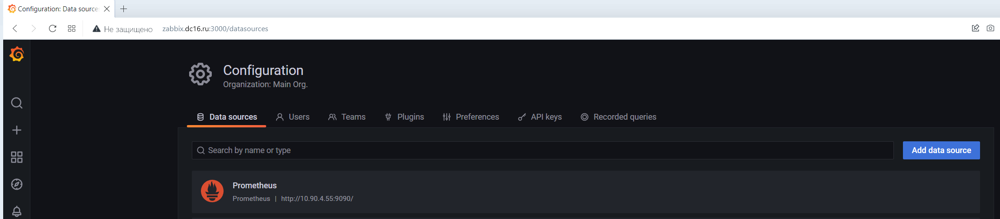
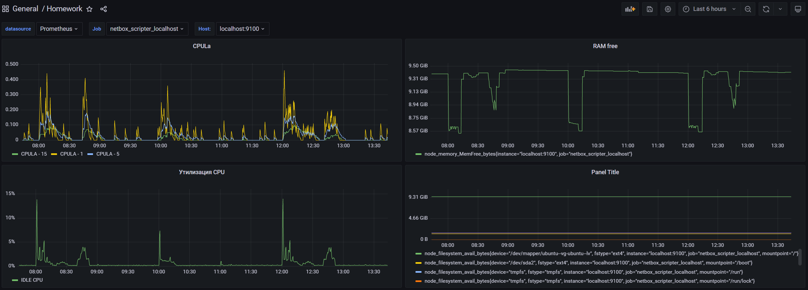
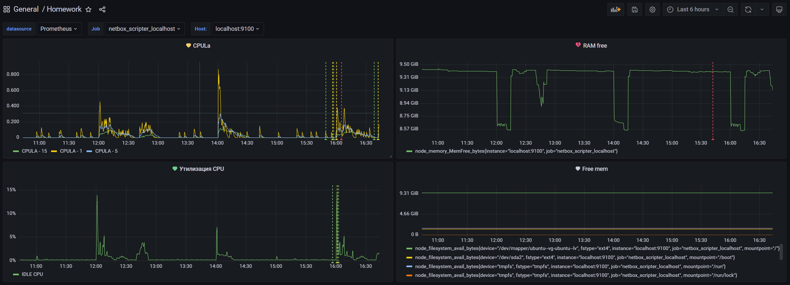

# Домашнее задание к занятию 14 «Введение в мониторинг»

## Выполнил Шарафуков Ильшат

### Основная часть:

1) Запустить стек мониторинга prometheus - grafana, подключить соответсвующий источник данных



2) Создать Dashboard и в ней создать Panels:



Так же привожу promql-запросы для выдачи этих метрик:

```
CpuLa

(node_load15{instance="$node",job="$job"})
(node_load5{instance="$node",job="$job"})
(node_load1{instance="$node",job="$job"})
```

```
Ram free

node_memory_MemFree_bytes{instance="$node",job="$job"}
```

```
CPU util

100 - (avg by (instance) (rate(node_cpu_seconds_total{job="$job",mode="idle"}[1m])) * 100)
```

```
Free mem

node_filesystem_avail_bytes{instance="$node",job="$job",device!~"/dev/vda2"}
```

3) Создать для каждой Dashboard подходящее правило alert и приложить скриншот итогового дашборда.

Alert template не будет работать, пока в Query панели есть какие-либо переменные. Например:

```
Вот так работать НЕ будет

node_memory_MemFree_bytes{instance="$node",job="$job"} 
```

```
Вот так БУДЕТ работать

node_memory_MemFree_bytes{instance="localhost:9100",job="netbox_scripter_localhost"} 
```

Итоговый вид дашборда:



4) Привел листинг json файла дашборда в файле dashboard.json