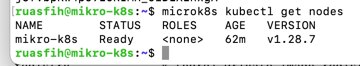
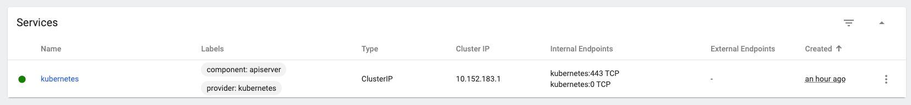

# Домашнее задание к занятию «Kubernetes. Причины появления. Команда kubectl»

### Выполнил Шарафуков Ильшат

## Основная часть

### Задание 1. Установка MicroK8S

1. Установить MicroK8S на локальную машину или на удалённую виртуальную машину.
2. Установить dashboard.
3. Сгенерировать сертификат для подключения к внешнему ip-адресу.

------

### Задание 2. Установка и настройка локального kubectl
1. Установить на локальную машину MicroK8S .
2. Настроить локально подключение к кластеру.
3. Подключиться к дашборду с помощью port-forward.

### Ответы:

1) Установил MicroK8S  и  kubectl. Командой "microk8s kubectl get nodes" получил информацию о нодах.

2) Установил аддон с дашбордом, сделал проброс порта и подключился к дашборду с помощью токена:

