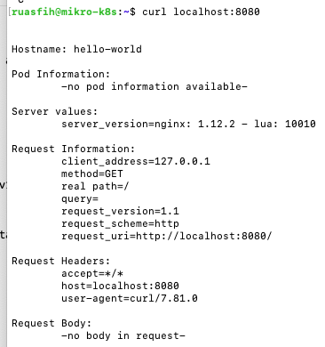
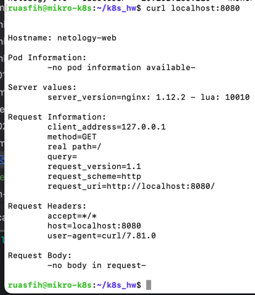
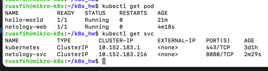

# Домашнее задание к занятию «Kubernetes. Базовые объекты K8S»

### Выполнил Шарафуков Ильшат

## Основная часть

### Задание 1. Создать Pod с именем hello-world

1. Создать манифест (yaml-конфигурацию) Pod.
2. Использовать image - gcr.io/kubernetes-e2e-test-images/echoserver:2.2.
3. Подключиться локально к Pod с помощью `kubectl port-forward` и вывести значение (curl или в браузере).

------

### Задание 2. Создать Service и подключить его к Pod

1. Создать Pod с именем netology-web.
2. Использовать image — gcr.io/kubernetes-e2e-test-images/echoserver:2.2.
3. Создать Service с именем netology-svc и подключить к netology-web.
4. Подключиться локально к Service с помощью `kubectl port-forward` и вывести значение (curl или в браузере).

### Ответы:

### Задание 1:

Подготовил манифест для пода с именем hello-world. После этого развернул его с помощью команды:

```commandline
kubectl apply -f pod.yml
```

Далее я пробросил порт 8080 с помощью port-forward:

```commandline
kubectl port-forward hello-world 8080:8080
```

В результате имеем:



### Задание 2:

Подготовил манифест для пода с именем netology-web и манифест для сервиса netology. Развернул их, пробросил порт и проверил что все работает:



Список всех подов и сервисов:



Исходники в папке src.