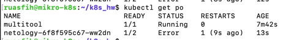
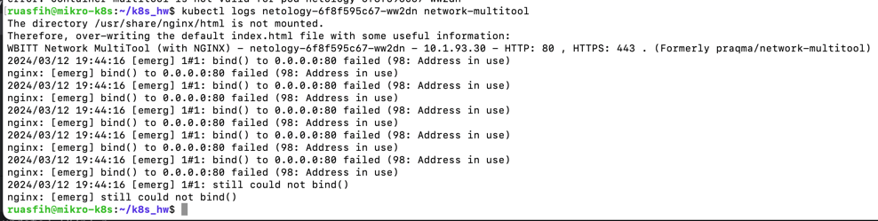
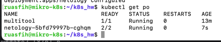
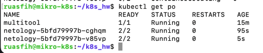
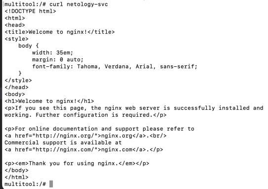
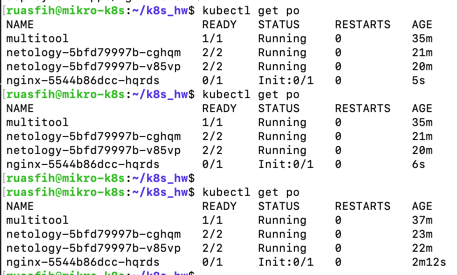

# Домашнее задание к занятию «Запуск приложений в K8S»

### Выполнил Шарафуков Ильшат

## Основная часть

### Задание 1. Создать Deployment и обеспечить доступ к репликам приложения из другого Pod

1. Создать Deployment приложения, состоящего из двух контейнеров — nginx и multitool. Решить возникшую ошибку.
2. После запуска увеличить количество реплик работающего приложения до 2.
3. Продемонстрировать количество подов до и после масштабирования.
4. Создать Service, который обеспечит доступ до реплик приложений из п.1.
5. Создать отдельный Pod с приложением multitool и убедиться с помощью `curl`, что из пода есть доступ до приложений из п.1.

------

### Задание 2. Создать Deployment и обеспечить старт основного контейнера при выполнении условий

1. Создать Deployment приложения nginx и обеспечить старт контейнера только после того, как будет запущен сервис этого приложения.
2. Убедиться, что nginx не стартует. В качестве Init-контейнера взять busybox.
3. Создать и запустить Service. Убедиться, что Init запустился.
4. Продемонстрировать состояние пода до и после запуска сервиса.

### Ответ:

### Задание 1.

Запустил deployment с двумя контейнерами, получил следующую ошибку:



Понять что это за ошибка можно с помощью логов контейнера внутри пода:



Исправил конфигурацию манифеста, заменив порт на 1180 и 11443 и все запустилось (с одной репликой):



Исправил манифест и добавил вторую реплику:



Создал service для доступа к приложению, запустил дополнительный под для проверки:

```commandline
kubectl run multitool --image=wbitt/network-multitool
```

Зашел внутрь контейнера и произвел проверку доступности сервиса:

```commandline
kubectl exec -it multitool -- /bin/bash

```


### Задание 2.

Запустил под (deployment_with_init.yml) с двумя контейнерами: nginx и busybox, который ждет пока запустится сервис для этого приложения.



Далее я поднимаю сервис (svc_nginx.yml) и вижу что все запустилось:


