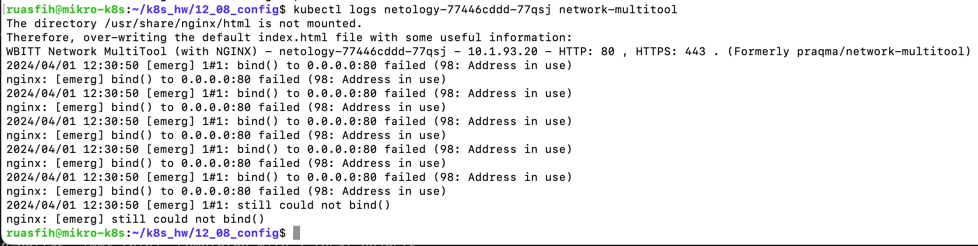
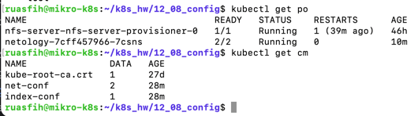
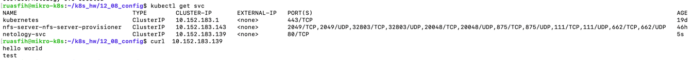
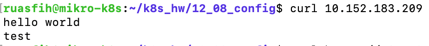
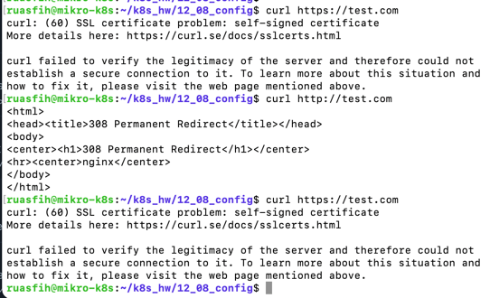

# Домашнее задание к занятию «Конфигурация приложений»

### Выполнил Шарафуков Ильшат

## Основная часть

### Задание 1. Создать Deployment приложения и решить возникшую проблему с помощью ConfigMap. Добавить веб-страницу

1. Создать Deployment приложения, состоящего из контейнеров busybox и multitool.
2. Решить возникшую проблему с помощью ConfigMap.
3. Продемонстрировать, что pod стартовал и оба конейнера работают.
4. Сделать простую веб-страницу и подключить её к Nginx с помощью ConfigMap. Подключить Service и показать вывод curl или в браузере.
5. Предоставить манифесты, а также скриншоты или вывод необходимых команд.

------

### Задание 2. Создать приложение с вашей веб-страницей, доступной по HTTPS 

1. Создать Deployment приложения, состоящего из Nginx.
2. Создать собственную веб-страницу и подключить её как ConfigMap к приложению.
3. Выпустить самоподписной сертификат SSL. Создать Secret для использования сертификата.
4. Создать Ingress и необходимый Service, подключить к нему SSL в вид. Продемонстировать доступ к приложению по HTTPS. 
4. Предоставить манифесты, а также скриншоты или вывод необходимых команд.

### Ответ:

### Задание 1.

Ошибка в том, что оба контейнера пытаются занять 80 порт:

Развернул новый [Deployment](src/deploy.yml). Так же создал ConfigMap'ы:

[ConfigMap for WEB PORT](src/configmap.yml) 

[ConfigMap for NGINX](src/configmap_nginx.yml) 

Список запущенных подов и CM:

Проверка доступности сервиса после создания [SVC](src/svc_nginx.yml):

### Задание 2.

Создал [Deployment for NGNIX](src/deploy_2.yml) и [ConfigMap for NGINX](src/configmap_nginx.yml):

Создал сертификат: openssl req -x509 -newkey rsa:2048 -sha256 -nodes -keyout tls.key -out tls.crt -subj "/CN=test.com" -days 365

Создал [Secret TLS](src/tls.yml), [INGRESS](src/ingress.yml) и [SVC](src/svc_for_ingress.yml)

Проверил доступ по HTTPS:

