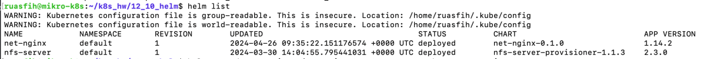
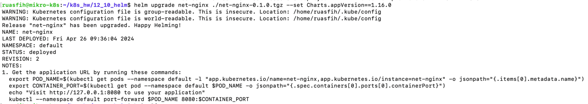
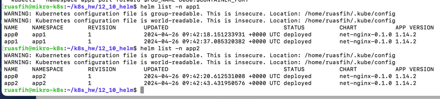

# Домашнее задание к занятию  «Helm»

### Выполнил Шарафуков Ильшат

## Основная часть

### Задание 1. Подготовить Helm-чарт для приложения

1. Необходимо упаковать приложение в чарт для деплоя в разные окружения. 
2. Каждый компонент приложения деплоится отдельным deployment’ом или statefulset’ом.
3. В переменных чарта измените образ приложения для изменения версии.

------
### Задание 2. Запустить две версии в разных неймспейсах

1. Подготовив чарт, необходимо его проверить. Запуститe несколько копий приложения.
2. Одну версию в namespace=app1, вторую версию в том же неймспейсе, третью версию в namespace=app2.
3. Продемонстрируйте результат.

### Ответ:

### Задание 1.

Создал чарт:

    helm create net-nginx

В Charts.yaml указал версию. В values указал image (если не указать версию image, версия возьметься из аpp version в Chats.yaml), порты

Упаковал приложение, после чего получил упакованное в tar.gz приложение :

    helm package net-nginx

Задеплоил новое приложение в ns defaul:

    m helm install net-ngin ./net-nginx-0.1.0.tgz

Изменил версию образа, передав новое значение переменной :

    m helm upgrade net-ngin ./net-nginx-0.1.0.tgz --set Charts.appVersion==1.16.0

### Задание 2.

Развернул приложение в разных namespace: 

    m helm install app0 ./net-nginx-0.1.0.tgz -n app1
    m helm install app1 ./net-nginx-0.1.0.tgz -n app1
    m helm install app2 ./net-nginx-0.1.0.tgz -n app2

