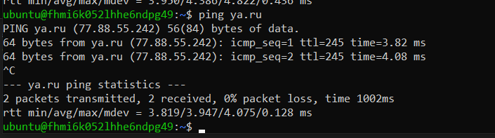

# Домашнее задание к занятию «Организация сети»

### Выполнил Шарафуков Ильшат

## Задание 1
1. Создать пустую VPC. Выбрать зону.

2. Публичная подсеть.

 - Создать в VPC subnet с названием public, сетью 192.168.10.0/24.
 - Создать в этой подсети NAT-инстанс, присвоив ему адрес 192.168.10.254. В качестве image_id использовать fd80mrhj8fl2oe87o4e1.
 - Создать в этой публичной подсети виртуалку с публичным IP, подключиться к ней и убедиться, что есть доступ к интернету.

3. Приватная подсеть.
 - Создать в VPC subnet с названием private, сетью 192.168.20.0/24.
 - Создать route table. Добавить статический маршрут, направляющий весь исходящий трафик private сети в NAT-инстанс.
 - Создать в этой приватной подсети виртуалку с внутренним IP, подключиться к ней через виртуалку, созданную ранее, и убедиться, что есть доступ к интернету.

## Ответ:

1. Cоздал vpc. (зону можно выбрать только при создании subnet)

2. Cоздал subnet "public" и в нем две ВМ:

3. Cоздал subnet "private" и в нем ВМ, навесил routing table на vpc

Скрин до применения статического маршрута:

После применения:

