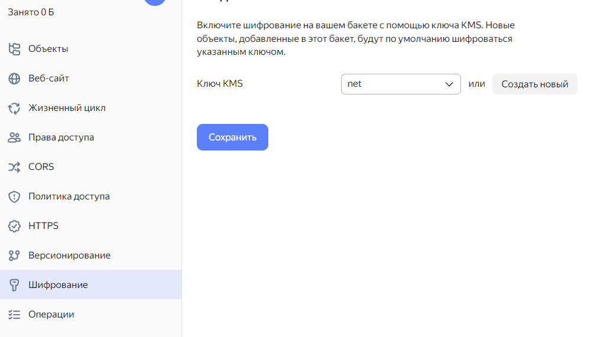
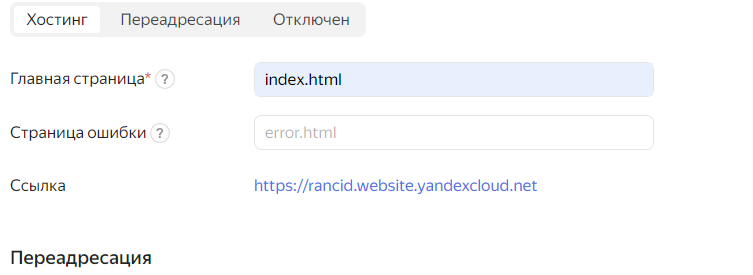

# Домашнее задание к занятию «Безопасность в облачных провайдерах»  

### Выполнил Шарафуков Ильшат

## Задание 1. Yandex Cloud   

1. С помощью ключа в KMS необходимо зашифровать содержимое бакета:

 - создать ключ в KMS;
 - с помощью ключа зашифровать содержимое бакета, созданного ранее.
 - 
2. (Выполняется не в Terraform)* Создать статический сайт в Object Storage c собственным публичным адресом и сделать доступным по HTTPS:

 - создать сертификат;
 - создать статическую страницу в Object Storage и применить сертификат HTTPS;
 - в качестве результата предоставить скриншот на страницу с сертификатом в заголовке (замочек).

## Ответ:

1. Cоздал [бакет](src/bucket.tf) и зашифровал с помощью ключа содержимое

2. Попробовал создать статичный сайт (яндес сам выдает поддомен по названию бакета). Но так как нет своего домена, прикручивать сертификат не стал

