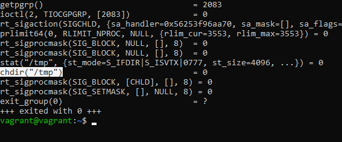
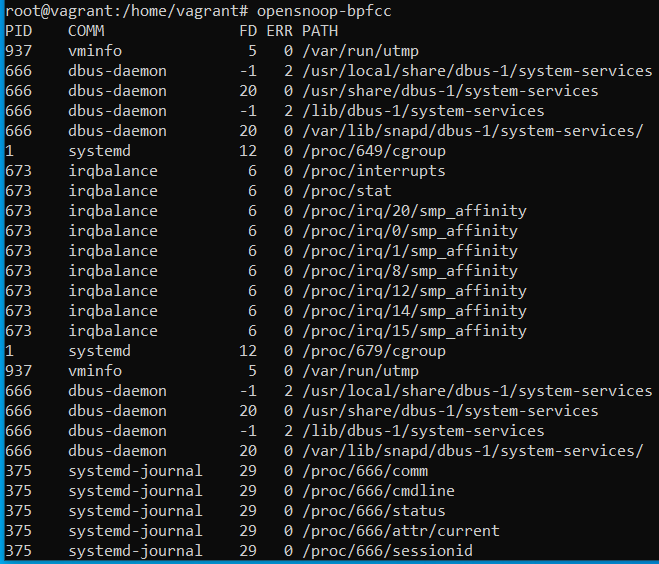
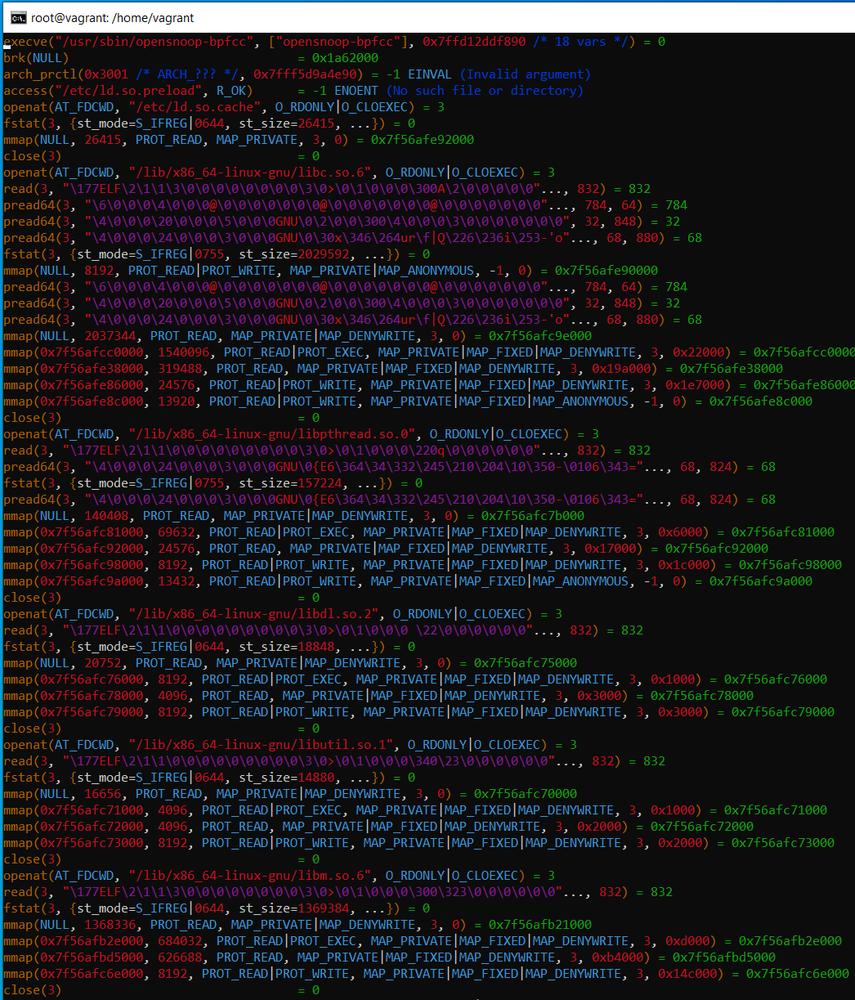

# Домашнее задание к занятию "3.3. Операционные системы. Лекция 1"

## Выполнил Шарафуков Ильшат

### 1. Какой системный вызов делает команда cd

"В прошлом ДЗ мы выяснили, что cd не является самостоятельной программой, это shell builtin, поэтому запустить strace непосредственно на cd не получится. Тем не менее, вы можете запустить strace на /bin/bash -c 'cd /tmp'. В этом случае вы увидите полный список системных вызовов, которые делает сам bash при старте."

Команда 'cd' делает системный вызов chdir. 

### 2. Попробуйте использовать команду file на объекты разных типов в файловой системе. Используя strace выясните, где находится база данных file, на основании которой она делает свои догадки.

Программа file работает с конфигурационным файлом, расположенным в /etc/magic. Данный файл содержит описания различных форматов файлов, опираясь на которые данная команда определяет тип файла.

### 3. Предположим, приложение пишет лог в текстовый файл. Этот файл оказался удален (deleted в lsof), однако возможности сигналом сказать приложению переоткрыть файлы или просто перезапустить приложение – нет. Так как приложение продолжает писать в удаленный файл, место на диске постепенно заканчивается. Основываясь на знаниях о перенаправлении потоков предложите способ обнуления открытого удаленного файла (чтобы освободить место на файловой системе).

Через lsof можно посмотреть какой файловый дескриптор использует приложение для записи в файл и сделать 'echo 0 > /proc/2343/fd/4' (FD взят для примера, а 2343 номер процесса который использует приложение)

### 4. Занимают ли зомби-процессы какие-то ресурсы в ОС (CPU, RAM, IO)?

Зомби процессы при завершении освобождают используемые ресурсы, но остаются пустой записью в таблице процессов. Зомби процесс хранит статус завершения, предназначенный для чтения родительским процессом.

### 5. В iovisor BCC есть утилита opensnoop. На какие файлы вы увидели вызовы группы open за первую секунду работы утилиты? Воспользуйтесь пакетом bpfcc-tools для Ubuntu 20.04.

Вывод утилиты opensnoop-bpfcc:

Частичный вывод утилиты opensnoop-bpfcc через strace:

### 6. Какой системный вызов использует uname -a? Приведите цитату из man по этому системному вызову, где описывается альтернативное местоположение в /proc, где можно узнать версию ядра и релиз ОС.

Команда uname -a делает системный вызов uname(). Альтернативное местоположение:

* Part of the utsname information is also accessible via /proc/sys/kernel/{ostype, hostname, osrelease, version, domainname}

### 7. Чем отличается последовательность команд через ; и через && в bash? Например:

Точка с запятой позволяет записывать две и более команд в одной строке, не влияя на ход выполнения программы. Служебные символы && означают логическое 'and'. То есть команда записанная через && будет выполнена только тогда, когда предыдущая команда выполнится успешно. 
Например: 
* $ command one && command two
Команда 2 выполнится только если команда 1 выполнится успешно.

set -e прерывает выполнение программы, если код выхода команды ненулевой. 

Смысла применять && в скриптах bash совместно с set -e не имеет смысла, потому что скрипт будет прерывать работу при первой обнаруженной ошибке в ходе выполнения.

### 8. Из каких опций состоит режим bash set -euxo pipefail и почему его хорошо было бы использовать в сценариях?

set -euxo pipefail

* -e : скрипт завершает работу, если любая команда выйдет с ошибкой
* -u : оболочка проверяет, определены ли переменные используемые в скрипте. если переменной не будет, скрипт завершится.
* -x : bash печатает в вывод все команды перед их исполнением
* -o pipefail : в отличие от ключа '-e' данный ключ проверяет что все команды завершились успешно

Данные параметры нужно использовать в скриптах для увеличения безопасности при исполнении кода, например bash в отличие от высокоуровневых ЯП не будет завершать работу программы при обнаружении неинициализированной переменной.

### 9. Используя -o stat для ps, определите, какой наиболее часто встречающийся статус у процессов в системе. В man ps ознакомьтесь (/PROCESS STATE CODES) что значат дополнительные к основной заглавной буквы статуса процессов. Его можно не учитывать при расчете (считать S, Ss или Ssl равнозначными).

Самые часто встречающиеся статусы процессов:

* S,s,l > (они комбинируются между собой)
* I, > (так же комбинируются между собой)

         S - прерываемый режим сна (ожидание завершения события)
         s - лидер сессии
         l - является многопоточным (использует треды)
         N - низкий приоритет
         > - высокий приоритет

