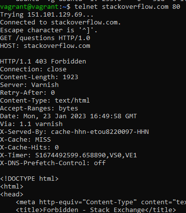
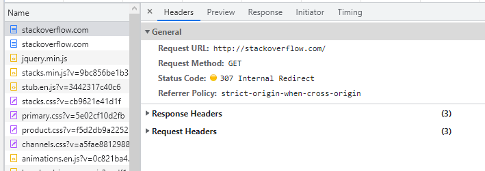
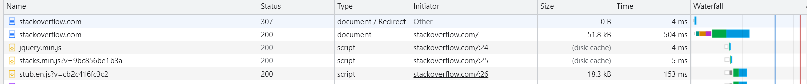
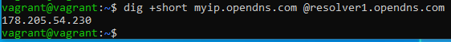
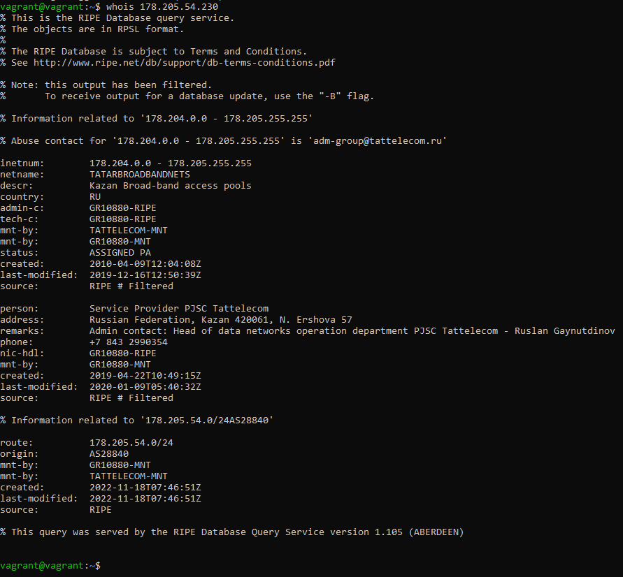
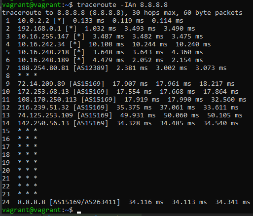
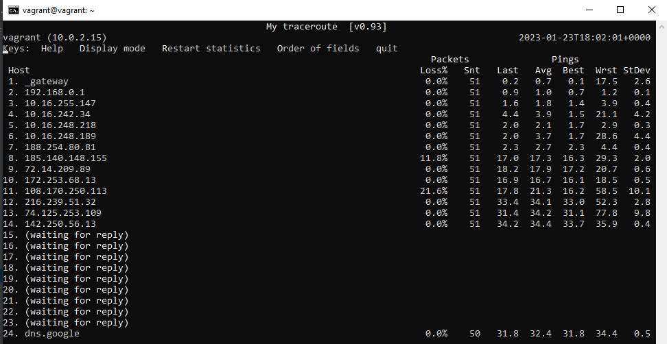
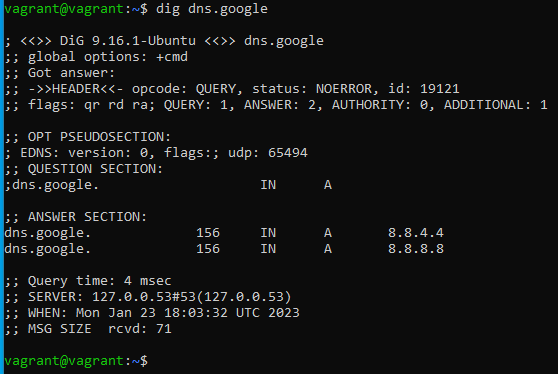
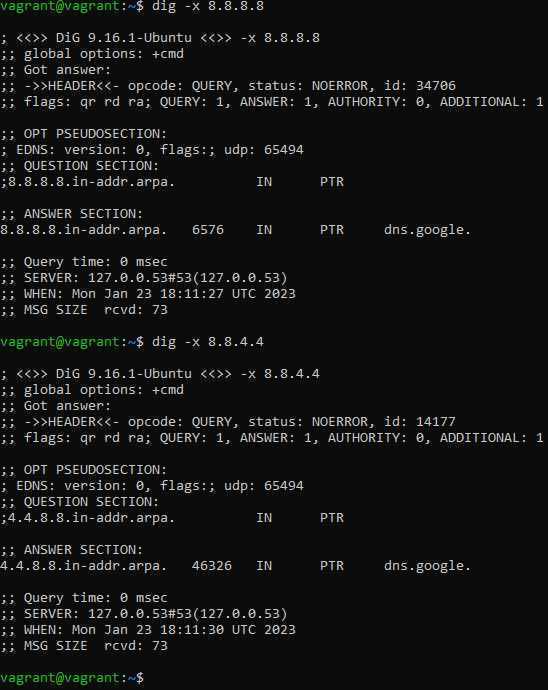

# Домашнее задание к занятию "3.6. Компьютерные сети"

## Выполнил Шарафуков Ильшат

### 1. Работа c HTTP через телнет. Подключитесь утилитой телнет к сайту stackoverflow.com
`telnet stackoverflow.com 80`
- Отправьте HTTP запрос
```bash
GET /questions HTTP/1.0
HOST: stackoverflow.com
[press enter]
[press enter]
```
*В ответе укажите полученный HTTP код, что он означает?*

Проделав указанные операции, получаю код ошибки 403 Forbidden.



Код ошибки 403 значит что у меня нет прав на доступ к материалам, которые я пытаюсь получить с помощью GET запроса.

### 2. Повторите задание 1 в браузере, используя консоль разработчика F12.

Открыл http://stackoverflow.com используя консоль разработчика, получил Код 307, а затем код 200.

* Код 307 - редирект с небезопасного протокола http на безопасный https
* Код 200 - это значит что запрос и ответ на данный запрос прошли корректно. Иначе говоря, status OK



* Дольше всего обрабатывалась сама html страничка



### 3. Какой IP адрес у вас в интернете?



### 4. Какому провайдеру принадлежит ваш IP адрес? Какой автономной системе AS? Воспользуйтесь утилитой whois

Провайдер Таттелеком, AS28840



### 5. Через какие сети проходит пакет, отправленный с вашего компьютера на адрес 8.8.8.8? Через какие AS? Воспользуйтесь утилитой traceroute



### 6. Повторите задание 5 в утилите mtr. На каком участке наибольшая задержка - delay?

Наибольшая задержка наблюдается на границе сети провайдера с AS151169



### 7. Какие DNS сервера отвечают за доменное имя dns.google? Какие A записи? Воспользуйтесь утилитой dig

С помощью утилиты dig получил A записи которые отвечают за доменное имя dns.google



### 8. Проверьте PTR записи для IP адресов из задания 7. Какое доменное имя привязано к IP? Воспользуйтесь утилитой dig

С помощью ключа '-x' для утилиты dig получил обратные записи для ip адресов DNS google:

8.8.8.8.in-addr.arpa.   6576    IN      PTR     dns.google.

4.4.8.8.in-addr.arpa.   46326   IN      PTR     dns.google.

