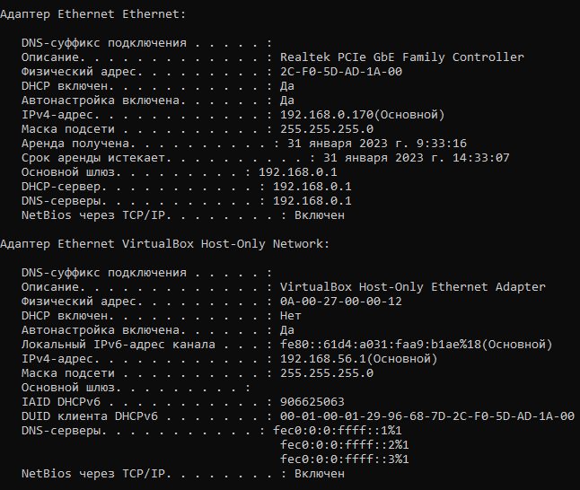

# Домашнее задание к занятию "3.7. Компьютерные сети"

## Выполнил Шарафуков Ильшат

### 1. Проверьте список доступных сетевых интерфейсов на вашем компьютере. Какие команды есть для этого в Linux и в Windows?

В win10 для вывода информации о доступных сетевых интерфейсах используется команда ipconfig /all в командной строке

В Linux для вывода информации о доступных сетевых интерфейсах используются команды:

* ip a

* ifconfig

### 2. Какой протокол используется для распознавания соседа по сетевому интерфейсу? Какой пакет и команды есть в Linux для этого?

Для решения данных задач используется протокол LLDP. В ubuntu можно поставить пакет lldpd

### 3. Какая технология используется для разделения L2 коммутатора на несколько виртуальных сетей? Какой пакет и команды есть в Linux для этого? Приведите пример конфига.

Для решения данных задач использутся VLAN'ы. Создавать vlan'ы на убунте можно с помощью ручного добавления сетевых интерфейсов в /etc/network/interfaces

Так же данные настройки можно прозводить с помощью утилиты 'vconfig'

https://manpages.ubuntu.com/manpages/focal/en/man8/vconfig.8.html

### 4. Какие типы агрегации интерфейсов есть в Linux? Какие опции есть для балансировки нагрузки? Приведите пример конфига.

Для агрегации интерфесов в убунте используется пакет ifenslave. 

Пример конфига: 

         auto bond0
         iface bond0 inet static
         address 192.168.1.150
         netmask 255.255.255.0    
         gateway 192.168.1.1
         dns-nameservers 192.168.1.1 8.8.8.8
         dns-search domain.local
             slaves eth0 eth1
             bond_mode 0
             bond-miimon 100
             bond_downdelay 200
             bound_updelay 200

Режимы работы: mode = 0 - пакеты по-очереди направляются в каждый интерфейс, участвующий в агрегации; mode = 1 - active-backup режим работы; mode = 2 - balance XOR. в данном случае отправка пакета на тот или иной интерфейс определяется с помощью вычисления хэша мак адресов источника и получателя; mode = 3 - широковещательный режим, все пакеты отправляются через каждый интерфейс; mode = 4 - объединение с помощью протокола LACP; mode = 5 - Распределение нагрузки при передаче. Входящий трафик обрабатывается в обычном режиме, а при передаче интерфейс определяется на основе данных о загруженности; mode = 6 - Адаптивное распределение нагрузки. Аналогично предыдущему режиму, но с возможностью балансировать также входящую нагрузку; 

### 5. Сколько IP адресов в сети с маской /29 ? Сколько /29 подсетей можно получить из сети с маской /24. Приведите несколько примеров /29 подсетей внутри сети 10.10.10.0/24.

В маске /29 всего 8 ip адресов, из них можно использовать только 6, за вычетом первого и последнего.

32 подсети с маской /29 вмещается в подсеть /24. Пример: 10.10.10.0/29, 10.10.10.8/29, 10.10.10.16/29

### 6. Задача: вас попросили организовать стык между 2-мя организациями. Диапазоны 10.0.0.0/8, 172.16.0.0/12, 192.168.0.0/16 уже заняты. Из какой подсети допустимо взять частные IP адреса? Маску выберите из расчета максимум 40-50 хостов внутри подсети.

Можно использовать диапазон 100.64.0.0 в целом, и для решения конкретной задачи нужно использовать сеть 100.64.0.0/26

### 7. Как проверить ARP таблицу в Linux, Windows? Как очистить ARP кеш полностью? Как из ARP таблицы удалить только один нужный IP?

В убунте arp можно посмотреть командой 'ip neigh (ip n)'

В win10 используется аналогичная команда в командной строке.

Очистить кеш полностью в убунте:

ip neigh flush all

Очистить кеш полностью в вин10:

arp -d *

Удалить конкретную запись в убунте:

ip neigh flush X.X.X.X

Удалить конкретную запись в вин10:

arp -d X.X.X.X