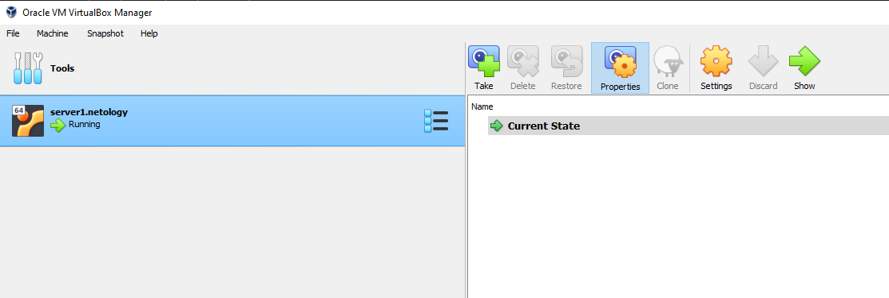
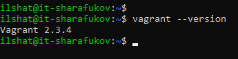
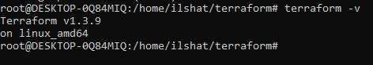
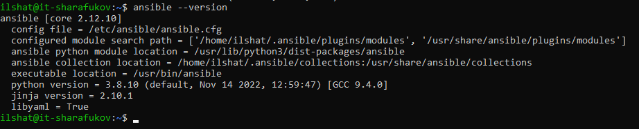
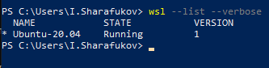
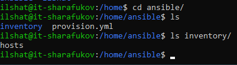
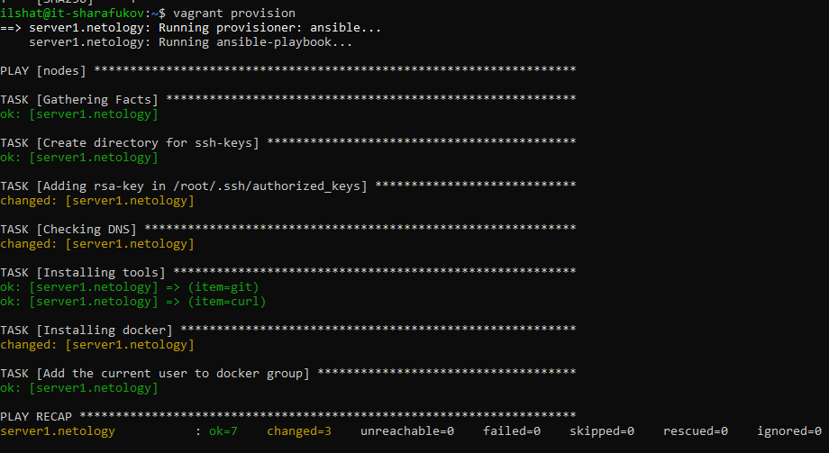
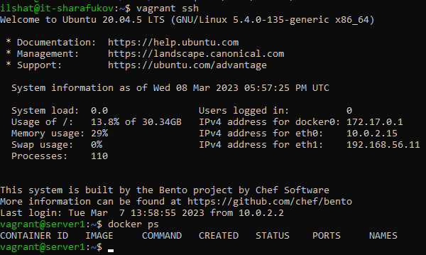

# Домашнее задание к занятию 2. «Применение принципов IaaC в работе с виртуальными машинами"»

## Выполнил Шарафуков Ильшат

### 1. Опишите основные преимущества применения на практике IaaC-паттернов. Какой из принципов IaaC является основополагающим?

1) Ускорение производства и вывода продукта на рынок. Иначе говоря, инфраструктура для развертывания различных программных продуктов конфигурируется быстрее, что приводит к сокращению издержек и позволяет командам работать быстрее и эффективнее.
2) Стабильность среды, устранение дрейфа конфигураций. Поскольку командам не требуется производить настройку инфраструктуры вручную, уменьшается количество проблем и ошибок во время выполнения. Происходит стандартизация инфраструктуры, что положительно сказывается на time to market.
3) Более быстрая и эффективная разработка. 

Основополагающим принципом IaaC является приведение процесса создания, настройки инфраструктуры к аналогичному виду с процессом разработки программного обеспечения.

### 2. Чем Ansible выгодно отличается от других систем управление конфигурациями? Какой, на ваш взгляд, метод работы систем конфигурации более надёжный — push или pull?

1) Ansible обладает низким порогом входа в сравнении с аналогами, не требует установки агентов на хосты, обладает хорошим быстродействием, простым запуском на текущей ssh инфраструктуре, декларативным методом описания конфигурации, позволяет легко и быстро подключать кастомные роли и модули.

2) Метод pull является более надеждным методом работы систем конфигурации, но у него есть свои недостатки, в частности более сложная настройка, потому что на хосты требуется ставить специальные агенты. При использовании push метода хосты не всегда могут быть доступны по различным причинам, соответственно конфигурация на данные хосты разливаться не будет. При использовании агентов хост сам будет подтягивать свежую конфигурацию в момент, когда будет обеспечена сетевая связность между ним и сервером управления конфигурациями.

### 3. Установите на личный компьютер: VirtualBox, Vagrant, Terraform, Ansible. Приложите вывод команд установленных версий каждой из программ, оформленный в Markdown.

Virtual Box: 

Vagrant:

Terraform: 

Ansible: 

### 4. Воспроизведите практическую часть лекции самостоятельно.

Установил WSL Ubuntu 20 LTS, версия WSL ОБЯЗАТЕЛЬНО должна быть первая, иначе ничего не будет работать.

Далее скачал и установил vagrant с официального сайта, используя vpn:

curl -O https://releases.hashicorp.com/vagrant/2.3.4/vagrant_2.3.4-1_amd64.deb

sudo apt install ./vagrant_2.3.4-1_amd64.deb

Дополнил переменную PATH в файле .bashrc для текущего пользователя для корректной работы vagrant:

export VAGRANT_WSL_ENABLE_WINDOWS_ACCESS="1"
export PATH=$PATH:/mnt/c/Windows/System32
export PATH="$PATH:/mnt/c/Windows/System32/WindowsPowerShell/v1.0"
export PATH="$PATH:/mnt/c/Program Files/Oracle/VirtualBox"
export VAGRANT_WSL_WINDOWS_ACCESS_USER_HOME_PATH="/mnt/c/virtualbox"

На win в корне диска /c/ создал папку virtualbox (как я понял, это нужно для синхронизации)

В обязательном порядке отключил антивирус (иначе ничего не работает)

Установил Ansible:

sudo apt-add-repository ppa:ansible/ansible
sudo apt update
sudo apt install ansible

Создал необходимые для работы директории и файлы конфигурации:

В конце запустил vagrant, он создал мне ВМ и я сделал provision с помощью ansible:

Убедился что у меня установился docker:

