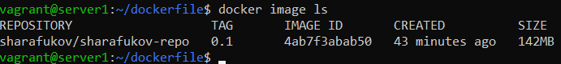

# Домашнее задание к занятию 3. «Введение. Экосистема. Архитектура. Жизненный цикл Docker-контейнера»

## Выполнил Шарафуков Ильшат

### 1. Сценарий выполнения задачи: создайте свой репозиторий на https://hub.docker.com; выберите любой образ, который содержит веб-сервер Nginx; создайте свой fork образа; реализуйте функциональность: запуск веб-сервера в фоне с индекс-страницей, содержащей HTML-код ниже:
```html
<html>
<head>
Hey, Netology
</head>
<body>
<h1>I’m DevOps Engineer!</h1>
</body>
</html>
```

Результат выполнения задания:
https://hub.docker.com/r/sharafukov/sharafukov-repo/

Для выполнения данного задания я собрал свой собственный docker контейнер на основе официального image nginx:

https://hub.docker.com/_/nginx

Для этого я написал dockerfile следующего содержания:


В данном файле директивой FROM мы указываем базовый образ, на котором будет работать наш докер контейнер

Директивой COPY я указываю файл со статическим контентом, который необходимо загрузить в image во время сборки.

Далее я собираю (делаю build) dockerfile:

```
docker build . -f nginx_html -t sharafukov/sharafukov-repo:0.1
```

Точка после build указывает на то что dockerfile лежит в текущей директории; ключ -f указывает на сам файл, на основании которого необходимо проводить сборку; ключ -t позволяет задать репозиторий и тег

После этого я проверяю собранный docker image:



И в конечном итоге запускаю его:

```
docker run -d -p 80:80  sharafukov/web:0.1
```

Ключ -d позволяет запуститься контейнеру в фоновом режиме; ключ -р прокидывает порты изнутри\наружу контейнера.

В конце проверяем работу nginx внутри контейнера:


Делаем push в публичный репозиторий:

```
docker image push sharafukov/sharafukov-repo:0.1
```

### 2. Посмотрите на сценарий ниже и ответьте на вопрос: «Подходит ли в этом сценарии использование Docker-контейнеров или лучше подойдёт виртуальная машина, физическая машина? Может быть, возможны разные варианты?» Детально опишите и обоснуйте свой выбор.

1. высоконагруженное монолитное Java веб-приложение - физический сервер, т.к. приложение высоконагруженное (требуется полная утилизация ресурсов сервера без лишней прослойки в виде гипервизора) и приложение монолитное и не использует разбивку на множество отдельных сервисов. 
2. Nodejs веб-приложение; - тут подойдёт докер, т.к. это простое веб приложение без особых требований. Наверно оно хорошо работает в контейнерах.
3. мобильное приложение c версиями для Android и iOS; - виртуальная машина на win или macos, т.к. для тестирования такого рода приложений требуется gui
4. шина данных на базе Apache Kafka; - в данном случае годится как виртуалка, так и docker, т.к. 
5. Elasticsearch-кластер для реализации логирования продуктивного веб-приложения — три ноды elasticsearch, два logstash и две ноды kibana; - годится как виртуалки, так и докеры. Виртуалкам можно обеспечить отказоустойчивость через кластеризацию.
6. мониторинг-стек на базе Prometheus и Grafana; - подойдёт как виртуалка, так и докер. В данном случае для докера надо будет смонтировать отдельные volume, чтобы метрики не терялись после ребута контейнера
7. MongoDB как основное хранилище данных для Java-приложения; - подойдёт виртуалка, т.к. данные БД не хранят в контейнерах.
8. Gitlab-сервер для реализации CI/CD-процессов и приватный (закрытый) Docker Registry. - годится как виртуалка, так и докер контейнеры, т.к. не сказано о каких либо ограничениях при работе с данными приложениями.

### 3. Запустите первый контейнер из образа centos c любым тегом в фоновом режиме, подключив папку /data из текущей рабочей директории на хостовой машине в /data контейнера. Запустите второй контейнер из образа debian в фоновом режиме, подключив папку /data из текущей рабочей директории на хостовой машине в /data контейнера. Подключитесь к первому контейнеру с помощью docker exec и создайте текстовый файл любого содержания в /data. Добавьте ещё один файл в папку /data на хостовой машине. Подключитесь во второй контейнер и отобразите листинг и содержание файлов в /data контейнера.

Для выполнения данного задания спулил 2 образа контейнеров с centos и debian:

```
docker pull debian
docker pull centos
```

Запустил оба контейнера в фоновом режиме и примонтировал к ним папку /data/ из домашнего каталога:

```
docker run -t -d -v /home/vagrant/data:/data debian:latest /bin/bash
docker run -t -d -v /home/vagrant/data:/data centos:latest /bin/bash
```

Провалился внутрь docker контейнера с помощью следующей команды:


Создал внутри папки /data/ файл test.txt


Теперь данный файлик появился и на хостовой машине, где поднимаются контейнеры и на контейнере с ОС debian где так же примонтирована папка /data/

