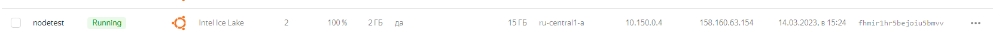
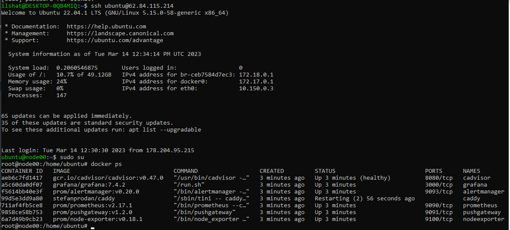
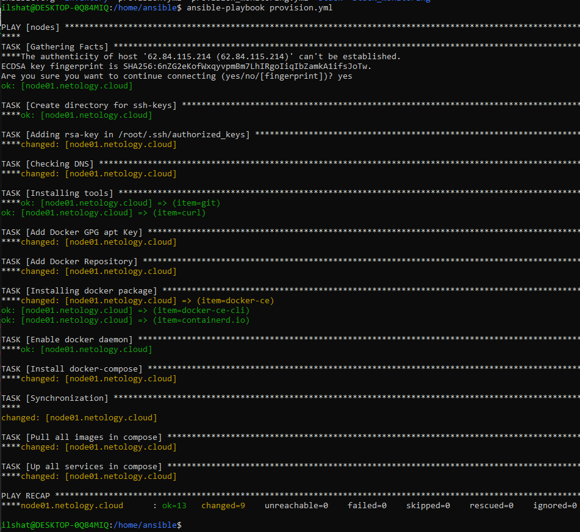
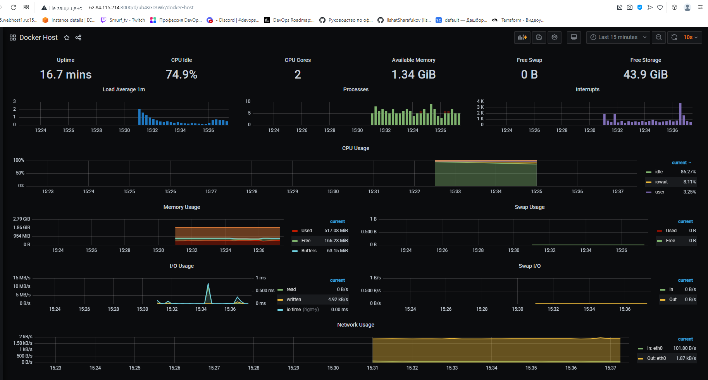
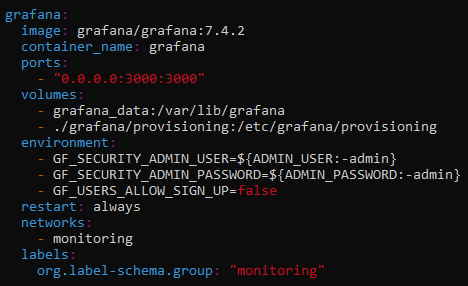

# Домашнее задание к занятию 3. «Введение. Экосистема. Архитектура. Жизненный цикл Docker-контейнера»

## Выполнил Шарафуков Ильшат

### 1. Создайте собственный образ любой операционной системы (например ubuntu-20.04) с помощью Packer.

Создал образ ВМ Ubuntu22-LTS:

### 2.1. Создайте вашу первую виртуальную машину в YandexCloud с помощью web-интерфейса YandexCloud.

Вручную создал ВМ в YC:

### 2.2.* (Необязательное задание). Создайте вашу первую виртуальную машину в YandexCloud с помощью Terraform (вместо использования веб-интерфейса YandexCloud). Используйте Terraform-код в директории (src/terraform).

Создал ВМ с помощью terraform: 

### 3. С помощью Ansible и Docker Compose разверните на виртуальной машине из предыдущего задания систему мониторинга на основе Prometheus/Grafana.

С помощью ansible развернул мониторинг на базе сервисов prometheus\grafana. Для того чтобы плейбук на ansible запустился под ОС ubuntu, пришлось его переписать (см. файл ansible/provision.yml)

Docker контейенер с Caddy не запустился по неизвестной причине, в логах не было никакой внятной информации о причинах данного поведения:

Поэтому чтобы графана была доступна извне, я переписал docker-compose файл в директории /opt/stack на ВМ в облаке:

### 4. Предоставьте скриншот работающего веб-интерфейса Grafana с текущими метриками, как на примере ниже.

Внешний IP адрес ВМ не совпадает с заданием 2, потому что эту дз я выполнял в течение двух дней. При перезапуске ВМ в YC внешний адрес меняется на другой.

### 5. Создайте вторую ВМ и подключите её к мониторингу, развёрнутому на первом сервере.

Создал вторую ВМ с помощью terraform, добавив к файлу конфигурации node01.tf переменную count, которая позволяет создавать много виртуалок, не плодя много одинаковых сущностей (см. файл node01.tf в /terraform/)

!

Далее с помощью ansible развернул на этой ВМ нужный прикладной софт, изменив плейбук и оставив в нем только один контейнер node_exporter, потому что для мониторинга нужен только он.

Зашел по внешнему IP этой ВМ, вижу что все нужные метрики отдаются:

!

Возвращаюсь на хост, где крутится графана. Там настраиваю новый дашборд node_exporter_full. В данном случае ВАЖНО отметить, что версию панелек нужно выбирать меньшую, т.к. графана в контейнере запускается с довольно старой версией.

Проверяем, что графики для новой ВМ рисуются:

