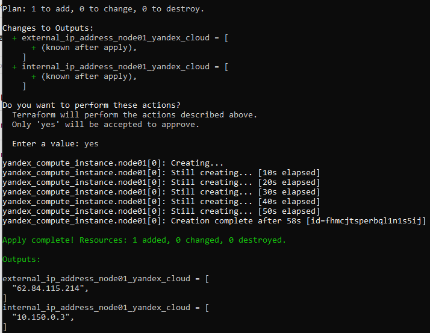

# Домашнее задание к занятию 3. «Введение. Экосистема. Архитектура. Жизненный цикл Docker-контейнера»

## Выполнил Шарафуков Ильшат

### 1. Создайте собственный образ любой операционной системы (например ubuntu-20.04) с помощью Packer.

Создал образ ВМ Ubuntu22-LTS:

### 2.1. Создайте вашу первую виртуальную машину в YandexCloud с помощью web-интерфейса YandexCloud.

Вручную создал ВМ в YC:

После создания данная ВМ была сразу же удалена. ВСЕ последующие задания делались с ВМ которая была создана через terraform!!!!!!!!

### 2.2.* (Необязательное задание). Создайте вашу первую виртуальную машину в YandexCloud с помощью Terraform (вместо использования веб-интерфейса YandexCloud). Используйте Terraform-код в директории (src/terraform).

Создал ВМ с помощью terraform: 

Скриншот данной ВМ в YC:

### 3. С помощью Ansible и Docker Compose разверните на виртуальной машине из предыдущего задания систему мониторинга на основе Prometheus/Grafana.

С помощью ansible развернул мониторинг на базе сервисов prometheus\grafana. Для того чтобы плейбук на ansible запустился под ОС ubuntu, пришлось его переписать (см. файл ansible/provision.yml)

Docker контейенер с Caddy не запустился по неизвестной причине, в логах не было никакой внятной информации о причинах данного поведения:

Поэтому чтобы графана была доступна извне, я переписал docker-compose файл в директории /opt/stack на ВМ в облаке:

### 4. Предоставьте скриншот работающего веб-интерфейса Grafana с текущими метриками, как на примере ниже.

Скриншот работающей графаны (ip адреса совпадают со вторым заданием):

