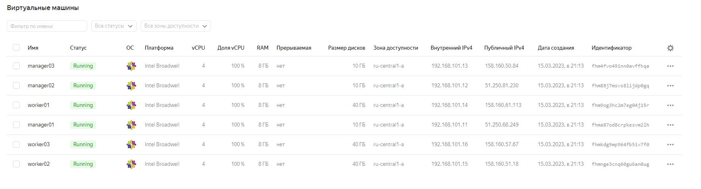
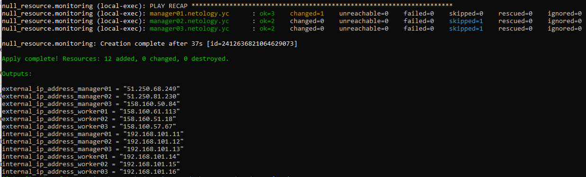
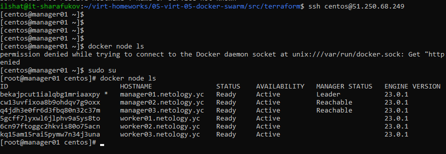
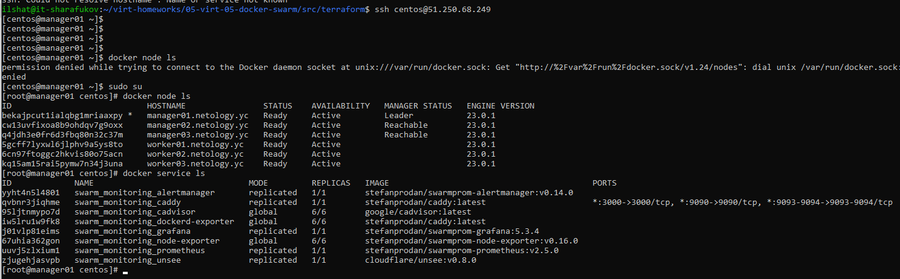
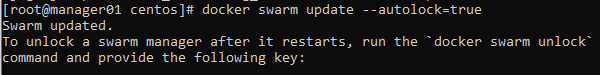

# Домашнее задание к занятию 5. «Оркестрация кластером Docker контейнеров на примере Docker Swarm»

## Выполнил Шарафуков Ильшат

### 1. Дайте письменые ответы на вопросы: В чём отличие режимов работы сервисов в Docker Swarm-кластере: replication и global? Какой алгоритм выбора лидера используется в Docker Swarm-кластере? Что такое Overlay Network?

1. Global сервис - это сервис, который запускает одну задачу на каждой воркер ноде. Replication сервис - это сервис который запускает n одинаковых задач на всех доступных нодах.
2. Механизм выбора лидера основан на алгоритме raft, который подразумевает выбор лидера на основе голосования (лидером становится тот, кто получил больше всего голосов, если кто-то не был назначен предыдущим лидером).
3. Overlay - это наложенная сеть, которая используется для связи контейнеров (сервисов) в кластере.

### 2. Создайте ваш первый Docker Swarm-кластер в Яндекс Облаке. Чтобы получить зачёт, предоставьте скриншот из терминала (консоли) с выводом команды:

```bash
docker node ls
```

С помощью предложенных исходников в гите создал 6 ВМ и запустил на них кластер docker-swarm.

Скриншот созданных ВМ в YC:



Скрин этих же ВМ после выполнения terraform apply:



Вывод команды docker node ls:



### 3. Создайте ваш первый, готовый к боевой эксплуатации кластер мониторинга, состоящий из стека микросервисов. Чтобы получить зачёт, предоставьте скриншот из терминала (консоли), с выводом команды:

```bash
docker service ls
```

Скриншот с выводом данной команды:



### 4. Выполните на лидере Docker Swarm-кластера команду, указанную ниже, и дайте письменное описание её функционала — что она делает и зачем нужна:

```
# см.документацию: https://docs.docker.com/engine/swarm/swarm_manager_locking/
docker swarm update --autolock=true
```



Данная команда включает автоблокировку swarm manager нод. Для защиты от утечки TLS ключей, которые нужны для связи между узлами, и ключей шифрования Raft журналов.

Для разблокировки manager ноды после перезагрузки:

```
docker swarm unlock <token из сообщения после включения автоблокировки>
```
