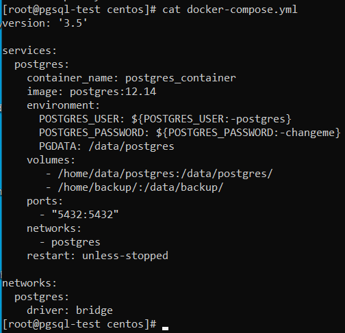
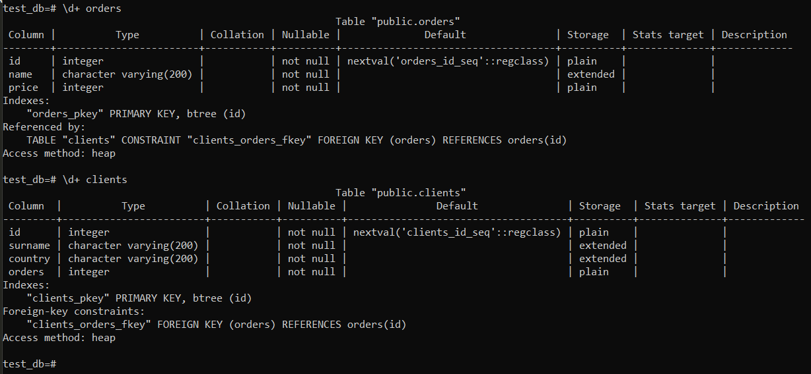
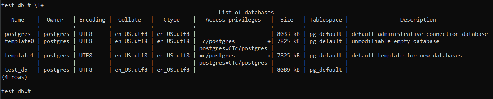
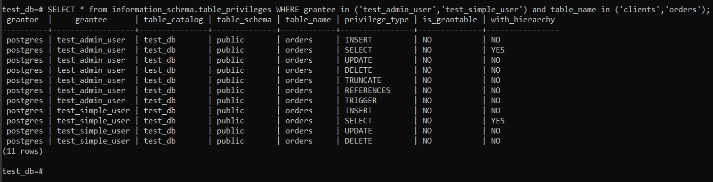
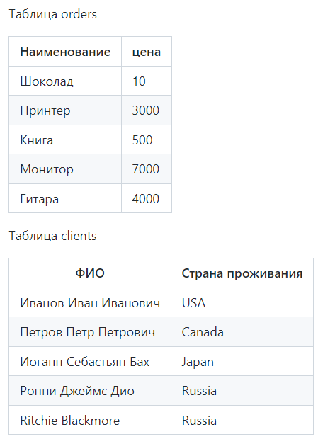
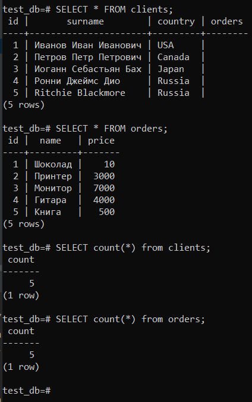
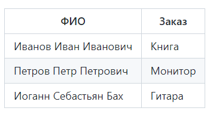
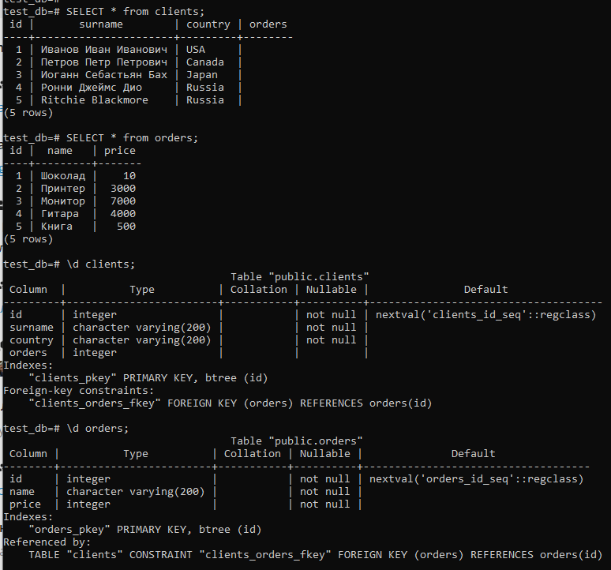
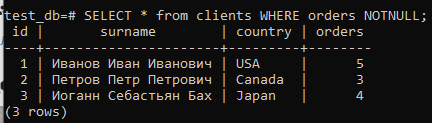
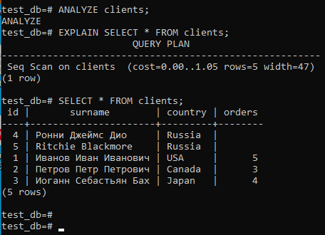

# Домашнее задание к занятию 2. «SQL». https://github.com/netology-code/virt-homeworks/tree/virt-11/06-db-02-sql

## Выполнил Шарафуков Ильшат

### Задание 1: Используя Docker, поднимите инстанс PostgreSQL (версию 12) c 2 volume, в который будут складываться данные БД и бэкапы. Приведите получившуюся команду или docker-compose-манифест.

Развернул инстанс Pgsql 12 версии с помощью docker-compose 2 volume.

https://github.com/khezen/compose-postgres




### Задание 2:
```
В БД из задачи 1:

создайте пользователя test-admin-user и БД test_db;
в БД test_db создайте таблицу orders и clients (спeцификация таблиц ниже);
предоставьте привилегии на все операции пользователю test-admin-user на таблицы БД test_db;
создайте пользователя test-simple-user;
предоставьте пользователю test-simple-user права на SELECT/INSERT/UPDATE/DELETE этих таблиц БД test_db.
Таблица orders:

id (serial primary key);
наименование (string);
цена (integer).
Таблица clients:

id (serial primary key);
фамилия (string);
страна проживания (string, index);
заказ (foreign key orders).
Приведите:

итоговый список БД после выполнения пунктов выше;
описание таблиц (describe);
SQL-запрос для выдачи списка пользователей с правами над таблицами test_db;
список пользователей с правами над таблицами test_db.
```

Ответы:

Выполнил все указанные задания:
```
psql --username=postgres --dbname=postgres

create database test_db;

\c test_db

CREATE TABLE orders (
id serial PRIMARY KEY,
name varchar(200) NOT NULL,
price integer NOT NULL);

CREATE TABLE IF NOT EXISTS clients (
id serial PRIMARY KEY,
surname varchar(200) NOT NULL,
country varchar(200) NOT NULL,
orders integer REFERENCES orders (id));

CREATE ROLE test_admin_user LOGIN PASSWORD 'Zaq12wsx';
CREATE ROLE test_simple_user LOGIN PASSWORD 'Zaq12wsx12';

GRANT ALL PRIVILEGES ON TABLE clients,orders TO test_admin_user;

GRANT SELECT,INSERT,UPDATE,DELETE ON TABLE clients,orders TO test_simple_user;

```
Описание всех таблиц:


Список всех БД:


SQL-запрос для выдачи списка пользователей с правами над таблицами test_db:
```
SELECT * from information_schema.table_privileges WHERE grantee in ('test_admin_user','test_simple_user') and table_name in ('clients','orders');
```
Список пользователей с правами над таблицами test_db:




### Задание 3: Используя SQL-синтаксис, наполните таблицы следующими тестовыми данными:



### Используя SQL-синтаксис: вычислите количество записей для каждой таблицы.

```
INSERT INTO orders (name, price)
VALUES('Шоколад', '10'),
('Принтер', '3000'),
('Монитор', '7000'),
('Гитара', '4000'),
('Книга', '500');


INSERT INTO clients (surname, country)
VALUES('Иванов Иван Иванович', 'USA'),
('Петров Петр Петрович', 'Canada'),
('Иоганн Себастьян Бах', 'Japan'),
('Ронни Джеймс Дио', 'Russia'),
('Ritchie Blackmore', 'Russia');
```

Количество записей в таблицах можно получить с помощью функции count() для метода SELECT:

```
SELECT count(*) from clients;
SELECT count(*) from orders;
```

Результат выполнения команды:



### Задание 4: Часть пользователей из таблицы clients решили оформить заказы из таблицы orders. Используя foreign keys, свяжите записи из таблиц, согласно таблице ниже. Приведите SQL-запросы для выполнения этих операций. Приведите SQL-запрос для выдачи всех пользователей, которые совершили заказ, а также вывод этого запроса. Подсказка: используйте директиву UPDATE.



Состояние и вид таблиц в БД до выполнения update:



```
UPDATE clients SET orders =5 WHERE id=1;
UPDATE clients SET orders =3 WHERE id=2;
UPDATE clients SET orders =4 WHERE id=3;
```

После этого смотрим кто выполнил заказ и по каким ID:

```
SELECT * from clients WHERE orders NOTNULL;
```

Результат выполнения этой команды:



### Задание 5: Получите полную информацию по выполнению запроса выдачи всех пользователей из задачи 4 (используя директиву EXPLAIN). Приведите получившийся результат и объясните, что значат полученные значения.

Для анализа запроса воспользовался следующей командой:

```
EXPLAIN SELECT * FROM clients;
```

Результат выполнения этой команды:



Sec Scan - последовательное чтение данных таблицы clients;
cost - условное значение, призванное оценить затратность операции. Первое значение 0.00 - затраты на получение первой строки, Второе значение 10.90 - затраты на получение всех строк.
rows - приблизительное количество возвращаемых строк при выполнении операции Seq Scan.
width - средний размер одной строки в байтах. 

### Задание 6:

Создал бэкап БД test_db следующей командой:

```
pg_dump -U postgres test_db > data/backup/test_db.dump
```

Выключил контейнер, не удаляя volume. После этого запустил ещё один контейнер, создал пустую БД test_db:

```
create database test_db;
```

В конце восстановил структуру таблицы с помощью сделанного бэкап файла:

```
psql -f data/backup/test_db.dump test_db --username postgres
```

