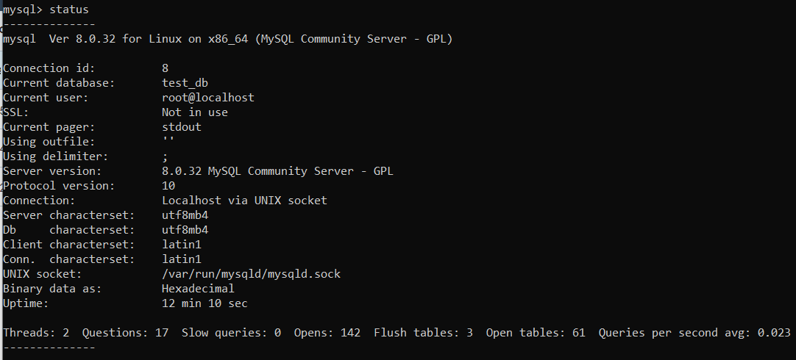
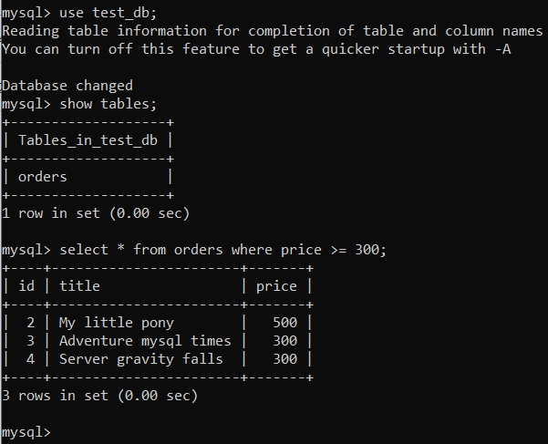
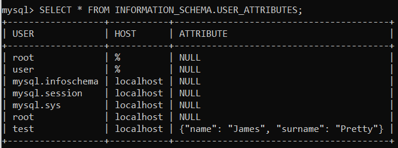
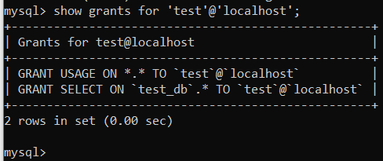
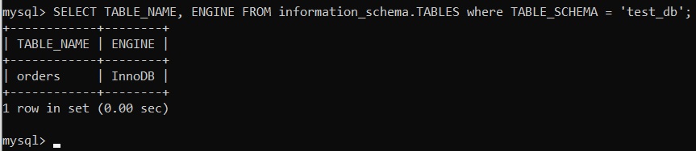
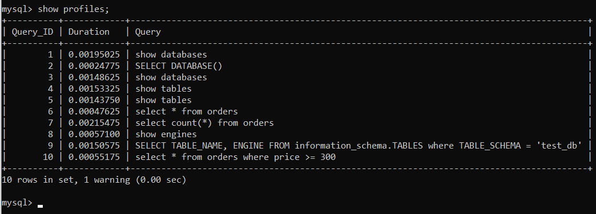
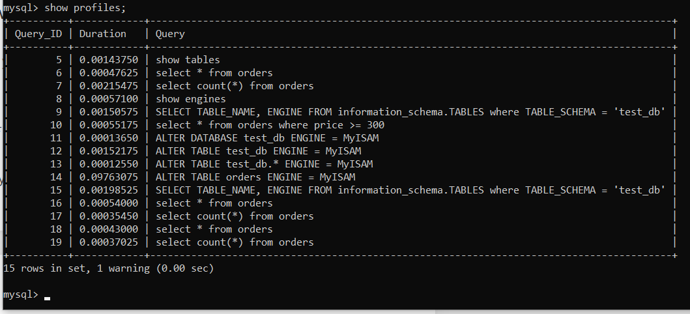

# Домашнее задание к занятию 3. «MySQL»

## Выполнил Шарафуков Ильшат

### Задание 1:

```
Используя Docker, поднимите инстанс MySQL (версию 8). Данные БД сохраните в volume.

Изучите бэкап БД и восстановитесь из него.

Перейдите в управляющую консоль mysql внутри контейнера.

Используя команду \h, получите список управляющих команд.

Найдите команду для выдачи статуса БД и приведите в ответе из её вывода версию сервера БД.

Подключитесь к восстановленной БД и получите список таблиц из этой БД.

Приведите в ответе количество записей с price > 300.
```

### Ответы: 

Поднял docker инстанс с mysql:8 (см. файл docker-compose.yml в src)

Восстановился из бэкапа БД. 

Статус БД и её версия:


Список таблиц и количество записей c price > 300:



### Задание 2:

```
Создайте пользователя test в БД c паролем test-pass, используя:

плагин авторизации mysql_native_password
срок истечения пароля — 180 дней
количество попыток авторизации — 3
максимальное количество запросов в час — 100
аттрибуты пользователя:
Фамилия "Pretty"
Имя "James".
Предоставьте привелегии пользователю test на операции SELECT базы test_db.

Используя таблицу INFORMATION_SCHEMA.USER_ATTRIBUTES, получите данные по пользователю test и приведите в ответе к задаче.
```

### Ответы:
```
CREATE USER 'test'@'localhost' IDENTIFIED WITH mysql_native_password BY 'test-pass' PASSWORD EXPIRE INTERVAL 180 DAY FAILED_LOGIN_ATTEMPTS 3;
ALTER USER 'test'@'localhost' WITH MAX_QUERIES_PER_HOUR 100;
ALTER USER 'test'@'localhost' ATTRIBUTE '{"name": "James", "surname": "Pretty"}';
GRANT SELECT ON test_db.* TO 'test'@'localhost';
FLUSH PRIVILEGES;
```





### Задание 3:

```
Установите профилирование SET profiling = 1. Изучите вывод профилирования команд SHOW PROFILES;.

Исследуйте, какой engine используется в таблице БД test_db и приведите в ответе.

Измените engine и приведите время выполнения и запрос на изменения из профайлера в ответе:

на MyISAM,
на InnoDB.
```

### Ответы:

Для нашей БД используется движок InnoDB:


Вывод профилирования команд:


Изменил движок: 

```
ALTER TABLE orders ENGINE = MyISAM; 
```

Вывод профилирования команд:



Видно что разница по времени есть при выполнении запроса SELECT count(*), но она незначительная, т.к. таблица состоит всего из 5 строк.,

### Задача 4:

```
Изучите файл my.cnf в директории /etc/mysql.

Измените его согласно ТЗ (движок InnoDB):

скорость IO важнее сохранности данных;
нужна компрессия таблиц для экономии места на диске;
размер буффера с незакомиченными транзакциями 1 Мб;
буффер кеширования 30% от ОЗУ;
размер файла логов операций 100 Мб.
Приведите в ответе изменённый файл my.cnf.
```

### Ответы:

Изменненый файл my.cnf.:
```
innodb_flush_log_at_trx_commit = 2
innodb_file_per_table = ON
innodb_log_buffer_size = 1M
innodb_buffer_pool_size = 600M
innodb_log_file_size = 1G
```