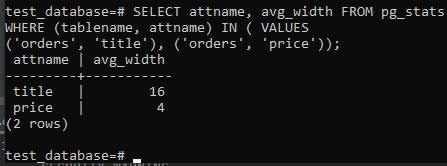
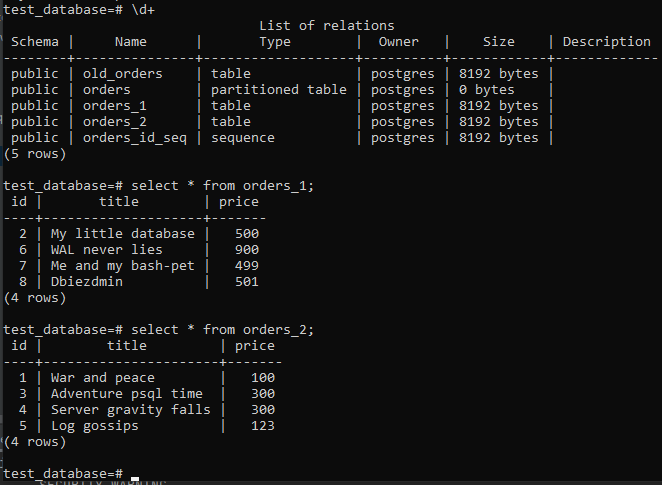

# Домашнее задание к занятию 4. «PostgreSQL»

## Выполнил Шарафуков Ильшат

### Задание 1:

```
Используя Docker, поднимите инстанс PostgreSQL (версию 13). Данные БД сохраните в volume.

Подключитесь к БД PostgreSQL, используя psql.

Воспользуйтесь командой \? для вывода подсказки по имеющимся в psql управляющим командам.

Найдите и приведите управляющие команды для:

вывода списка БД,
подключения к БД,
вывода списка таблиц,
вывода описания содержимого таблиц,
выхода из psql.
```

### Ответы:

```
Вывод списка БД - \l+
Подключение к БД - \c 'db_name'
Вывод списка таблиц - \d+
Вывод описания содержимого таблиц - select * from 'db_name'
Выход из psql - \q
```

### Задание 2:

```
Используя psql, создайте БД test_database.

Изучите бэкап БД.

Восстановите бэкап БД в test_database.

Перейдите в управляющую консоль psql внутри контейнера.

Подключитесь к восстановленной БД и проведите операцию ANALYZE для сбора статистики по таблице.

Используя таблицу pg_stats, найдите столбец таблицы orders с наибольшим средним значением размера элементов в байтах.

Приведите в ответе команду, которую вы использовали для вычисления, и полученный результат.
```

### Ответы:

Команда для вычисления наибольшего среднего значения размера элементов в байтах:

```
SELECT attname, avg_width FROM pg_stats
WHERE (tablename, attname) IN ( VALUES
('orders', 'title'), ('orders', 'price'));
```

Результат выполнения команды:



### Задача 3:

```
Архитектор и администратор БД выяснили, что ваша таблица orders разрослась до невиданных размеров и поиск по ней занимает долгое время. Вам как успешному выпускнику курсов DevOps в Нетологии предложили провести разбиение таблицы на 2: шардировать на orders_1 - price>499 и orders_2 - price<=499.

Предложите SQL-транзакцию для проведения этой операции.

Можно ли было изначально исключить ручное разбиение при проектировании таблицы orders?
```

### Ответы:

SQL транзакция для проведения шардинга:

```
alter table public.orders rename to old_orders;
create table public.orders (like public.old_orders) partition by range(price);
create table public.orders_1 partition of public.orders for values from (499) to (999999999);
create table public.orders_2 partition of public.orders for values from (0) to (499);
insert into public.orders (id,title,price) select*from public.old_orders;
```

Результат выполнения данных операций:



При проектировании больших таблиц, можно изначально их разбивать на партиции с необходимыми ограничениями, чтобы данные записывались в партиции в равных долях.

### Задание 4:

```
Используя утилиту pg_dump, создайте бекап БД test_database.

Как бы вы доработали бэкап-файл, чтобы добавить уникальность значения столбца title для таблиц test_database?
```

Команда для бэкапа всей БД:

```
pg_dump --format custom -U postgres -d test_database -f test_database.dump -v
```

Доработка бэкап файла заключается в немного видоизмененном создании таблицы:

```
CREATE TABLE public.orders (
    id integer NOT NULL,
    title character varying(80) UNIQUE NOT NULL,
    price integer
)
```
