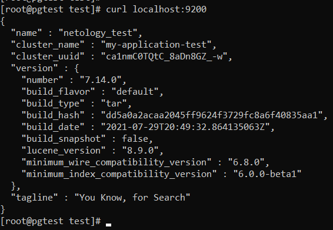
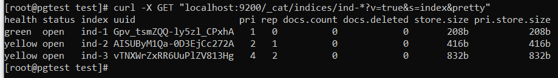
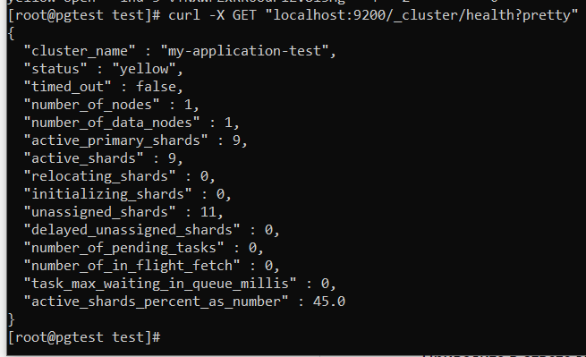
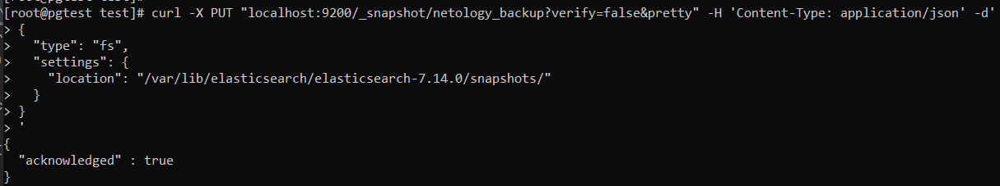
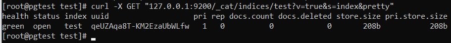
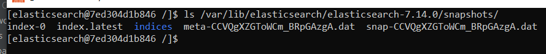
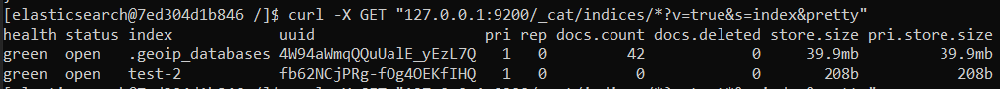
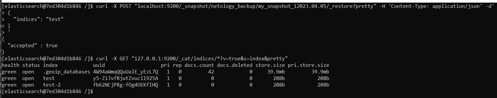

# Домашнее задание к занятию 5. «Elasticsearch»

## Выполнил Шарафуков Ильшат

### Задание 1:

```
Используя Docker-образ centos:7 как базовый и документацию по установке и запуску Elastcisearch:

составьте Dockerfile-манифест для Elasticsearch,
соберите Docker-образ и сделайте push в ваш docker.io-репозиторий,
запустите контейнер из получившегося образа и выполните запрос пути / c хост-машины.
Требования к elasticsearch.yml:

данные path должны сохраняться в /var/lib,
имя ноды должно быть netology_test.
В ответе приведите:

текст Dockerfile-манифеста,
ссылку на образ в репозитории dockerhub,
ответ Elasticsearch на запрос пути / в json-виде.
```

Ответы:

Dockerfile:

```
FROM centos:7
USER 0
RUN groupadd -g 1000 elasticsearch && useradd elasticsearch -u 1000 -g 1000

RUN yum makecache && \
    yum -y install wget perl-Digest-SHA openjdk-11-jdk

COPY elasticsearch-7.14.0-linux-x86_64.tar.gz /

RUN mkdir /var/lib/data /var/lib/logs /var/lib/elasticsearch && \
    chown -R elasticsearch:elasticsearch /var/lib/data /var/lib/logs /var/lib/elasticsearch


RUN \
    cd / && \
    tar -xzf elasticsearch-7.14.0-linux-x86_64.tar.gz && \
    rm -rf elasticsearch-7.14.0-linux-x86_64.tar.gz && \
    mv /elasticsearch-7.14.0 /var/lib/elasticsearch && \
    chown -R elasticsearch:elasticsearch /var/lib/elasticsearch/

COPY elasticsearch.yml /var/lib/elasticsearch/elasticsearch-7.14.0/config/

RUN cd /var/lib/elasticsearch/elasticsearch-7.14.0/config/ && chown -R elasticsearch:elasticsearch elasticsearch.yml

USER 1000

CMD ["/var/lib/elasticsearch/elasticsearch-7.14.0/bin/elasticsearch"]
```
Сбилдил docker-image:

```
docker image build -f docker-file . -t sharafukov/elasticsearch:v1.2
```

Сделал push в dockerhub:

```
docker push sharafukov/elasticsearch:v1.0
```

Ссылка на image на dockerhub:

```
https://hub.docker.com/layers/sharafukov/elasticsearch/v1.0/images/sha256-11284cedd993cc6e9fe28dd1a0945ffa9b917b34331977e11574d6b70ed99dc6?context=repo
```

Запустил контейнер:

```
docker run -dt -p 9200:9200 -p 9300:9300 0927216785c4
```

Запрос пути / в json-виде:



### Задание 2:

```
В этом задании вы научитесь:

создавать и удалять индексы,
изучать состояние кластера,
обосновывать причину деградации доступности данных.
Ознакомьтесь с документацией и добавьте в Elasticsearch 3 индекса в соответствии с таблицей:

Имя	Количество реплик	Количество шард
ind-1	    0	                1
ind-2	    1	                2
ind-3	    2	                4   
Получите список индексов и их статусов, используя API, и приведите в ответе на задание.

Получите состояние кластера Elasticsearch, используя API.

Как вы думаете, почему часть индексов и кластер находятся в состоянии yellow?

Удалите все индексы.

Важно

При проектировании кластера Elasticsearch нужно корректно рассчитывать количество реплик и шард, иначе возможна потеря данных индексов, вплоть до полной, при деградации системы.
```

### Ответы:

Создал 3 индекса (впишу сюда только один, в остальных отличается только количество шардов, реплик и названия):

https://www.elastic.co/guide/en/elasticsearch/reference/current/indices-create-index.html

```
curl -X PUT "localhost:9200/ind-3?pretty" -H 'Content-Type: application/json' -d'
{
  "settings": {
    "index": {
      "number_of_shards": 4,  
      "number_of_replicas": 2 
    }
  }
}
'
```

Список индексов и их статус:



Состояние кластера:



Часть индексов находится в состоянии yellow потому что elastic имеет всего 1 доступную ноду и ему некуда разворачивать реплики индексов ind-2 и ind-3.

Удалил индексы:

https://www.elastic.co/guide/en/elasticsearch/reference/current/indices-delete-index.html

```
curl -X DELETE "localhost:9200/ind-1?pretty"
curl -X DELETE "localhost:9200/ind-2?pretty"
curl -X DELETE "localhost:9200/ind-3?pretty"
```

### Задание 3:

```
В этом задании вы научитесь:

создавать бэкапы данных,
восстанавливать индексы из бэкапов.
Создайте директорию {путь до корневой директории с Elasticsearch в образе}/snapshots.

Используя API, зарегистрируйте эту директорию как snapshot repository c именем netology_backup.

Приведите в ответе запрос API и результат вызова API для создания репозитория.

Создайте индекс test с 0 реплик и 1 шардом и приведите в ответе список индексов.

Создайте snapshot состояния кластера Elasticsearch.

Приведите в ответе список файлов в директории со snapshot.

Удалите индекс test и создайте индекс test-2. Приведите в ответе список индексов.

Восстановите состояние кластера Elasticsearch из snapshot, созданного ранее.

Приведите в ответе запрос к API восстановления и итоговый список индексов.

Подсказки:

возможно, вам понадобится доработать elasticsearch.yml в части директивы path.repo и перезапустить Elasticsearch.
```

Запрос API и результат вызова API для создания репозитория:

```
curl -X PUT "localhost:9200/_snapshot/netology_backup?verify=false&pretty" -H 'Content-Type: application/json' -d'
{
  "type": "fs",
  "settings": {
    "location": "/var/lib/elasticsearch/elasticsearch-7.14.0/snapshots/"
  }
}
'
```



Перед этим я добавил в elasticsearch.yml следующую строчку:

```
path.repo: ["/var/lib/elasticsearch/elasticsearch-7.14.0/snapshots/"]
```

Создал индекс 'test' с 0 реплик и 1 шардом:

```
curl -X DELETE "localhost:9200/test?pretty"

curl -X PUT "localhost:9200/test?pretty" -H 'Content-Type: application/json' -d'
{
  "settings": {
    "index": {
      "number_of_shards": 1,  
      "number_of_replicas": 0 
    }
  }
}
'
```



Список файлов в директории snapshot:



Удалил индекс test и создал индекс test-2. Список индексов:

```
curl -X DELETE "localhost:9200/test?pretty"

curl -X PUT "localhost:9200/test-2?pretty" -H 'Content-Type: application/json' -d'
{
  "settings": {
    "index": {
      "number_of_shards": 1,  
      "number_of_replicas": 0 
    }
  }
}
'
```



Восстановил индекс test из снапшота:

```
curl -X POST "localhost:9200/_snapshot/netology_backup/my_snapshot_12023.04.05/_restore?pretty" -H 'Content-Type: application/json' -d'
{
  "indices": "test"
}
'
```



