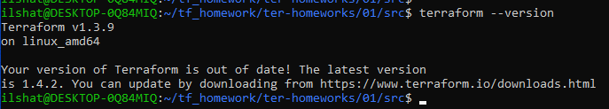
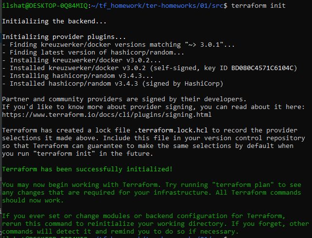
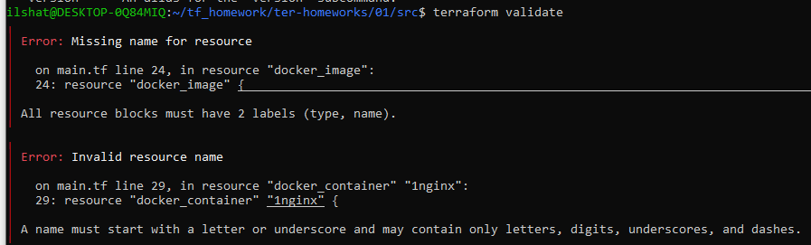
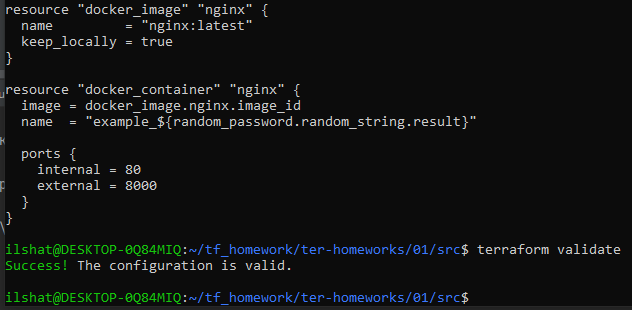
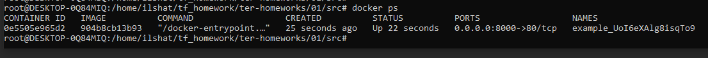
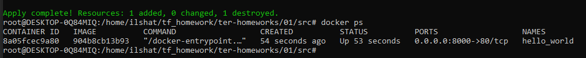
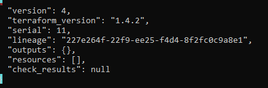
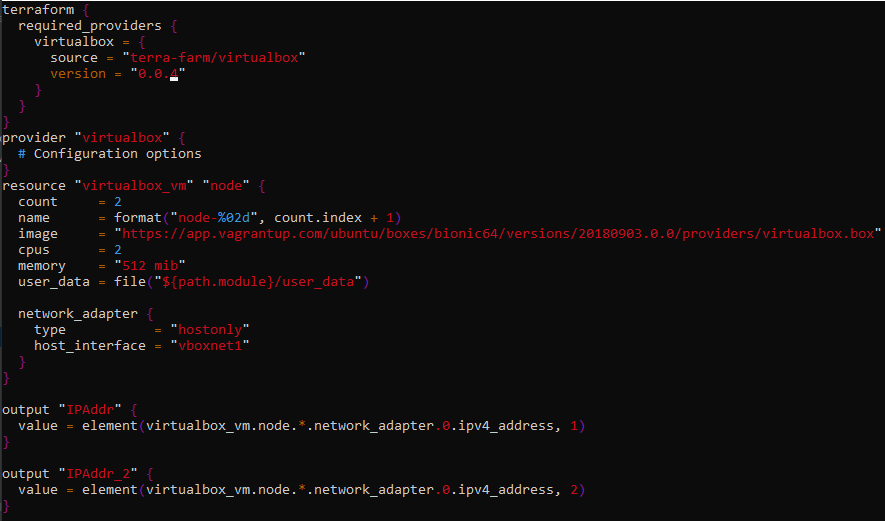

# Домашнее задание к занятию 5. «Оркестрация кластером Docker контейнеров на примере Docker Swarm»

## Выполнил Шарафуков Ильшат

Скриншот вывода версии terraform:

### Задание:
1. Перейдите в каталог src. Скачайте все необходимые зависимости, использованные в проекте.
2. Изучите файл .gitignore. В каком terraform файле допустимо сохранить личную, секретную информацию?
3. Выполните код проекта. Найдите в State-файле секретное содержимое созданного ресурса random_password. Пришлите его в качестве ответа.
4. Раскомментируйте блок кода, примерно расположенный на строчках 29-42 файла main.tf. Выполните команду terraform -validate. Объясните в чем заключаются намеренно допущенные ошибки? Исправьте их.
5. Выполните код. В качестве ответа приложите вывод команды docker ps
6. Замените имя docker-контейнера в блоке кода на hello_world, выполните команду terraform apply -auto-approve. Объясните своими словами, в чем может быть опасность применения ключа -auto-approve ?
7. Уничтожьте созданные ресурсы с помощью terraform. Убедитесь, что все ресурсы удалены. Приложите содержимое файла terraform.tfstate.
8. Объясните, почему при этом не был удален docker образ nginx:latest ?(Ответ найдите в коде проекта или документации)

### Ответы:

1. Выполнил terraform init (с использованием vpn) и подгрузил все необходимые для выполнения задания зависимости.

2. Личную информацию допустимо хранить в файле personal.auto.tfvars

3. UoI6eXAlg8isqTo9

4. В блоке resource "docker_image" не хватает второго lable (локального), а в блоке resource "docker_container" "1nginx" lable могут начинаться только с символов латинского алфавита. 

Исправил эти ошибки, добавив второй локальный label в блоке resource "docker_image" и убрав единичку перед вторым label в блоке resource "docker_container" "1nginx":

5. Выполнил код. Прикладываю вывод команды docker ps:

6. -auto-approve запускает apply без подтверждения, тем самым можно удалить или создать лишние ресурсы. Иначе говоря, не будет возможности проверить то что будет делать terraform. Вывод команды docker ps:

7. Удалил созданные ресурсы. Вывод terraform.tfstate:

8. В блоке resource "docker_image" "nginx" прописана опция keep_locally = true, которая не дает удалить образ; меняя значение на false можно удалить образ командой terraform destroy;

### Задание 2 (*)

1. Изучите в документации provider Virtualbox от shekeriev.
2. Создайте с его помощью любую виртуальную машину.

### Ответы:

