# Домашнее задание к занятию "Основы Terraform. Yandex Cloud"

## Выполнил Шарафуков Ильшат

### Задание 1:

```
Изучите проект. В файле variables.tf объявлены переменные для yandex provider.

Переименуйте файл personal.auto.tfvars_example в personal.auto.tfvars. 

Заполните переменные (идентификаторы облака, токен доступа). Благодаря .gitignore этот файл не попадет в публичный репозиторий. Вы можете выбрать иной способ безопасно передать секретные данные в terraform.

Сгенерируйте или используйте свой текущий ssh ключ. Запишите его открытую часть в переменную vms_ssh_root_key.

Инициализируйте проект, выполните код. Исправьте возникшую ошибку. Ответьте в чем заключается ее суть?

Ответьте, что означает preemptible = true и core_fraction в параметрах ВМ? Как это может пригодится в процессе обучения? Ответ в документации Yandex cloud.


В качестве решения приложите:
* скриншот ЛК Yandex Cloud с созданной ВМ,
* скриншот успешного подключения к консоли ВМ через ssh,
* ответы на вопросы.
```

### Ответы:

1. Изучил проект.
2. Переименовал файл, заполнил переменные.
3. Заложил в файл свой текущий ssh ключ.
4. Инициализировал проект, получил следующую ошибку:

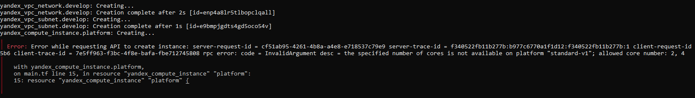

Суть в том, что для указанной платформы указано число ядер 1. Но выбрать можно либо 2, либо 4. Исправил на 2 и ВМ создалась.

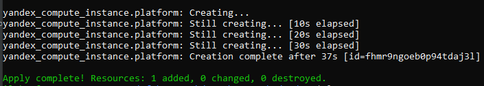

5. Ответы на вопросы:
* preemptible - ВМ, которая работает не более 24 часов и может быть остановлена Compute Cloud в любой момент. После остановки ВМ не удаляется, все ее данные сохраняются. Предоставляется с большой скидкой.
* core_fraction - Гарантированная доля vCPU, которая будет выделена ВМ. ВМ с гарантированной долей меньше 100% обеспечивают указанный уровень производительности с вероятностью временного повышения вплоть до 100%. Такие ВМ подходят для задач, которые не требуют постоянной гарантии производительности vCPU на 100%.

Скриншот созданной ВМ в ЛК:
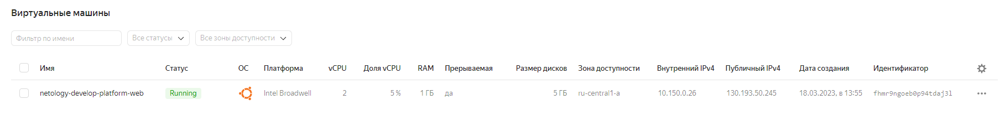

Скриншот подключения к ВМ:
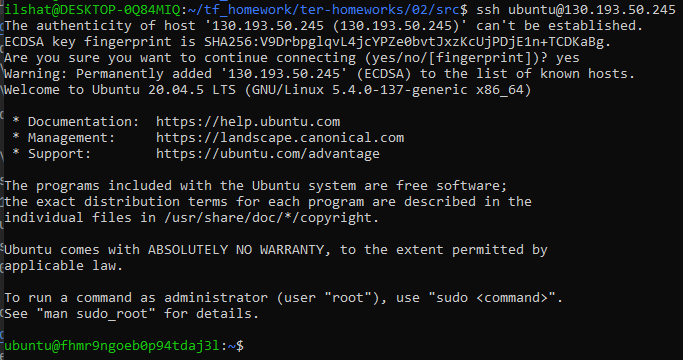

### Задание 2:
```
Изучите файлы проекта.

Замените все "хардкод" значения для ресурсов yandex_compute_image и yandex_compute_instance на отдельные переменные. К названиям переменных ВМ добавьте в начало префикс vm_web_ . Пример: vm_web_name.

Объявите нужные переменные в файле variables.tf, обязательно указывайте тип переменной. Заполните их default прежними значениями из main.tf.

Проверьте terraform plan (изменений быть не должно).
```

### Ответы:

Прописал новые переменные в variables.tf:

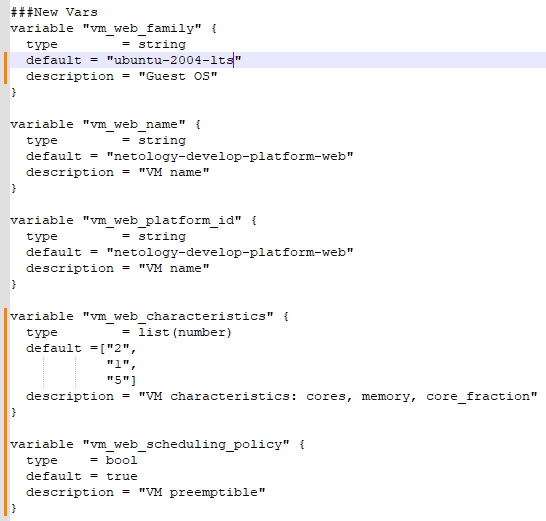

Добавил ссылки на эти переменные в main.tf:

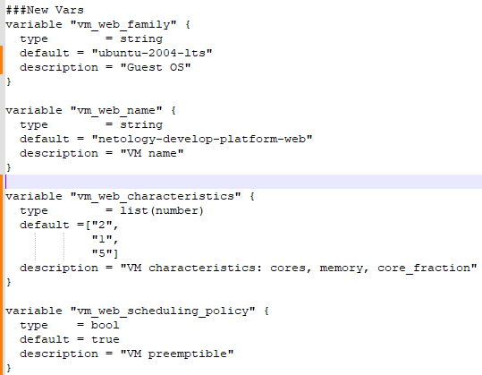

Изменений в конфигурации после этого не последовало:

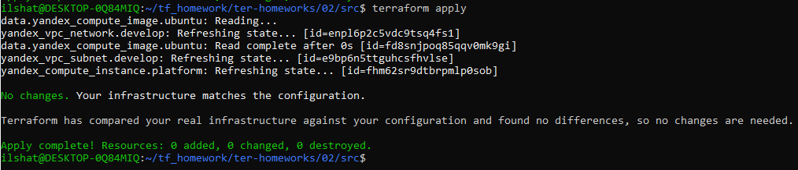

### Задание 3:
```
Создайте в корне проекта файл 'vms_platform.tf' . Перенесите в него все переменные ВМ.

Скопируйте блок ресурса и создайте с его помощью вторую ВМ: "netology-develop-platform-db" , cores = 2, memory = 2, core_fraction = 20. Объявите ее переменные с префиксом vm_db_ в том же файле.

Примените изменения.
```

### Ответы:

Скопировал блок ресурса:
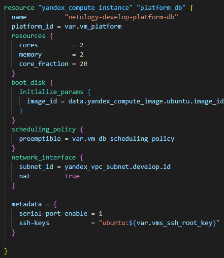

Определил новые переменные:

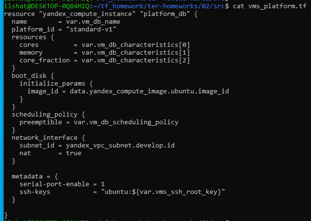

Создал ВМ:
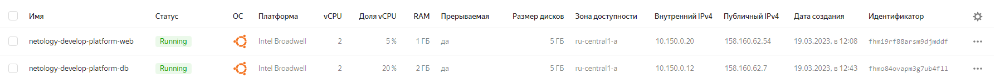

### Задание 4:
```
Объявите в файле outputs.tf отдельные output, для каждой из ВМ с ее внешним IP адресом.

Примените изменения.

В качестве решения приложите вывод значений ip-адресов команды terraform output
```

### Ответы:

Описал файл outputs.tf:
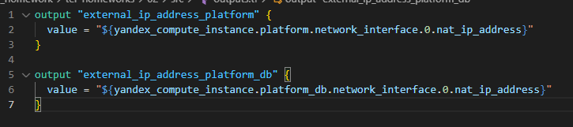

Вывод tf apply:
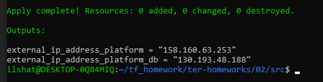

### Задание 5:
```
В файле locals.tf опишите в одном local-блоке имя каждой ВМ, используйте интерполяцию по примеру из лекции.

Замените переменные с именами ВМ из файла variables.tf на созданные вами local переменные.

Примените изменения.
```

### Ответы:

Определил переменные для названий виртуальных машин:

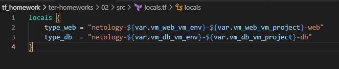

Сделал ссылки на эти переменные (для DB аналогично):

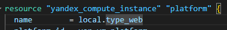

После этого применил изменения.

### Задание 6:
```
Вместо использования 3-х переменных ".._cores",".._memory",".._core_fraction" в блоке resources {...}, объедените их в переменные типа map с именами "vm_web_resources" и "vm_db_resources".

Так же поступите с блоком metadata {serial-port-enable, ssh-keys}, эта переменная должна быть общая для всех ваших ВМ.

Найдите и удалите все более не используемые переменные проекта.

Проверьте terraform plan (изменений быть не должно).
```

### Ответы:

Определил новые переменные:

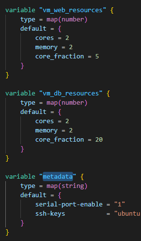

Дал ссылки на эти переменные в блоке main.tf (аналогично для vm db):

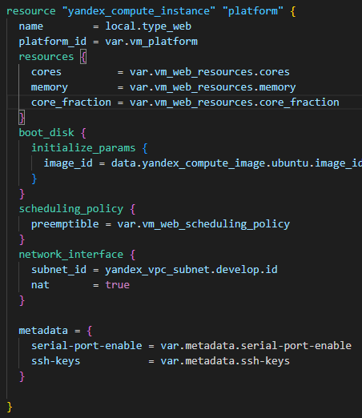

После этого применил изменения.

### Задание 7:
```
Изучите сожержимое файла console.tf. Откройте terraform console, выполните следующие задания:

Напишите, какой командой можно отобразить второй элемент списка test_list?

Найдите длину списка test_list с помощью функции length(<имя переменной>).

Напишите, какой командой можно отобразить значение ключа admin из map test_map ?

Напишите interpolation выражение, результатом которого будет: "John is admin for production server based on OS ubuntu-20-04 with X vcpu, Y ram and Z virtual disks", используйте данные из переменных test_list, test_map, servers и функцию length() для подстановки значений.

В качестве решения предоставьте необходимые команды и их вывод.
```

### Ответы:

1. local.test_list[1]
2. length(local.test_list)
3. local.test_map.admin

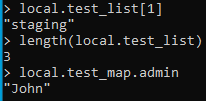

4. "${local.test_map.admin} is admin for production server based on OS ${local.servers.production.image} with ${local.servers.production.cpu} vcpu, ${local.servers.production.ram} ram and ${length(local.servers.production.disks)} virtual disks"

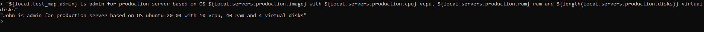